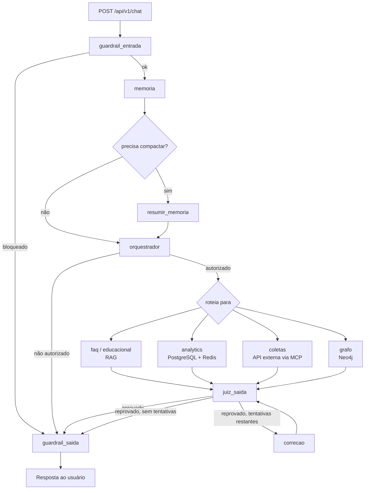

# EcoCiente IA


> API multiagente do EcoCiente: FastAPI + LangChain/LangGraph orquestrando especialistas (FAQ, educação ambiental, coletas, analytics e grafo de relacionamentos) com RAG, memória conversacional persistente, guardrails de entrada/saída e integrações MCP/A2A.

## Sobre o projeto

O EcoCiente é uma plataforma de gestão de reciclagem para condomínios que conecta moradores,
síndicos e cooperativas de coleta. Este repositório é o backend de IA: um chatbot multiagente
que responde de forma diferente conforme o perfil autenticado (`usuario_comum`,
`sindico_residencial`, `sindico_comercial`, `morador_residencial`, `usuario_comercial`,
`cooperativa`), cada um com seu próprio recorte de permissões.

Uma mensagem do usuário passa por um pipeline determinístico em grafo (LangGraph): validação
de entrada, recuperação de memória, roteamento para o especialista correto, validação de saída
por um juiz e, se reprovada, uma rodada de correção — tudo isso instrumentado com Prometheus e
exposto via FastAPI.

| Perfil | Pode acessar |
| --- | --- |
| `usuario_comum` | `faq`, `educacional` |
| `sindico_residencial` / `sindico_comercial` | `faq`, `educacional`, `analytics`, `coletas`, `grafo` |
| `morador_residencial` | `faq`, `educacional`, `analytics` (individual), `grafo` |
| `usuario_comercial` | `faq`, `educacional`, `analytics` (individual), `coletas` |
| `cooperativa` | `faq`, `coletas` |

As regras completas de autorização (perfil × ação, não só perfil × agente) estão em
`src/security/policies.py`.

### Ajustes e melhorias

O projeto está em desenvolvimento ativo. Estado atual:

- [x] Pipeline LangGraph com guardrails de entrada/saída, memória e juiz de correção
- [x] Especialistas `faq` e `educacional` via RAG (FAISS + base de conhecimento local)
- [x] Especialista `analytics` sobre PostgreSQL (somente leitura) e ranking via Redis
- [x] Especialista `coletas` integrado à API externa de calendário via MCP
- [x] Especialista `grafo` sobre Neo4j para caminhos, conexões e influência entre entidades
- [x] Memória conversacional persistida no MongoDB com compactação automática
- [x] Autorização por perfil e por ação sensível (`src/security/policies.py`)
- [x] Observabilidade via Prometheus (`/metrics`) e healthcheck agregado (`/health`)
- [x] Protocolo A2A e servidor MCP para integração com outros agentes
- [x] CI no GitHub Actions rodando a suíte `pytest`
- [x] Endpoint `/api/v1/agents` lista o especialista `grafo`
- [x] Import quebrado corrigido em `tests/test_external_integrations.py` (testes reescritos para a arquitetura MCP atual — `CalendarMcpClient`/`CalendarTools`)
- [x] `load_dotenv()` isolado em `src/core/config.py` (o `qdrant_service.py` agora lê a configuração de `Settings`)
- [x] FAQ por busca vetorial no Qdrant (`FAQ_BACKEND=qdrant`): responde com a `resposta_canonica` da coleção, sem LLM
- [x] Pipeline de povoamento do grafo Neo4j a partir do PostgreSQL (`python -m src.etl.populate_graph`; mapeamento nó a nó/relação a relação no topo de `src/etl/populate_graph.py`)
- [x] Licença MIT adicionada (`LICENSE`)
- [x] Prompts dos agentes importam com LLM real (seis módulos de prompt quebravam no import por JSON dentro de f-string; só o modo `mock` funcionava)
- [x] Juízes e orquestrador aceitam o JSON que os próprios prompts pedem (antes, com LLM real, o juiz de saída reprovava 100% das respostas e o de entrada nunca bloqueava)
- [x] Resposta censurada pelo juiz (`aprovado_com_censura`) é a que chega ao usuário
- [x] Cota diária de respostas por perfil, anti-rajada por minuto e sessão do `usuario_comum` encerrada antes de acionar o resumo de memória
- [x] Tracing de LLM com Langfuse (self-hosted) ou LangSmith, com CPF/e-mail/telefone/tokens mascarados
- [x] Prometheus + Grafana no `docker-compose.yml`, com dashboard e alertas provisionados
- [x] Evals de roteamento (`python -m evals.routing.run`) com acurácia, F1 por rota e matriz de confusão
- [x] Tokens por conversa e taxa de reprovação do juiz por especialista/categoria
- [x] ETL do grafo incremental, agendado (CronJob ou loop) e com `TEM_DIFICULDADE_EM`/`RECOMENDADO_PARA`
- [x] Endpoint SSE `/api/v1/chat/stream` com progresso do pipeline
- [x] Lock da sessão no Redis (`SET NX PX` + renovação): duas mensagens da mesma conversa não rodam juntas nem em réplicas diferentes
- [x] Carga do FAQ canônico no Qdrant (`python -m src.etl.populate_qdrant`), incremental e idempotente
- [x] ETL do grafo validado em PostgreSQL 16 real com o schema do projeto (até 1,8 mi de votos), lendo em lotes com memória constante, e comando `--validar` para conferir contra o Neo4j/Aura
- [ ] Rodar os evals com o modelo de produção e registrar a acurácia de referência (harness pronto para o limite do Gemini free: `--rpm`)
- [ ] Rodar `python -m src.etl.populate_graph --validar` no Aura e registrar os tempos reais
- [ ] Tool do agente `grafo` para consultar recomendações de curso diretamente

## Pré-requisitos

Antes de começar, verifique se você tem:

- Python `3.11` ou superior
- PostgreSQL `14+`, MongoDB e Redis (podem subir via Docker)
- Neo4j `5+` (opcional — só é necessário para o especialista `grafo`; a API sobe sem ele)
- Qdrant (opcional — só com `FAQ_BACKEND=qdrant`)
- Ollama rodando localmente (provider padrão de LLM/embeddings) **ou** uma chave Groq/Gemini
- Docker e Docker Compose, se for usar os bancos em contêiner

## Instalando

Clone o repositório:

```bash
git clone https://github.com/EcoCiente-Instituto-J-F/Eko.git
cd Eko
```

Crie e ative o ambiente virtual:

Linux e macOS:

```bash
python -m venv .venv
source .venv/bin/activate
```

Windows:

```bash
python -m venv .venv
.venv\Scripts\activate
```

Instale as dependências:

```bash
pip install -r requirements.txt
```

> Para usar Groq ou Gemini como provider de LLM, instale `requirements-optional.txt` no lugar
> (ele já inclui o `requirements.txt` base).

Configure as variáveis de ambiente:

```bash
cp .env.example .env
```

No Windows: `copy .env.example .env`.

<details>
<summary>Principais variáveis do <code>.env</code></summary>

| Variável | Padrão | Descrição |
| --- | --- | --- |
| `APP_ENV` | `development` | `development`, `test` ou `production` |
| `LLM_PROVIDER` | `ollama` | `ollama`, `groq`, `gemini` ou `mock` (sem custo de API, usado nos testes) |
| `OLLAMA_BASE_URL` / `OLLAMA_MODEL` | `http://localhost:11434` / `qwen3:4b` | LLM local via Ollama |
| `POSTGRES_URL` | — | Fonte de verdade dos dados analíticos (somente leitura pelo agente) |
| `MONGODB_URI` / `MONGODB_DATABASE` | `mongodb://localhost:27017` / `ecociente` | Memória conversacional das sessões |
| `REDIS_URL` | `redis://localhost:6379/0` | Ranking, ponteiro de sessão, cotas de uso e lock da sessão entre réplicas |
| `NEO4J_URI` / `NEO4J_USERNAME` / `NEO4J_PASSWORD` / `NEO4J_DATABASE` | `bolt://localhost:7687` / `neo4j` | Camada de relacionamentos consultada pelo especialista `grafo` (opcional) |
| `KNOWLEDGE_BASE_PATH` | `data/FAQ_KNOWLEDGE_BASE.md` | Base RAG dos especialistas `faq` e `educacional` |
| `CALENDAR_API_BASE_URL` | `http://localhost:9800` | API externa de coletas, consumida via MCP |
| `JUDGE_MAX_CORRECTIONS` | `1` | Quantas vezes o juiz de saída pode pedir correção antes de desistir |
| `MEMORY_MAX_MESSAGES` / `MEMORY_KEEP_RECENT_MESSAGES` | `20` / `6` | Quando e quanto da memória é compactada |

Veja `.env.example` para a lista completa (autenticação, testes de integração, A2A etc.).

</details>

> [!NOTE]
> O `docker-compose.yml` sobe a `api`, o Prometheus e o Grafana (e o `graph-etl` no profile
> `etl`). Os bancos (Postgres, MongoDB, Redis, Neo4j, Qdrant) **não** estão nele: precisam estar
> acessíveis nos endereços do `.env`. Para desenvolver sem nenhum deles, use
> `STORAGE_MODE=memory` e `LLM_PROVIDER=mock`.

## Usando

Com as dependências no ar e o `.env` preenchido:

```bash
python -m uvicorn src.api.main:app --reload
```

A API sobe em `http://127.0.0.1:8000`. Endpoints principais:

| Método | Rota | Descrição |
| --- | --- | --- |
| `POST` | `/api/v1/chat` | Envia uma mensagem e recebe a resposta do especialista roteado |
| `POST` | `/api/v1/chat/stream` | Mesmo pipeline, com progresso por etapa via SSE (`session` → `progress` → `answer` → `done`) |
| `GET` | `/api/v1/chat/quota` | Quantas respostas o usuário ainda tem hoje |
| `GET` | `/api/v1/agents` | Lista os especialistas disponíveis |
| `POST` / `GET` / `DELETE` | `/api/v1/sessions`, `/api/v1/sessions/{session_id}` | Cria, consulta e encerra uma sessão de conversa |
| `GET` | `/api/v1/rankings/moradores`, `/torres`, `/me` | Ranking de reciclagem (conforme perfil) e a posição do próprio usuário |
| `GET` | `/health` | Healthcheck agregado (LLM, Postgres, Mongo/Redis, RAG, Neo4j, Qdrant, calendário) |
| `GET` | `/metrics` | Métricas Prometheus |
| `GET` | `/docs` | Swagger UI (OpenAPI) |

Exemplo de chamada (em `APP_ENV=test` com `ALLOW_TEST_IDENTITY_HEADERS=true`, sem precisar de
token real):

```bash
curl -X POST http://127.0.0.1:8000/api/v1/chat \
  -H "Content-Type: application/json" \
  -H "X-Usuario-Id: 42" \
  -H "X-Perfil: sindico_residencial" \
  -H "X-Condominio-Id: 7" \
  -d '{
        "usuario_id": 42,
        "session_id": null,
        "mensagem": "Quais moradores mais influenciam a reciclagem do condomínio?"
      }'
```

Resposta (resumida):

```json
{
  "session_id": "…",
  "agent": "grafo",
  "answer": "…",
  "agents_called": ["guardrail_entrada", "memoria", "verificar_compactacao", "orquestrador", "grafo", "juiz_saida", "guardrail_saida"],
  "sources": [],
  "judge": { "aprovado": true, "motivo": "aprovado", "necessita_correcao": false, "categoria": "aprovado" },
  "usage": { "input_tokens": 1830, "output_tokens": 212, "total_tokens": 2042 },
  "quota": { "limite_diario": 100, "usadas_hoje": 3, "restantes_hoje": 97, "renova_em": "2026-09-28T00:00:00-03:00" }
}
```

### Limites de uso

Checados antes de qualquer chamada de LLM (`src/services/quota_service.py`). Estourou → HTTP
`429` com `Retry-After` e `detail.codigo` = `limite_daily`, `limite_rate` ou `limite_session`.

| Perfil | Respostas/dia | Observação |
| --- | --- | --- |
| `usuario_comum` | 20 | Sessão encerrada em 10 perguntas: o resumo de memória (LLM extra) nunca é acionado |
| `morador_residencial` | 40 | |
| `usuario_comercial` | 50 | |
| `cooperativa` | 80 | Uso operacional (agenda de coletas) |
| `sindico_residencial` / `sindico_comercial` | 100 | Analytics e gestão do condomínio |

Além disso, qualquer perfil tem no máximo 10 mensagens por minuto (anti-script). A cota vira à
meia-noite de `QUOTA_TIMEZONE` e não é consumida quando a resposta falha por erro do servidor.
Tudo configurável por variável de ambiente (`QUOTA_*`, `RATE_LIMIT_PER_MINUTE`).

Mensagens da mesma sessão são processadas uma por vez, inclusive com várias réplicas da API: o
lock fica no Redis (`session:lock:<id>`, `SET NX PX`, renovado enquanto a resposta é gerada e
liberado sozinho pelo TTL se o pod morrer). Uma segunda mensagem espera a primeira terminar por
até `SESSION_LOCK_WAIT_SECONDS` (45 s); passou disso, HTTP `409` com `detail.codigo` =
`sessao_ocupada` e a cota devolvida. Sem Redis (`STORAGE_MODE=memory`), o lock é só do processo.

> [!NOTE]
> O teto de 10 perguntas por sessão do `usuario_comum` vem de `MEMORY_MAX_MESSAGES=20`: cada
> pergunta gera 2 mensagens (usuário + assistente), e o resumo dispara quando a sessão passa de
> 20. Só a cota diária de 20 não bastaria — 20 respostas numa sessão só seriam 40 mensagens.

### Observabilidade

```bash
# API + Prometheus (9090) + Grafana (3001, dashboard "EcoCiente IA" já provisionado)
docker compose up -d

# Langfuse self-hosted (3000), projeto e chaves de dev já criados
docker compose -f docker-compose.langfuse.yml -p langfuse up -d
```

Para ligar o tracing, no `.env`:

```env
TRACING_PROVIDER=langfuse
LANGFUSE_PUBLIC_KEY=pk-lf-ecociente-local
LANGFUSE_SECRET_KEY=sk-lf-ecociente-local
LANGFUSE_HOST=http://localhost:3000
```

Cada agente vira um span agrupado por sessão e usuário. Antes de sair da API, o conteúdo passa
por `mask_pii` (CPF, CNPJ, e-mail, telefone, CEP, JWT e chaves como `token`/`senha`).
`TRACING_PROVIDER=langsmith` com `LANGSMITH_API_KEY` também funciona, com o mesmo mascaramento.

| Ferramenta | Responde |
| --- | --- |
| Prometheus/Grafana | Quanto e quão rápido: latência por agente, taxa de reprovação do juiz, tokens/min, recusas por limite |
| Langfuse/LangSmith | O que aconteceu nesta conversa: prompt, resposta, tokens e decisão de cada agente |

### FAQ via Qdrant (sem LLM)

Com `FAQ_BACKEND=qdrant`, o especialista `faq` não chama LLM:

1. A pergunta vira embedding localmente (`fastembed`, `intfloat/multilingual-e5-large`,
   prefixo `query: `). Nenhuma chamada de API é feita nessa etapa.
2. A coleção `QDRANT_COLLECTION` é consultada. O payload de cada ponto tem `faq_id`, `titulo`,
   `intencao`, `perfis_relacionados`, `resposta_canonica`, `palavras_chave` e `tipo`.
3. O resultado usado é o primeiro que tiver score acima de `QDRANT_MIN_SCORE` e cujos
   `perfis_relacionados` incluam o perfil do usuário (lista vazia vale para todos). A
   `resposta_canonica` dele é a resposta final. Por ser texto curado, o juiz de saída também
   não chama LLM.
4. Se nenhum resultado passar: com `FAQ_LLM_FALLBACK=false` (padrão), a resposta diz que a base
   não tem essa pergunta; com `true`, cai no RAG + LLM antigo.

```env
FAQ_BACKEND=qdrant
QDRANT_URL=https://<cluster>.cloud.qdrant.io
QDRANT_API_KEY=...
QDRANT_COLLECTION=faq
QDRANT_MIN_SCORE=0.80
```

Carga da coleção a partir da seção "Perguntas Frequentes Canônicas" de
`data/FAQ_KNOWLEDGE_BASE.md` (64 FAQs `FAQ-NNN`):

```bash
python -m src.etl.populate_qdrant --dry-run      # valida o arquivo, não toca no Qdrant
python -m src.etl.populate_qdrant                # cria/atualiza a coleção
python -m src.etl.populate_qdrant --testar "como faço login?" "posso apagar minha conta?"
```

A carga é idempotente (id do ponto derivado do `faq_id`), só gera embedding do que mudou (hash
no payload) e remove da coleção os FAQs que saíram do arquivo. Rode de novo sempre que a base
mudar. "Perfis relacionados" do documento viram os códigos de perfil do sistema; rótulos
descritivos ("Todos", "perfis com mapa") deixam o FAQ aberto a todos.

> [!WARNING]
> O modelo de embedding (`QDRANT_EMBEDDING_MODEL`, ~2,2 GB, baixado no primeiro uso) tem que ser
> o mesmo na carga e na API. A carga grava o modelo em cada ponto e o `/health` acusa `qdrant:
> error` se divergir; trocar de modelo exige `--recriar`. Calibre `QDRANT_MIN_SCORE` com
> `--testar` e perguntas reais: scores do e5 costumam ficar entre 0,75 e 0,90.

O orquestrador e o juiz de entrada continuam sendo LLM: a busca vetorial substitui a geração da
resposta do FAQ, não o roteamento.

### Carga do grafo

```bash
python -m src.etl.populate_graph --mode full            # tudo
python -m src.etl.populate_graph --mode full --prune    # tudo + remove do grafo o que não existe mais
python -m src.etl.populate_graph --mode incremental     # só o que mudou desde a última carga
python -m src.etl.populate_graph --validar --relatorio etl.json  # confere Postgres × grafo, com tempos
docker compose --profile etl up -d graph-etl            # loop: incremental 15 min, full 24 h
kubectl apply -f k8s/graph-etl-cronjobs.yaml            # CronJobs equivalentes
```

O incremental usa as datas do schema e a auditoria de `tb_rel_usuarios_condominios` (todo
UPDATE, inclusive de `trust_score`, fica registrado). `PERTENCE_A` só existe para vínculo
aprovado e sem `data_saida`. As regras de `TEM_DIFICULDADE_EM` e `RECOMENDADO_PARA` estão no
topo de `src/etl/populate_graph.py`.

Medido em PostgreSQL 16 com o schema do projeto e 200 mil usuários, 600 mil postagens e 1,8 mi
de votos (só a leitura e o preparo dos lotes; o tempo do Neo4j vem do `--validar`): full em
~21 s com ~125 MB de memória; incremental com atividade de 15 min em ~1 s.

Em produção, o `Authorization: Bearer <token>` é obrigatório e a identidade vem da API de
autenticação (`AUTH_API_URL`) — os headers `X-*` acima só funcionam com `APP_ENV=test`.

### Docker

```bash
docker build -t ecociente-ia .
docker run --env-file .env -p 8000:8000 ecociente-ia
```

### Kubernetes

Manifests de referência em `k8s/` (namespace, ConfigMap, Secret de exemplo, Deployment, Service
e os CronJobs da carga do grafo, com `app.kubernetes.io/name: ia-eko`). O deploy da AWS é
mantido pela equipe de infraestrutura em
[`devops-infra-ecociente`](https://github.com/EcoCiente-Instituto-J-F/devops-infra-ecociente)
(Helm).

## Como funciona

### Pipeline de uma mensagem



### Especialistas

| Agente | Fonte de dados | Quando responde |
| --- | --- | --- |
| `faq` | RAG sobre `data/FAQ_KNOWLEDGE_BASE.md`, ou Qdrant sem LLM (`FAQ_BACKEND=qdrant`) | Regras, políticas e limites do assistente |
| `educacional` | RAG sobre a mesma base + fonte externa (SINIR) | Separação de resíduos, compostagem, sustentabilidade |
| `analytics` | PostgreSQL (leitura) + Redis (ranking) | Pontos, desempenho, métricas e comparações — sempre que a resposta é um número ou série |
| `coletas` | API externa de calendário via MCP | Agendamento, recorrência e confirmação de coleta |
| `grafo` | Neo4j | Caminho, conexão ou influência entre entidades — quando a resposta é a estrutura da relação, não uma métrica |

O agente `grafo` é o mais recente: ele existe porque perguntas como *"quais moradores mais
influenciam a reciclagem do condomínio?"* não são respondidas por uma agregação SQL — elas
pedem a topologia da rede de relacionamentos (`Usuario`, `Condominio`, `Torre`, `Cooperativa`,
`CategoriaResiduo`, `Curso`, `Postagem` e relações como `MORA_EM`, `PERTENCE_A`, `CRIOU`,
`VALIDOU`, `DENUNCIOU`, `TEM_DIFICULDADE_EM` e `RECOMENDADO_PARA`). O vocabulário fica em um lugar
só (`src/etl/graph_model.py`), usado pelo ETL e pela whitelist das tools. Veja
`docs/REQUISITOS_E_FLUXOS.md` para o racional completo e `src/agents/graph_traversal/tools.py`
para as queries Cypher expostas ao LLM.

### Arquitetura

- `api/` — rotas FastAPI e injeção de dependência
- `agents/` — grafo LangGraph e os especialistas (`analytics/`, `coleta/`, `graph_traversal/`)
- `prompts/` — todo o conteúdo de sistema dos agentes, fora da infraestrutura
- `services/` — casos de uso reutilizáveis (sessão, ranking, RAG, health, memória)
- `database/` — lifecycle dos clientes/pools (PostgreSQL, MongoDB, Redis, Neo4j)
- `integrations/` — MCP, A2A, autenticação e a API externa de calendário
- `security/` — autenticação, autorização por perfil/ação e guardrails determinísticos

Detalhes de decisões arquiteturais em `docs/ARQUITETURA.md`.

## Testes

```bash
pytest
```

A suíte roda em `LLM_PROVIDER=mock` por padrão (sem custo de API — respostas determinísticas
simulam cada agente). Alguns testes sobem serviços reais sozinhos se os binários existirem na
máquina e são pulados se não existirem: `redis-server` (lock da sessão entre réplicas) e
PostgreSQL (`initdb`/`pg_ctl`, ETL do grafo sobre o schema real); `TEST_REDIS_URL` e
`TEST_POSTGRES_URL` apontam para servidores já existentes. Os testes de integração em
`tests/integration/` exigem `RUN_INTEGRATION_TESTS=true` com `APP_ENV=test`.

### Evals de roteamento

`pytest` garante que o código funciona; os evals medem se o **modelo** roteia bem. São 58
perguntas rotuladas (`evals/routing/dataset.jsonl`, fácil/média/difícil) passadas pelo mesmo
prompt e parser da produção:

```bash
python -m evals.routing.run                       # usa o LLM_PROVIDER do .env
python -m evals.routing.run --rpm 10 --concurrency 1   # Gemini free: respeita o limite por minuto
python -m evals.routing.run --min-accuracy 0.85   # exit 1 abaixo do mínimo (para CI)
```

Saída: acurácia, precisão/recall/F1 por rota, acurácia por dificuldade, matriz de confusão e a
lista de erros, gravadas em `evals/reports/`. Falha de API (429, timeout) é tentada de novo com
espera crescente e, se persistir, aparece como `erro_api` — separada de erro de roteamento;
saída sem rota legível aparece como `saida_invalida`. Em `LLM_PROVIDER=mock` a heurística de
palavras-chave acerta ~57% — é só para validar o harness, não uma referência de qualidade.

## Estrutura do projeto

```
Eko/
├── src/
│   ├── api/                  # rotas, schemas, dependências FastAPI
│   ├── agents/
│   │   ├── graph.py          # StateGraph (LangGraph) — o pipeline inteiro
│   │   ├── factory.py        # constrói os agentes LangChain / modo mock
│   │   ├── analytics/        # tools PostgreSQL/Redis do especialista analytics
│   │   ├── graph_traversal/  # tools Neo4j do especialista grafo
│   │   └── coleta/           # integração MCP com a API de calendário
│   ├── prompts/               # prompts de sistema de cada agente
│   ├── services/               # sessão, ranking, RAG, memória, health, cotas
│   ├── database/               # clientes/pools: postgres, mongodb, redis, neo4j
│   ├── etl/                    # cargas PostgreSQL → Neo4j e FAQ → Qdrant, vocabulário do grafo
│   ├── observability/          # métricas Prometheus, middleware e tracing (Langfuse/LangSmith)
│   ├── integrations/            # MCP, A2A, auth, calendário
│   └── security/                # autenticação, policies, guardrails
├── evals/routing/               # dataset rotulado e avaliação do roteamento
├── observability/               # config do Prometheus (alertas) e Grafana (dashboard)
├── tests/                       # pytest (unitário, integration/ e fixtures/ com o seed do ETL)
├── docs/                         # arquitetura, requisitos e referências técnicas
├── sql/                          # schema PostgreSQL (DDL)
├── k8s/                          # manifests Kubernetes
├── scripts/                      # pr-bot (geração de PR) e benchmark da API
├── Dockerfile
├── docker-compose.yml           # API + Prometheus + Grafana (+ graph-etl no profile "etl")
├── docker-compose.langfuse.yml  # Langfuse self-hosted
├── requirements.txt
└── .env.example
```

## Colaboradores

Agradecemos às seguintes pessoas que contribuíram para este projeto:

<table>
  <tr>
    <td align="center">
      <a href="https://github.com/shinitihm" title="Perfil no GitHub">
        <br>
        <sub>
          <b>shinitihm</b>
        </sub>
      </a>
    </td>
  </tr>
</table>

## Contribuindo

Para contribuir com o projeto, siga estas etapas:

1. Bifurque este repositório.
2. Crie um branch: `git checkout -b <nome_branch>`.
3. Faça suas alterações e confirme-as: `git commit -m '<mensagem_commit>'`
4. Envie para o branch original: `git push origin <nome_branch>`
5. Crie a solicitação de pull.

Como alternativa, consulte a documentação do GitHub em [como criar uma solicitação pull](https://help.github.com/en/github/collaborating-with-issues-and-pull-requests/creating-a-pull-request).

## 📝 Licença

Este projeto está sob a licença MIT. Veja o arquivo [LICENSE](LICENSE) para mais detalhes.
