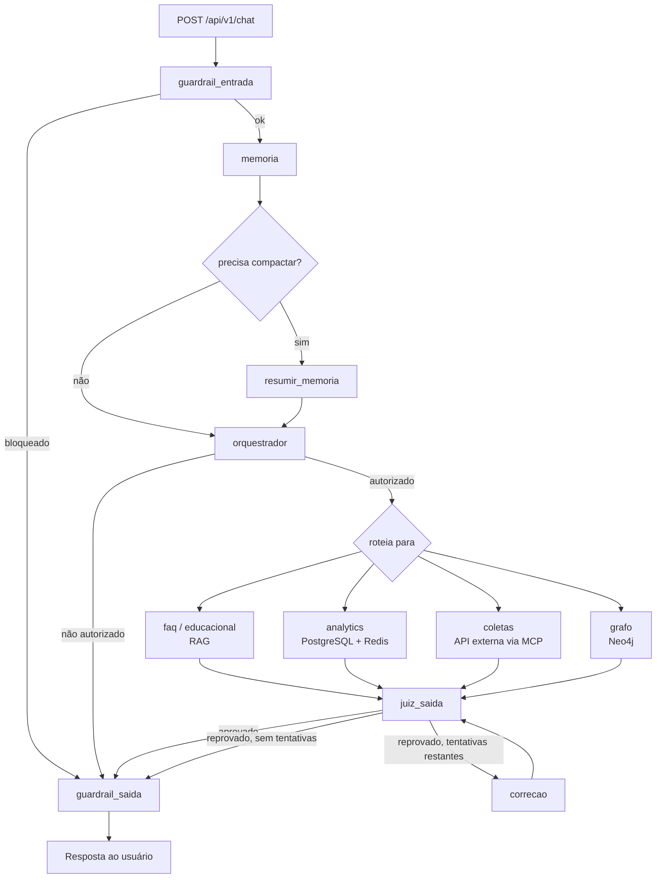

# EcoCiente IA


> API multiagente do EcoCiente: FastAPI + LangChain/LangGraph orquestrando especialistas (FAQ, educação ambiental, coletas, analytics e grafo de relacionamentos) com RAG, memória conversacional persistente, guardrails de entrada/saída e integrações MCP/A2A.

## Sobre o projeto

O EcoCiente é uma plataforma de gestão de reciclagem para condomínios que conecta moradores,
síndicos e cooperativas de coleta. Este repositório é o backend de IA: um chatbot multiagente
que responde de forma diferente conforme o perfil autenticado (`usuario_comum`,
`sindico_residencial`, `sindico_comercial`, `morador_residencial`, `usuario_comercial`,
`cooperativa`), cada um com seu próprio recorte de permissões.

Uma mensagem do usuário passa por um pipeline determinístico em grafo (LangGraph): validação
de entrada, recuperação de memória, roteamento para o especialista correto, validação de saída
por um juiz e, se reprovada, uma rodada de correção — tudo isso instrumentado com Prometheus e
exposto via FastAPI.

| Perfil | Pode acessar |
| --- | --- |
| `usuario_comum` | `faq`, `educacional` |
| `sindico_residencial` / `sindico_comercial` | `faq`, `educacional`, `analytics`, `coletas`, `grafo` |
| `morador_residencial` | `faq`, `educacional`, `analytics` (individual), `grafo` |
| `usuario_comercial` | `faq`, `educacional`, `analytics` (individual), `coletas` |
| `cooperativa` | `faq`, `coletas` |

As regras completas de autorização (perfil × ação, não só perfil × agente) estão em
`src/security/policies.py`.

### Ajustes e melhorias

O projeto está em desenvolvimento ativo. Estado atual:

- [x] Pipeline LangGraph com guardrails de entrada/saída, memória e juiz de correção
- [x] Especialistas `faq` e `educacional` via RAG (FAISS + base de conhecimento local)
- [x] Especialista `analytics` sobre PostgreSQL (somente leitura) e ranking via Redis
- [x] Especialista `coletas` integrado à API externa de calendário via MCP
- [x] Especialista `grafo` sobre Neo4j para caminhos, conexões e influência entre entidades
- [x] Memória conversacional persistida no MongoDB com compactação automática
- [x] Autorização por perfil e por ação sensível (`src/security/policies.py`)
- [x] Observabilidade via Prometheus (`/metrics`) e healthcheck agregado (`/health`)
- [x] Protocolo A2A e servidor MCP para integração com outros agentes
- [x] CI no GitHub Actions rodando a suíte `pytest`
- [ ] Endpoint `/api/v1/agents` listar o especialista `grafo` (hoje a lista está desatualizada)
- [ ] Corrigir import quebrado em `tests/test_external_integrations.py` (`CalendarEvent` não existe mais em `src/integrations/calendar/client.py`)
- [ ] Mover o `load_dotenv()` de `src/services/qdrant_service.py` para `src/core/config.py` (regra do projeto é carregar `.env` só ali; há um teste cobrindo isso)
- [ ] Popular o grafo Neo4j a partir do PostgreSQL (hoje o schema existe, mas não há pipeline de carga)
- [ ] Definir e adicionar arquivo de licença

## Pré-requisitos

Antes de começar, verifique se você tem:

- Python `3.11` ou superior
- PostgreSQL `14+`, MongoDB e Redis (podem subir via Docker)
- Neo4j `5+` (opcional — só é necessário para o especialista `grafo`; a API sobe sem ele)
- Ollama rodando localmente (provider padrão de LLM/embeddings) **ou** uma chave Groq/Gemini
- Docker e Docker Compose, se for usar os bancos em contêiner

## Instalando

Clone o repositório:

```bash
git clone https://github.com/EcoCiente-Instituto-J-F/Eko.git
cd Eko
```

Crie e ative o ambiente virtual:

Linux e macOS:

```bash
python -m venv .venv
source .venv/bin/activate
```

Windows:

```bash
python -m venv .venv
.venv\Scripts\activate
```

Instale as dependências:

```bash
pip install -r requirements.txt
```

> Para usar Groq ou Gemini como provider de LLM, instale `requirements-optional.txt` no lugar
> (ele já inclui o `requirements.txt` base).

Configure as variáveis de ambiente:

```bash
cp .env.example .env
```

No Windows: `copy .env.example .env`.

<details>
<summary>Principais variáveis do <code>.env</code></summary>

| Variável | Padrão | Descrição |
| --- | --- | --- |
| `APP_ENV` | `development` | `development`, `test` ou `production` |
| `LLM_PROVIDER` | `ollama` | `ollama`, `groq`, `gemini` ou `mock` (sem custo de API, usado nos testes) |
| `OLLAMA_BASE_URL` / `OLLAMA_MODEL` | `http://localhost:11434` / `qwen3:4b` | LLM local via Ollama |
| `POSTGRES_URL` | — | Fonte de verdade dos dados analíticos (somente leitura pelo agente) |
| `MONGODB_URI` / `MONGODB_DATABASE` | `mongodb://localhost:27017` / `ecociente` | Memória conversacional das sessões |
| `REDIS_URL` | `redis://localhost:6379/0` | Ranking em tempo real |
| `NEO4J_URI` / `NEO4J_USERNAME` / `NEO4J_PASSWORD` / `NEO4J_DATABASE` | `bolt://localhost:7687` / `neo4j` | Camada de relacionamentos consultada pelo especialista `grafo` (opcional) |
| `KNOWLEDGE_BASE_PATH` | `data/FAQ_KNOWLEDGE_BASE.md` | Base RAG dos especialistas `faq` e `educacional` |
| `CALENDAR_API_BASE_URL` | `http://localhost:9800` | API externa de coletas, consumida via MCP |
| `JUDGE_MAX_CORRECTIONS` | `1` | Quantas vezes o juiz de saída pode pedir correção antes de desistir |
| `MEMORY_MAX_MESSAGES` / `MEMORY_KEEP_RECENT_MESSAGES` | `20` / `6` | Quando e quanto da memória é compactada |

Veja `.env.example` para a lista completa (autenticação, testes de integração, A2A etc.).

</details>

Para subir a infraestrutura (Postgres, MongoDB, Redis) com Docker enquanto a API roda local:

```bash
docker compose up -d
```

> [!NOTE]
> O `docker-compose.yml` deste repositório sobe o serviço `api`; os bancos de dados (Postgres,
> MongoDB, Redis, Neo4j) precisam estar acessíveis nos endereços configurados no `.env` — ajuste
> conforme seu ambiente local.

## Usando

Com as dependências no ar e o `.env` preenchido:

```bash
python -m uvicorn src.api.main:app --reload
```

A API sobe em `http://127.0.0.1:8000`. Endpoints principais:

| Método | Rota | Descrição |
| --- | --- | --- |
| `POST` | `/api/v1/chat` | Envia uma mensagem e recebe a resposta do especialista roteado |
| `GET` | `/api/v1/agents` | Lista os especialistas disponíveis |
| `GET` | `/api/v1/sessions/{session_id}` | Consulta o estado de uma sessão de conversa |
| `GET` | `/api/v1/rankings` | Ranking de reciclagem (morador ou torres, conforme perfil) |
| `GET` | `/health` | Healthcheck agregado (LLM, Postgres, Mongo/Redis, RAG, Neo4j, calendário) |
| `GET` | `/metrics` | Métricas Prometheus |
| `GET` | `/docs` | Swagger UI (OpenAPI) |

Exemplo de chamada (em `APP_ENV=test` com `ALLOW_TEST_IDENTITY_HEADERS=true`, sem precisar de
token real):

```bash
curl -X POST http://127.0.0.1:8000/api/v1/chat \
  -H "Content-Type: application/json" \
  -H "X-Usuario-Id: 42" \
  -H "X-Perfil: sindico_residencial" \
  -H "X-Condominio-Id: 7" \
  -d '{
        "usuario_id": 42,
        "session_id": null,
        "mensagem": "Quais moradores mais influenciam a reciclagem do condomínio?"
      }'
```

Resposta (resumida):

```json
{
  "session_id": "…",
  "agent": "grafo",
  "answer": "…",
  "agents_called": ["guardrail_entrada", "memoria", "verificar_compactacao", "orquestrador", "grafo", "juiz_saida", "guardrail_saida"],
  "sources": [],
  "judge": { "aprovado": true, "motivo": "…", "necessita_correcao": false }
}
```

Em produção, o `Authorization: Bearer <token>` é obrigatório e a identidade vem da API de
autenticação (`AUTH_API_URL`) — os headers `X-*` acima só funcionam com `APP_ENV=test`.

### Docker

```bash
docker build -t ecociente-ia .
docker run --env-file .env -p 8000:8000 ecociente-ia
```

### Kubernetes

Manifests prontos em `k8s/` (namespace, ConfigMap, Secret de exemplo, Deployment e Service com
`app.kubernetes.io/name: ia-eko`).

## Como funciona

### Pipeline de uma mensagem



### Especialistas

| Agente | Fonte de dados | Quando responde |
| --- | --- | --- |
| `faq` | RAG sobre `data/FAQ_KNOWLEDGE_BASE.md` | Regras, políticas e limites do assistente |
| `educacional` | RAG sobre a mesma base + fonte externa (SINIR) | Separação de resíduos, compostagem, sustentabilidade |
| `analytics` | PostgreSQL (leitura) + Redis (ranking) | Pontos, desempenho, métricas e comparações — sempre que a resposta é um número ou série |
| `coletas` | API externa de calendário via MCP | Agendamento, recorrência e confirmação de coleta |
| `grafo` | Neo4j | Caminho, conexão ou influência entre entidades — quando a resposta é a estrutura da relação, não uma métrica |

O agente `grafo` é o mais recente: ele existe porque perguntas como *"quais moradores mais
influenciam a reciclagem do condomínio?"* não são respondidas por uma agregação SQL — elas
pedem a topologia da rede de relacionamentos (`Usuario`, `Condominio`, `Torre`, `Cooperativa`,
`Postagem`, `Material`, `Conteudo` e relações como `PERTENCE_A`, `CRIOU`, `VALIDOU`,
`DENUNCIOU`). Veja `docs/REQUISITOS_E_FLUXOS.md` para o racional completo e
`src/agents/graph_traversal/tools.py` para as queries Cypher expostas ao LLM.

### Arquitetura

- `api/` — rotas FastAPI e injeção de dependência
- `agents/` — grafo LangGraph e os especialistas (`analytics/`, `coleta/`, `graph_traversal/`)
- `prompts/` — todo o conteúdo de sistema dos agentes, fora da infraestrutura
- `services/` — casos de uso reutilizáveis (sessão, ranking, RAG, health, memória)
- `database/` — lifecycle dos clientes/pools (PostgreSQL, MongoDB, Redis, Neo4j)
- `integrations/` — MCP, A2A, autenticação e a API externa de calendário
- `security/` — autenticação, autorização por perfil/ação e guardrails determinísticos

Detalhes de decisões arquiteturais em `docs/ARQUITETURA.md`.

## Testes

```bash
pytest
```

A suíte roda em `LLM_PROVIDER=mock` por padrão (sem custo de API — respostas determinísticas
simulam cada agente). Testes de integração real (Postgres/MongoDB/Redis reais) ficam em
`tests/integration/` e exigem `RUN_INTEGRATION_TESTS=true` com `APP_ENV=test`.

## Estrutura do projeto

```
Eko/
├── src/
│   ├── api/                  # rotas, schemas, dependências FastAPI
│   ├── agents/
│   │   ├── graph.py          # StateGraph (LangGraph) — o pipeline inteiro
│   │   ├── factory.py        # constrói os agentes LangChain / modo mock
│   │   ├── analytics/        # tools PostgreSQL/Redis do especialista analytics
│   │   ├── graph_traversal/  # tools Neo4j do especialista grafo
│   │   └── coleta/           # integração MCP com a API de calendário
│   ├── prompts/               # prompts de sistema de cada agente
│   ├── services/               # sessão, ranking, RAG, memória, health
│   ├── database/               # clientes/pools: postgres, mongodb, redis, neo4j
│   ├── integrations/            # MCP, A2A, auth, calendário
│   └── security/                # autenticação, policies, guardrails
├── tests/                       # pytest (unitário + integration/)
├── docs/                         # arquitetura, requisitos e referências técnicas
├── sql/                          # schema PostgreSQL (DDL)
├── k8s/                          # manifests Kubernetes
├── scripts/pr-bot/               # geração automática de PR
├── Dockerfile
├── docker-compose.yml
├── requirements.txt
└── .env.example
```

## Colaboradores

Agradecemos às seguintes pessoas que contribuíram para este projeto:

<table>
  <tr>
    <td align="center">
      <a href="https://github.com/shinitihm" title="Perfil no GitHub">
        <br>
        <sub>
          <b>shinitihm</b>
        </sub>
      </a>
    </td>
    <td align="center">
      <a href="https://github.com/VDG419" title="Perfil no GitHub">
        <br>
        <sub>
          <b>VDG419</b>
        </sub>
      </a>
    </td>
    <td align="center">
      <a href="https://github.com/JulioCPMenezes" title="Perfil no GitHub">
        <br>
        <sub>
          <b>JulioCPMenezes</b>
        </sub>
      </a>
    </td>
  </tr>
</table>

## Contribuindo

Para contribuir com o projeto, siga estas etapas:

1. Bifurque este repositório.
2. Crie um branch: `git checkout -b <nome_branch>`.
3. Faça suas alterações e confirme-as: `git commit -m '<mensagem_commit>'`
4. Envie para o branch original: `git push origin <nome_branch>`
5. Crie a solicitação de pull.

Como alternativa, consulte a documentação do GitHub em [como criar uma solicitação pull](https://help.github.com/en/github/collaborating-with-issues-and-pull-requests/creating-a-pull-request).

## 📝 Licença

Esse projeto está sob a licença MIT. Veja o arquivo [LICENSE](LICENSE) para mais detalhes.
<div align="center">

Desenvolvido por:

 </div>
