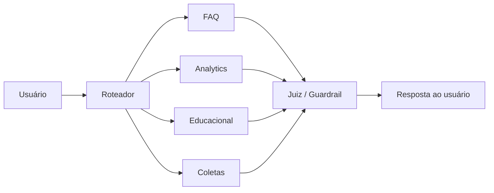
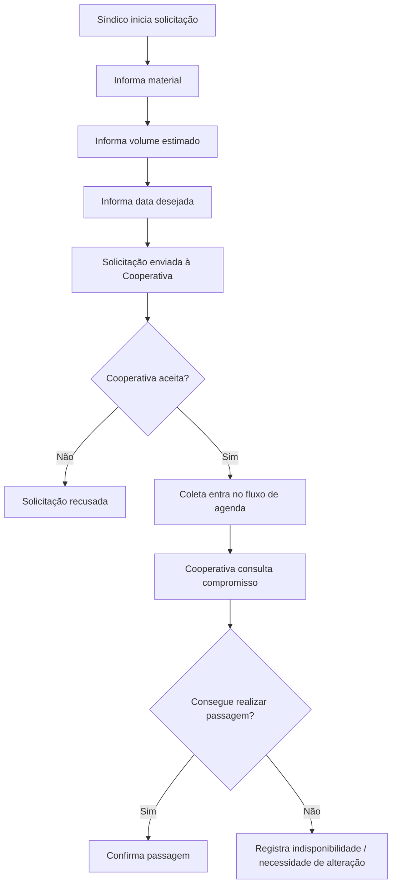
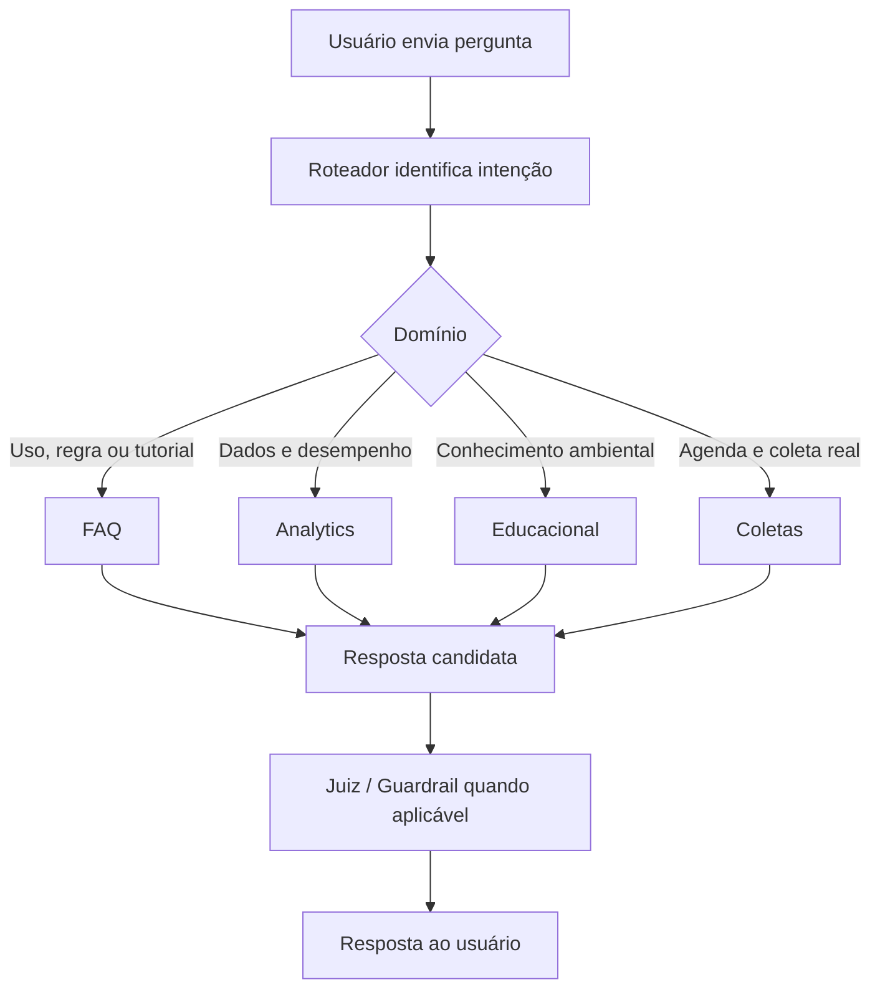
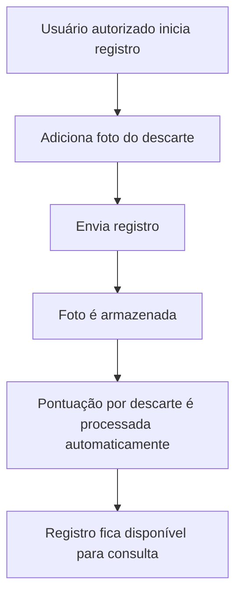
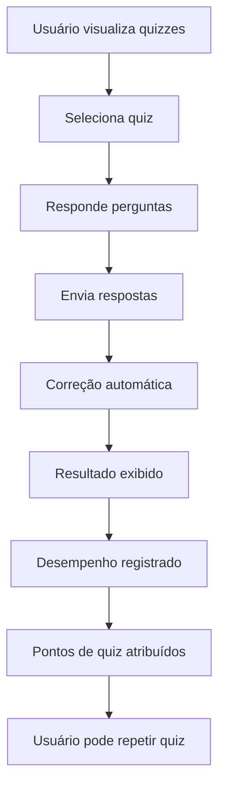

# EcoCiente — Base de Conhecimento do Agente FAQ

## 1. Sobre esta base de conhecimento

**Categoria:** governança da base FAQ  
**Agente principal:** FAQ  
**Perfis relacionados:** Todos  
**Status:** base documental consolidada; implementação do sistema deve ser confirmada separadamente  
**Palavras-chave:** EcoCiente, FAQ, RAG, documentação oficial, base de conhecimento, retrieval

Esta base de conhecimento foi estruturada para ser consumida por humanos, por um pipeline de Retrieval-Augmented Generation (RAG) e por um modelo de linguagem. Cada seção procura declarar explicitamente o sujeito, o perfil, a funcionalidade e o status da informação para reduzir ambiguidades quando um trecho for recuperado de forma isolada.

### 1.1 Finalidade da base

A Base de Conhecimento do Agente FAQ do EcoCiente deve permitir que o Agente FAQ explique, de forma documental e não inventada:

- o que é o EcoCiente;
- o propósito do aplicativo;
- os perfis de usuário;
- as permissões conhecidas de cada perfil;
- cadastro, autenticação, vínculo com condomínio e conta;
- home e navegação por perfil;
- rankings, quizzes, gamificação e pontuação;
- registro de descarte por foto;
- dashboards e Analytics;
- calendário, coletas, cooperativas e histórico;
- pontos de coleta, mapa e geolocalização;
- notificações;
- conteúdo educacional;
- arquitetura multiagente;
- diferenças entre FAQ, Analytics, Educacional e Coletas;
- arquitetura RAG do FAQ;
- responsabilidades dos bancos de dados;
- segurança, privacidade e regras de negócio;
- tutoriais funcionais;
- fluxos de operação e situações excepcionais.

### 1.2 Hierarquia de estados

Quando uma funcionalidade aparece apenas como requisito ou idealização, esta base não a apresenta como concluída. Os estados utilizados são:

- **✅ Implementado:** somente quando houver evidência explícita de implementação atual.
- **🚧 Em desenvolvimento:** quando o material declarar explicitamente que a funcionalidade ou componente está em implementação, construção ou integração no momento.
- **📋 Planejado / requisito:** quando a funcionalidade está especificada como requisito, fluxo desejado ou arquitetura prevista.
- **❓ Não confirmado:** quando os materiais não permitem confirmar estado, regra ou permissão.

### 1.3 Fontes disponíveis para esta consolidação

A consolidação utiliza os seguintes materiais fornecidos:

1. **Requisitos por disciplina — Projeto Interdisciplinar, 14/05/2026**, com exigências acadêmicas de Banco de Dados, Desenvolvimento, Inteligência Artificial, Engenharia de Software, Mobile, BI, Modelagem de Dados, Operações Ágeis e outras disciplinas.
2. **Fluxos e requisitos do EcoCiente**, contendo os seis fluxos de usuário, permissões pretendidas, arquitetura multiagente e requisitos funcionais e não funcionais.
3. **Documento de Idealização para Consumo de IA**, contendo propósito, problema, público, objetivos, proposta de valor e conceitos de negócio do EcoCiente.

> **Status:** O material denominado “documento atual do Agente FAQ”, citado nas instruções de consolidação como uma terceira fonte de conteúdo já existente, não foi disponibilizado como documento de conteúdo nesta entrega. O arquivo Markdown recebido com esse nome funcional contém as instruções para produzir esta base, não uma base FAQ anterior. Por isso, não foi possível preservar ou comparar trechos de uma versão anterior do FAQ.

### 1.4 Regra de evidência

O Agente FAQ deve tratar esta base como documentação do EcoCiente, não como fonte de dados transacionais em tempo real. Perguntas que dependam de posição atual em ranking, quantidade reciclada, próxima coleta, atraso, confirmação de passagem, desempenho real ou dados de um usuário devem ser encaminhadas ao agente ou serviço dinâmico apropriado.

---

## 2. Visão geral do EcoCiente

**Categoria:** projeto  
**Perfis relacionados:** Todos  
**Status:** visão e proposta de valor definidas na idealização; implementação completa não confirmada  
**Palavras-chave:** EcoCiente, aplicativo, reciclagem, sustentabilidade, resíduos, condomínio, cooperativa

O EcoCiente é idealizado como um aplicativo móvel de conscientização ambiental e gestão sustentável de resíduos sólidos urbanos. O EcoCiente procura conectar cidadãos, moradores, condomínios e cooperativas de reciclagem em um ecossistema digital que combina educação ambiental, orientação de descarte, gamificação, acompanhamento de desempenho e coordenação de coletas.

O EcoCiente não é descrito apenas como um repositório de conteúdo educativo. A proposta do EcoCiente é reduzir barreiras de informação e motivação, facilitar o descarte correto, aumentar o engajamento com coleta seletiva e aproximar condomínios de cooperativas.

A idealização também descreve o EcoCiente como uma solução voltada a gerar valor ambiental, social e econômico. Benefícios econômicos, percentuais de redução de custos, valorização imobiliária e enquadramentos jurídicos mencionados no documento de idealização representam **premissas e expectativas do material de negócio** e não foram validados externamente nesta base.

---

## 3. Problema que o EcoCiente resolve

**Categoria:** projeto  
**Perfis relacionados:** Todos  
**Status:** problema e justificativa definidos na idealização  
**Palavras-chave:** desinformação, reciclagem, descarte, motivação, coleta seletiva

O EcoCiente foi idealizado para enfrentar dois problemas principais:

1. **Desinformação sobre reciclagem e descarte:** usuários podem não saber separar resíduos, identificar materiais recicláveis ou localizar pontos de coleta adequados.
2. **Baixa participação na coleta seletiva:** mesmo usuários que reconhecem a importância da sustentabilidade podem não transformar intenção em hábito por falta de informação, orientação prática ou motivação contínua.

O EcoCiente busca reduzir essa distância entre conscientização e ação por meio de conteúdo educativo, pontos de coleta, gamificação, registro de descarte, rankings, dados de desempenho e integração operacional com cooperativas.

---

## 4. Objetivos do projeto

**Categoria:** projeto  
**Perfis relacionados:** Todos  
**Status:** objetivos definidos na idealização  
**Palavras-chave:** objetivo, sustentabilidade, educação, coleta seletiva, cooperativas, condomínios

### 4.1 Objetivo principal

O objetivo principal do EcoCiente é reduzir barreiras de informação e motivação que dificultam a participação da população na coleta seletiva, utilizando uma experiência tecnológica acessível, educativa e gamificada.

### 4.2 Objetivos estratégicos

O EcoCiente pretende:

- democratizar informação ambiental sobre separação, descarte e reciclagem;
- conectar cidadãos e condomínios a cooperativas e pontos de coleta;
- incentivar o descarte correto e a compostagem;
- aumentar o volume e a qualidade de materiais encaminhados para reciclagem;
- apoiar a gestão de resíduos em condomínios;
- oferecer dados de desempenho individual e agregado conforme o perfil;
- incentivar hábitos sustentáveis contínuos;
- apoiar cooperativas com maior previsibilidade, visibilidade e organização de coletas.

---

## 5. Público e atores do sistema

**Categoria:** atores  
**Perfis relacionados:** Todos  
**Status:** atores definidos; permissões detalhadas nas seções seguintes  
**Palavras-chave:** cidadão, morador, síndico, condomínio, cooperativa, usuário comercial

A visão do EcoCiente possui três grupos de negócio amplos: cidadãos/moradores, condomínios e cooperativas. Para o funcionamento do aplicativo, esses grupos foram refinados em seis fluxos de usuário:

1. Usuário Comum;
2. Morador Residencial;
3. Usuário Comercial;
4. Síndico Residencial;
5. Síndico Comercial;
6. Cooperativa.

> **Inconsistência identificada:** alguns requisitos de quiz, descarte e chatbot também citam um perfil “industrial”. O conjunto oficial de fluxos fornecido possui apenas seis perfis e não inclui “Usuário Industrial”.
>
> **Definição necessária:** decidir se “industrial” será um sétimo perfil, um subtipo de Usuário Comercial ou um termo legado a ser removido dos requisitos.

---

## 6. Perfis de usuário

### 6.1 Usuário Comum

**Categoria:** perfil  
**Perfil:** Usuário Comum  
**Status:** fluxo idealizado; implementação não confirmada  
**Palavras-chave:** usuário comum, cidadão, sem condomínio, gratuito, ensino, mapa, notificações

#### Definição

O Usuário Comum representa o cidadão que utiliza o EcoCiente sem vínculo com condomínio. O material de fluxos afirma que o Usuário Comum não paga mensalidade do aplicativo.

> **Pendente de definição:** não existem preço, plano comercial, regra de cobrança ou contrato detalhado nos materiais. A informação “não paga mensalidade” deve ser tratada apenas como característica declarada do fluxo do Usuário Comum, sem inferir preços para outros perfis.

#### Vínculo com condomínio

O Usuário Comum não está inserido em condomínio no fluxo descrito.

#### Forma de acesso

O cadastro é requisito para todos os perfis e permite escolher o perfil. O login por e-mail e senha também é requisito geral.

#### Funcionalidades disponíveis com evidência

- ensino sobre materiais recicláveis;
- mapa ou consulta de pontos de coleta;
- notificações de conta e avisos de segurança;
- mensagens motivacionais diárias, conforme a descrição do fluxo;
- visualização, realização e repetição de quizzes, conforme os requisitos de quiz;
- correção automática e exibição de resultado de quiz;
- pontuação de quiz e ranking de quiz, conforme requisitos específicos;
- envio de foto de descarte, consulta das próprias fotos e pontuação automática por descarte, conforme requisitos específicos;
- busca de conteúdo educativo;
- possibilidade de salvar conteúdo educativo, conforme requisito de baixa prioridade.

#### Funcionalidades indisponíveis ou não confirmadas

- Analytics individual: **❌ não atribuído ao Usuário Comum** no mapeamento dos agentes.
- Analytics de condomínio: **❌ não aplicável** porque o Usuário Comum não possui vínculo condominial.
- gerenciamento de coletas: **❌ não atribuído**.
- calendário condominial de coleta: **❌ não atribuído no fluxo principal**.
- ranking de moradores e ranking de torres: **⚠️ inconsistente**. A narrativa e o mapeamento de agentes não atribuem Ranking ao Usuário Comum, mas o requisito “Exibir ranking de usuários” inclui Usuário Comum.

#### Rankings

O Usuário Comum possui acesso previsto ao **Ranking de Quiz** e há um requisito genérico de **Ranking de Usuários** baseado em pontuação acumulada. O Usuário Comum não possui evidência consistente de acesso ao Ranking de Moradores ou ao Ranking de Torres.

#### Analytics

O Usuário Comum não está listado entre os perfis atendidos pelo agente Analytics.

#### Calendário

O calendário condominial de coleta não é atribuído ao Usuário Comum no fluxo principal.

#### Coletas

O Usuário Comum não gerencia agendamentos e não participa do fluxo operacional do agente Coletas.

#### Notificações

O Usuário Comum recebe notificações gerais, avisos de segurança e mensagens motivacionais. Existe requisito geral de avisos enviados pela cooperativa e lembretes de coleta para Usuário Comum, mas isso conflita com a ausência de vínculo condominial e de calendário operacional.

> **Inconsistência identificada:** o requisito de lembretes automáticos de coleta inclui Usuário Comum, embora o fluxo do Usuário Comum não possua condomínio nem calendário de coleta.
>
> **Definição necessária:** definir se o Usuário Comum recebe lembretes de pontos/coletas públicas ou se deve ser removido desse requisito.

#### Ensino

O Usuário Comum possui acesso ao conteúdo sobre materiais, busca de conteúdo e guia de compostagem. O Usuário Comum também aparece como perfil autorizado para quizzes relacionados a conteúdo educativo.

#### FAQ

O mapeamento de agentes atribui FAQ ao Usuário Comum. Entretanto, um requisito específico de “Chatbot FAQ” lista usuários residencial, comercial, industrial e síndicos, sem citar Usuário Comum.

**Permissão documental:** ⚠️ Parcial / inconsistente. O fluxo multiagente indica acesso ao FAQ; o requisito de chatbot precisa ser harmonizado.

#### Outros agentes

- FAQ: ⚠️ atribuído no mapeamento, com inconsistência em requisito específico.
- Educacional: ✅ atribuído.
- Analytics: ❌ não atribuído.
- Coletas: ❌ não atribuído.

#### Exemplos de perguntas do Usuário Comum ao FAQ

- “O Usuário Comum precisa estar vinculado a um condomínio?”
- “Como funciona o mapa de pontos de coleta?”
- “Como funcionam os quizzes?”
- “Como enviar uma foto de descarte?”
- “O Usuário Comum participa de algum ranking?”

---

### 6.2 Morador Residencial

**Categoria:** perfil  
**Perfil:** Morador Residencial  
**Status:** fluxo idealizado; implementação não confirmada  
**Palavras-chave:** morador residencial, residente, condomínio, analytics individual, ranking, ensino

#### Definição

O Morador Residencial representa o usuário que reside em condomínio residencial e possui vínculo com esse condomínio.

#### Vínculo com condomínio

O requisito de vínculo prevê que usuários residenciais informem o condomínio por meio de um código durante o cadastro.

> **Pendente de definição:** não está documentado se o vínculo precisa de aprovação do síndico, validação adicional ou expira em caso de mudança.

#### Forma de acesso

Cadastro com escolha de perfil, vínculo por código de condomínio e login com e-mail/senha são requisitos documentados.

#### Funcionalidades disponíveis com evidência

- dashboard de desempenho individual;
- Analytics individual;
- ensino sobre materiais recicláveis;
- guia de compostagem;
- busca de conteúdo e possibilidade de salvar conteúdo;
- Ranking de Moradores e Ranking de Torres, conforme descrição do fluxo;
- calendário de coleta vinculado ao condomínio;
- histórico de coletas, conforme requisito;
- quizzes e pontuação de quiz;
- registro de descarte por foto e pontuação automática por descarte;
- notificações gerais, de segurança, desempenho e coleta;
- FAQ, conforme mapeamento dos agentes.

#### Funcionalidades indisponíveis ou condicionadas

- Analytics macro do condomínio: **❌ não permitido**; o Morador Residencial possui Analytics individual.
- gerenciamento de agenda da cooperativa: **❌ não atribuído**.
- aceitar/recusar solicitações de coleta: **❌ função da Cooperativa**.
- solicitar coleta: **❓ não confirmado para Morador Residencial**; o requisito atribui solicitação ao Síndico.

#### Rankings

O Morador Residencial tem acesso previsto ao Ranking de Moradores e ao Ranking de Torres. A posição atual e os valores do ranking são dados dinâmicos e não devem ser inventados pelo FAQ.

#### Analytics

O Morador Residencial possui Analytics individual. Perguntas como “quanto eu reciclei este mês?” devem ser encaminhadas ao Analytics.

#### Calendário

O Morador Residencial possui acesso ao calendário de coleta do condomínio, conforme requisito de calendário para perfil residencial.

#### Coletas

O Morador Residencial pode consultar informações de coleta relacionadas ao condomínio, mas o fluxo operacional de agendamento e confirmação não é atribuído ao Morador Residencial.

#### Notificações

O Morador Residencial recebe avisos gerais, segurança, desempenho, lembretes de coleta e avisos enviados pela cooperativa, conforme requisitos.

#### Ensino

O Morador Residencial possui conteúdo sobre materiais, compostagem, busca, favoritos e quizzes.

#### FAQ

O Morador Residencial está explicitamente associado ao FAQ.

#### Outros agentes

- FAQ: ✅.
- Educacional: ✅.
- Analytics: ✅ individual.
- Ranking: ✅ como domínio/serviço previsto no mapeamento.
- Coletas: ❌ não atribuído ao fluxo operacional do morador.

#### Exemplos de perguntas do Morador Residencial ao FAQ

- “Qual a diferença entre meu dashboard e o dashboard do síndico?”
- “Como funciona o Ranking de Moradores?”
- “Como vejo o calendário de coleta do meu condomínio?”
- “Posso solicitar uma coleta diretamente?”
- “Como funciona a pontuação por descarte?”

---

### 6.3 Usuário Comercial

**Categoria:** perfil  
**Perfil:** Usuário Comercial  
**Status:** fluxo idealizado com inconsistências de permissão; implementação não confirmada  
**Palavras-chave:** usuário comercial, empresa, corporativo, analytics individual, calendário, ensino

#### Definição

O Usuário Comercial representa o usuário ligado ao contexto comercial e utiliza uma interface descrita como mais corporativa que a interface residencial.

#### Vínculo com condomínio

O Usuário Comercial aparentemente depende de contexto comercial/condominial para calendário e Analytics, mas a forma de vínculo não está definida de maneira consistente.

> **Pendente de definição:** o requisito de vínculo por código menciona “Residencial, Síndico” e não identifica explicitamente o Usuário Comercial. É necessário definir como o Usuário Comercial é associado a um condomínio ou empreendimento comercial.

#### Forma de acesso

Cadastro por perfil e login com e-mail/senha são requisitos gerais.

#### Funcionalidades disponíveis com evidência

- Analytics individual;
- dashboard individual;
- calendário de coleta, conforme a narrativa do fluxo;
- ensino sobre materiais;
- busca de conteúdo;
- quizzes;
- registro de descarte por foto;
- pontuação de quiz e por descarte;
- notificações e avisos;
- FAQ, conforme mapeamento dos agentes.

#### Funcionalidades indisponíveis ou condicionadas

- Analytics macro corporativo: **❌ reservado ao Síndico Comercial**.
- Ranking de Moradores e Ranking de Torres: **⚠️ não atribuído no fluxo, mas requisito genérico de ranking de usuários inclui o Usuário Comercial**.
- Coletas operacionais: **⚠️ inconsistente**. O mapeamento de agentes lista Coleta para Usuário Comercial, mas a descrição do agente Coletas afirma que usuário comum, residencial e comercial não terão acesso a esse fluxo.
- guia de compostagem: **⚠️ inconsistente**. A narrativa do Usuário Comercial inclui compostagem, mas o requisito de guia de compostagem lista apenas Residencial e Usuário Comum.

#### Rankings

Não há definição consistente de Ranking de Moradores/Torres para o Usuário Comercial. O Ranking de Quiz e o ranking genérico de usuários aparecem em requisitos que incluem Usuário Comercial.

#### Analytics

O Usuário Comercial possui Analytics individual.

#### Calendário

A narrativa do fluxo do Usuário Comercial atribui acesso ao calendário com o dia de coleta da cooperativa. O requisito consolidado de calendário usa a categoria “Residencial, Síndico”, sem esclarecer se “Residencial” exclui Comercial.

**Permissão documental:** ⚠️ acesso previsto na narrativa; harmonização do requisito necessária.

#### Coletas

Ações de criar, aceitar, recusar, confirmar ou alterar agendamentos não devem ser atribuídas ao Usuário Comercial enquanto a inconsistência do mapeamento de agentes não for resolvida.

#### Notificações

O Usuário Comercial recebe notificações gerais, segurança, desempenho e lembretes de coleta, conforme requisitos gerais.

#### Ensino

O Usuário Comercial possui ensino sobre materiais e busca de conteúdo. A disponibilidade de guia de compostagem precisa ser harmonizada.

#### FAQ

O Usuário Comercial é atendido pelo FAQ.

#### Outros agentes

- FAQ: ✅.
- Educacional: ✅.
- Analytics: ✅ individual.
- Coletas: ⚠️ inconsistente.

#### Exemplos de perguntas do Usuário Comercial ao FAQ

- “O Usuário Comercial participa de ranking?”
- “Como funciona o dashboard individual comercial?”
- “Como vejo o calendário de coleta?”
- “O Usuário Comercial pode gerenciar uma coleta?”
- “O guia de compostagem está disponível para o perfil comercial?”

---

### 6.4 Síndico Residencial

**Categoria:** perfil  
**Perfil:** Síndico Residencial  
**Status:** fluxo idealizado; implementação não confirmada  
**Palavras-chave:** síndico residencial, administrador, condomínio residencial, ranking, analytics macro, coleta

#### Definição

O Síndico Residencial representa o responsável pela gestão do condomínio residencial no EcoCiente.

#### Vínculo com condomínio

O requisito de vínculo por código inclui Síndico. O material não descreve o processo de comprovação de que a pessoa é efetivamente síndica.

> **Pendente de definição:** regra de aprovação e verificação do papel de Síndico Residencial.

#### Forma de acesso

Cadastro por perfil, vínculo com condomínio e login por e-mail/senha são requisitos.

#### Funcionalidades disponíveis com evidência

- Ranking de Moradores;
- Ranking de Torres;
- calendário de coleta;
- eventos e campanhas ambientais no calendário;
- mapa de pontos de coleta e localização de cooperativas próximas;
- notificações gerais, segurança e motivacionais;
- dashboard agregado do condomínio;
- Analytics macro do condomínio;
- ensino sobre reciclagem e compostagem;
- solicitação de coleta;
- chat síndico-cooperativa, conforme requisito;
- histórico de coletas;
- FAQ;
- acesso ao domínio Coletas, conforme mapeamento de agentes.

#### Funcionalidades indisponíveis ou condicionadas

- Analytics de outros condomínios: **❌ não autorizado por qualquer requisito fornecido**.
- aceitar ou recusar solicitação de coleta: **❌ função da Cooperativa**.
- gerenciar notificações em nome da cooperativa: **❌ função da Cooperativa**.
- pontuação e quiz como participante individual: **❓ não definido para Síndico** nos requisitos de quiz/descarte.

#### Rankings

O Síndico Residencial visualiza Ranking de Moradores e Ranking de Torres. A descrição também menciona ranking na home por apartamento/bloco. Os valores atuais são dinâmicos.

#### Analytics

O Síndico Residencial possui Analytics agregado do condomínio. Exemplos de perguntas dinâmicas incluem “qual material é mais reciclado?” e “como está a reciclagem em geral?”.

#### Calendário

O Síndico Residencial possui calendário com dias de coleta da cooperativa e requisito para adicionar eventos e campanhas ambientais.

#### Coletas

O Síndico Residencial pode abrir solicitação de coleta informando tipo de material, volume estimado e data desejada. A Cooperativa recebe a solicitação e decide aceitar ou recusar.

#### Notificações

O Síndico Residencial recebe notificações de conta, segurança, desempenho e coleta. A narrativa também menciona mensagens motivacionais.

#### Ensino

O Síndico Residencial possui área de ensino com reciclagem e compostagem na narrativa do fluxo.

#### FAQ

O Síndico Residencial é atendido pelo FAQ.

#### Outros agentes

- FAQ: ✅.
- Educacional: ✅.
- Analytics: ✅ agregado do condomínio.
- Coletas: ✅.
- Ranking: ✅.

#### Exemplos de perguntas do Síndico Residencial ao FAQ

- “Como funciona o Ranking de Torres?”
- “Quem pode solicitar uma coleta?”
- “Como o condomínio avalia a cooperativa?”
- “Qual a diferença entre Analytics individual e Analytics do síndico?”
- “Como funciona uma coleta recorrente?”

---

### 6.5 Síndico Comercial

**Categoria:** perfil  
**Perfil:** Síndico Comercial  
**Status:** fluxo idealizado; implementação não confirmada  
**Palavras-chave:** síndico comercial, gestor comercial, corporativo, analytics macro, calendário, coleta

#### Definição

O Síndico Comercial representa o responsável pela gestão de um condomínio ou empreendimento comercial. A interface prevista é mais corporativa e algumas funções residenciais foram retiradas.

#### Vínculo com condomínio

O requisito de vínculo por código inclui Síndico, mas não descreve diferenças de vínculo entre síndico residencial e comercial.

#### Forma de acesso

Cadastro por perfil, vínculo e login por e-mail/senha são requisitos.

#### Funcionalidades disponíveis com evidência

- calendário de coleta;
- mapa de pontos de coleta/cooperativas, conforme narrativa;
- notificações de conta e segurança;
- dashboard agregado;
- Analytics macro corporativo;
- ensino sobre reciclagem e compostagem, conforme narrativa;
- solicitação de coleta, considerando o requisito atribuído a “Síndico”;
- chat síndico-cooperativa;
- histórico de coletas, considerando o requisito atribuído a “Síndico”;
- FAQ;
- agente Coletas.

#### Funcionalidades indisponíveis ou condicionadas

- Ranking de Moradores: **❌ não atribuído na narrativa do Síndico Comercial**.
- Ranking de Torres: **❌ não atribuído na narrativa do Síndico Comercial**.
- Analytics individual: **❌ o perfil usa visão macro corporativa**.

#### Rankings

O fluxo comercial retira funcionalidades do contexto residencial e não atribui Ranking de Moradores ou Ranking de Torres ao Síndico Comercial.

#### Analytics

O Síndico Comercial possui Analytics macro corporativo.

#### Calendário

O Síndico Comercial possui acesso ao calendário com dias de coleta.

#### Coletas

O Síndico Comercial participa do domínio Coletas conforme o mapeamento e, por ser perfil de Síndico, está abrangido pelo requisito de solicitação de coleta.

#### Notificações

O Síndico Comercial recebe notificações de conta e segurança. Outros tipos gerais podem existir por requisito de notificações para todos, mas mensagens motivacionais não são explicitadas nesse fluxo.

#### Ensino

A narrativa inclui ensino sobre materiais e compostagem para o Síndico Comercial.

#### FAQ

O Síndico Comercial é atendido pelo FAQ.

#### Outros agentes

- FAQ: ✅.
- Educacional: ✅.
- Analytics: ✅ macro corporativo.
- Coletas: ✅.
- Ranking residencial: ❌.

#### Exemplos de perguntas do Síndico Comercial ao FAQ

- “O Síndico Comercial participa do ranking residencial?”
- “Como funciona o Analytics macro corporativo?”
- “Como solicitar uma coleta?”
- “Como funciona o calendário comercial?”
- “Quais notificações o Síndico Comercial recebe?”

---

### 6.6 Cooperativa

**Categoria:** perfil  
**Perfil:** Cooperativa  
**Status:** fluxo operacional detalhado na idealização; implementação não confirmada  
**Palavras-chave:** cooperativa, coleta, agendamento, recorrente, avulsa, confirmação, condomínio

#### Definição

A Cooperativa representa a organização de reciclagem responsável por atender condomínios, organizar agendas, receber solicitações e participar da operação de coleta.

#### Vínculo com condomínio

A Cooperativa pode visualizar condomínios atendidos e selecionar condomínios em operações de agenda. O mecanismo formal de criação do vínculo cooperativa-condomínio não está definido.

#### Forma de acesso

A Cooperativa é um perfil selecionável no cadastro e utiliza login por e-mail/senha. O material não define processo de validação cadastral da organização.

#### Funcionalidades disponíveis com evidência

- calendário consolidado de coletas agendadas;
- visualizar condomínios atendidos;
- visualizar solicitações pendentes;
- aceitar ou recusar solicitação de coleta;
- criar compromisso recorrente selecionando condomínio e dia da semana;
- criar coleta avulsa;
- confirmar se conseguirá realizar passagem;
- visualizar localização e dados de contato do condomínio associados ao compromisso;
- visualizar compromissos agendados e confirmados;
- alterar dia de compromisso;
- gerenciar calendário de coleta;
- criar, editar, excluir e enviar notificações aos usuários;
- configurar lembretes automáticos;
- receber lembretes de compromissos;
- histórico de coletas;
- chat com síndico/condomínios, conforme requisitos;
- FAQ;
- agente Coletas.

#### Funcionalidades indisponíveis ou condicionadas

- Analytics individual: **❌ não atribuído**.
- Analytics de condomínio como agente analítico: **❌ não atribuído**.
- Ranking de Moradores/Torres: **❌ não atribuído**.
- conteúdo educacional: **❌ não atribuído no mapeamento de agentes**.

#### Rankings

A Cooperativa não possui acesso previsto aos rankings residenciais.

#### Analytics

A Cooperativa não aparece entre os perfis atendidos pelo agente Analytics.

#### Calendário

A Cooperativa possui calendário consolidado e capacidade de cadastrar, atualizar e remover datas de coleta como requisito funcional.

#### Coletas

O domínio Coletas é central para a Cooperativa. A Cooperativa pode administrar compromissos recorrentes e avulsos, responder solicitações e confirmar passagem.

#### Notificações

A Cooperativa pode gerenciar notificações e lembretes para usuários. A Cooperativa também recebe lembretes de seus próprios compromissos no fluxo descrito.

#### Ensino

Não há acesso educacional atribuído à Cooperativa nos materiais de fluxo.

#### FAQ

O mapeamento de agentes atribui FAQ à Cooperativa. Um requisito geral de chatbot também inclui Cooperativa, embora o requisito específico “Chatbot FAQ” não a cite. A permissão de FAQ para Cooperativa é sustentada pelo mapeamento de agentes.

#### Outros agentes

- FAQ: ✅.
- Coletas: ✅.
- Educacional: ❌ não atribuído.
- Analytics: ❌ não atribuído.

#### Exemplos de perguntas da Cooperativa ao FAQ

- “Como funciona uma coleta recorrente?”
- “Como funciona uma coleta avulsa?”
- “Como aceitar ou recusar uma solicitação?”
- “Como alterar o dia de uma coleta?”
- “Quais dados do condomínio aparecem ao abrir um compromisso?”

---

## 7. Matriz de permissões

**Categoria:** autorização funcional  
**Perfis relacionados:** Todos  
**Status:** consolidado a partir dos fluxos e requisitos; inconsistências preservadas como ⚠️  
**Palavras-chave:** permissão, acesso, perfil, matriz, autorização

Legenda: **✅ Permitido** | **❌ Não permitido** | **⚠️ Parcial / condicionado / inconsistente** | **❓ Não definido**

| Funcionalidade | Usuário Comum | Morador Residencial | Usuário Comercial | Síndico Residencial | Síndico Comercial | Cooperativa |
|---|---:|---:|---:|---:|---:|---:|
| Cadastro e login | ✅ | ✅ | ✅ | ✅ | ✅ | ✅ |
| Editar perfil | ✅ | ✅ | ✅ | ✅ | ✅ | ✅ |
| Excluir conta | ✅ | ✅ | ✅ | ✅ | ✅ | ✅ |
| FAQ | ⚠️ | ✅ | ✅ | ✅ | ✅ | ✅ |
| Educacional | ✅ | ✅ | ✅ | ✅ | ✅ | ❌ |
| Analytics individual | ❌ | ✅ | ✅ | ❌ | ❌ | ❌ |
| Analytics agregado do condomínio | ❌ | ❌ | ❌ | ✅ | ✅ | ❌ |
| Ranking de Moradores | ⚠️ | ✅ | ⚠️ | ✅ | ❌ | ❌ |
| Ranking de Torres | ❌ | ✅ | ❌ | ✅ | ❌ | ❌ |
| Ranking de Quiz | ✅ | ✅ | ✅ | ❓ | ❓ | ❌ |
| Ranking genérico por pontuação | ⚠️ | ⚠️ | ⚠️ | ❓ | ❓ | ❌ |
| Calendário de coleta | ❌ | ✅ | ⚠️ | ✅ | ✅ | ✅ |
| Criar evento/campanha no calendário | ❌ | ❌ | ❌ | ✅ | ✅ | ❌ |
| Solicitar coleta | ❌ | ❓ | ❓ | ✅ | ✅ | ❌ |
| Aceitar/recusar solicitação | ❌ | ❌ | ❌ | ❌ | ❌ | ✅ |
| Criar coleta recorrente | ❌ | ❌ | ⚠️ | ⚠️ | ⚠️ | ✅ |
| Criar coleta avulsa | ❌ | ❌ | ⚠️ | ⚠️ | ⚠️ | ✅ |
| Confirmar passagem da cooperativa | ❌ | ❌ | ❌ | ❌ | ❌ | ✅ |
| Alterar agenda da cooperativa | ❌ | ❌ | ❌ | ❌ | ❌ | ✅ |
| Histórico de coletas | ❌ | ✅ | ❓ | ⚠️ | ⚠️ | ✅ |
| Pontos de coleta / mapa informativo | ✅ | ❓ | ❓ | ✅ | ✅ | ❓ |
| Localizar cooperativas próximas | ❌ | ❌ | ❌ | ✅ | ⚠️ | ❌ |
| Notificações gerais | ✅ | ✅ | ✅ | ✅ | ✅ | ✅ |
| Avisos da cooperativa | ✅ | ✅ | ✅ | ⚠️ | ⚠️ | ⚠️ |
| Gerenciar notificações | ❌ | ❌ | ❌ | ❌ | ❌ | ✅ |
| Gerenciar lembretes | ❌ | ❌ | ❌ | ❌ | ❌ | ✅ |
| Quizzes | ✅ | ✅ | ✅ | ❓ | ❓ | ❌ |
| Enviar foto de descarte | ✅ | ✅ | ✅ | ❓ | ❓ | ❌ |
| Avaliar cooperativa | ❌ | ⚠️ | ⚠️ | ⚠️ | ⚠️ | ❌ |
| Chat síndico-cooperativa | ❌ | ❌ | ❌ | ✅ | ✅ | ✅ |

### 7.1 Observações críticas da matriz

1. **Usuário Comum e ranking:** há conflito entre o fluxo que não atribui Ranking ao Usuário Comum e o requisito de ranking genérico que inclui Usuário Comum.
2. **Usuário Comercial e Coletas:** o mapeamento de agentes inclui Coletas, mas a descrição do agente Coletas exclui usuários comum, residencial e comercial do fluxo operacional.
3. **FAQ do Usuário Comum:** o mapeamento atribui FAQ ao Usuário Comum, mas um requisito específico de chatbot FAQ não cita esse perfil.
4. **Avaliação condomínio → cooperativa:** o requisito usa perfis “Residencial, Comercial”, mas a ação é descrita como do condomínio. Não está definido se a avaliação é feita por qualquer usuário vinculado ou somente pelo responsável/síndico.
5. **Síndico e quiz/descarte:** os requisitos de quiz e descarte não citam Síndicos, portanto a participação pessoal desses perfis não deve ser presumida.

---

## 8. Cadastro, autenticação e conta

**Categoria:** conta  
**Perfis relacionados:** Todos  
**Status:** 📋 requisitos funcionais e não funcionais; implementação não confirmada  
**Palavras-chave:** cadastro, login, senha, e-mail, perfil, condomínio, código, logout, excluir conta

### 8.1 Cadastro

O sistema deve permitir que o usuário escolha um perfil no cadastro. Os materiais citam Comum, Residencial/Comercial, Síndico e Cooperativa. Os seis fluxos detalhados separam Residencial/Comercial e Síndico Residencial/Síndico Comercial.

> **Pendente de definição:** a tela ou processo exato para distinguir Síndico Residencial de Síndico Comercial e Morador Residencial de Usuário Comercial não foi documentado.

### 8.2 Login e autenticação

O login por e-mail e senha é requisito para todos os perfis. O sistema deve exigir autenticação para funcionalidades restritas.

> **Pendente de definição:** token, sessão, MFA, política de senha, confirmação de e-mail, bloqueio por tentativas e mecanismo de recuperação de senha não foram definidos nos materiais.

### 8.3 Vínculo com condomínio

O requisito funcional de vínculo determina que perfil residencial e Síndico informem o condomínio por meio de um código no cadastro.

> **Pendente de definição:** formato do código, validade, aprovação, revogação e processo para Usuário Comercial.

### 8.4 Perfil editável

Todos os perfis possuem requisito de edição de nome, e-mail, senha e foto de perfil, além de logout.

A disciplina de Desenvolvimento de Aplicativos Móveis também lista configuração de avatar como item extra acadêmico. Isso significa que **o requisito funcional de foto de perfil existe na especificação do EcoCiente**, mas o mecanismo mobile de avatar é uma exigência adicional cuja implementação deve ser confirmada.

### 8.5 Exclusão de conta

O requisito define a possibilidade de apagar o perfil e todos os dados do usuário.

> **Pendente de definição:** regras de retenção legal, anonimização, dados de auditoria, dados agregados, registros de coleta, mensagens e fotos após exclusão. O FAQ não deve prometer exclusão física irrestrita de todos os registros até que a política de dados esteja definida.

### 8.6 Redefinição de senha

O FAQ pode explicar que senha é um dado editável do perfil e que autenticação usa e-mail/senha. Entretanto, o fluxo específico de “esqueci minha senha” não está descrito.

> **Status:** Não definido no material fornecido.

### 8.7 Configurações da conta e do aplicativo

Os materiais confirmam apenas algumas operações que podem compor a área de configurações: edição de nome, e-mail, senha e foto de perfil, logout e exclusão de conta. Notificações são previstas, mas não foi definida uma tela de preferências em que o usuário possa ativar ou desativar categorias de aviso.

> **Status:** Não definido no material fornecido quanto a uma tela única de “Configurações”, opções de tema, idioma, privacidade, preferências de push ou outras preferências do aplicativo.

O Agente FAQ não deve inventar opções de configuração não documentadas.

---

## 9. Home e navegação por perfil

**Categoria:** interface  
**Perfis relacionados:** Todos  
**Status:** 📋 home personalizada é requisito; layout e nomes de botões não confirmados  
**Palavras-chave:** home, início, atalhos, navegação, interface, corporativa

O EcoCiente deve possuir Home personalizada por perfil, com atalhos e conteúdos relevantes. A documentação não define nomes exatos de botões, posição dos componentes ou menus definitivos.

### 9.1 Usuário Comum

A Home do Usuário Comum deve priorizar ensino, pontos de coleta e notificações. Quizzes e registro de descarte são requisitos adicionais aplicáveis ao perfil.

### 9.2 Morador Residencial

A Home do Morador Residencial deve refletir acesso a Analytics individual, ranking, calendário, ensino, notificações e demais funções residenciais.

### 9.3 Usuário Comercial

A Home do Usuário Comercial é descrita como mais corporativa, com Analytics individual, calendário, ensino e notificações. Ranking e Coletas possuem inconsistências documentais.

### 9.4 Síndico Residencial

A Home do Síndico Residencial deve contemplar ranking por apartamento/bloco, calendário, Analytics macro, mapa, notificações, ensino e operações de coleta.

### 9.5 Síndico Comercial

A Home do Síndico Comercial é descrita como corporativa, sem rankings residenciais, e com calendário, mapa, Analytics macro, ensino, notificações e coleta.

### 9.6 Cooperativa

A Home da Cooperativa possui requisito de calendário consolidado de todas as coletas agendadas e acesso às operações de condomínios, solicitações, compromissos e notificações.

---

## 10. Rankings

**Categoria:** gamificação  
**Perfis relacionados:** variável por ranking  
**Status:** 📋 regras funcionais definidas parcialmente; valores dinâmicos não pertencem ao FAQ  
**Palavras-chave:** ranking, classificação, posição, moradores, torres, quiz, leaderboard, pontos

Os materiais descrevem pelo menos três conceitos diferentes de ranking. Esses rankings não devem ser tratados como uma única lista.

### 10.1 Ranking de Moradores

O Ranking de Moradores é um ranking residencial associado ao desempenho dos moradores/apartamentos.

- **Visualização prevista:** Síndico Residencial e Morador Residencial.
- **Participação prevista:** moradores residenciais, mas a unidade exata pode aparecer como morador, apartamento ou bloco em diferentes trechos.
- **Periodicidade:** ciclo de 7 dias.
- **Reinicialização:** requisito determina reinicialização a cada 7 dias.
- **Origem da pontuação:** há mecanismos de pontos por quiz e pontos por descarte, mas o material não define formalmente quais eventos alimentam especificamente o Ranking de Moradores.

> **Pendente de definição:** fórmula, unidade classificada (morador versus apartamento), regra de empate, horário/timezone da reinicialização e fontes de pontos consideradas.

### 10.2 Ranking de Torres

O Ranking de Torres compara torres/blocos do contexto residencial.

- **Visualização prevista:** Síndico Residencial e Morador Residencial.
- **Participação prevista:** torres/blocos do condomínio residencial.
- **Periodicidade:** ciclo de 30 dias.
- **Reinicialização:** requisito determina reinicialização a cada 30 dias.
- **Origem da pontuação:** não detalhada de forma conclusiva.

> **Pendente de definição:** agregação da pontuação, critérios de empate, início do ciclo e tratamento de moradores que mudam de torre.

### 10.3 Ranking de Quiz

O Ranking de Quiz é baseado na pontuação obtida em quizzes e é separado dos rankings residenciais.

- **Perfis previstos:** Usuário Comum, Morador Residencial e Usuário Comercial; o requisito também cita “industrial”.
- **Síndicos e Cooperativa:** não definidos como participantes.
- **Periodicidade:** não definida.
- **Reinicialização:** não definida.

### 10.4 Ranking genérico de usuários por pontuação acumulada

Existe requisito de “Exibir ranking de usuários” baseado em pontuação acumulada e de “Consultar posição no ranking”. Esse requisito inclui Usuário Comum, Residencial, Comercial e industrial.

> **Inconsistência identificada:** esse ranking genérico pode se sobrepor ao Ranking de Moradores e ao Ranking de Quiz, mas os materiais não esclarecem se é um quarto ranking, uma visão do ranking por descarte ou um requisito antigo.
>
> **Definição necessária:** nomear e delimitar cada ranking e sua fonte de pontuação.

### 10.5 FAQ versus dado dinâmico de ranking

- “Como funciona o Ranking de Torres?” → **FAQ**.
- “Quando o Ranking de Moradores reinicia?” → **FAQ**.
- “Qual é minha posição agora?” → **Analytics/serviço de ranking**.
- “Quem está em primeiro lugar?” → **Analytics/serviço de ranking**.

---

## 11. Gamificação e pontuação

**Categoria:** gamificação  
**Perfis relacionados:** Usuário Comum, Morador Residencial, Usuário Comercial; outros não definidos  
**Status:** 📋 mecanismos previstos; fórmula e ledger de pontos não definidos  
**Palavras-chave:** pontos, gamificação, quiz, descarte, pontuação, recompensa

O EcoCiente possui ao menos dois mecanismos de pontuação documentados:

1. **Pontos de Quiz:** concedidos conforme o desempenho do usuário em um quiz.
2. **Pontos por Descarte:** concedidos automaticamente quando o usuário registra um descarte, sem etapa de validação manual segundo o requisito funcional.

Os dois mecanismos não devem ser tratados como equivalentes. O material não define se os pontos são somados em um saldo único ou mantidos em sistemas separados.

> **Pendente de definição:** fórmula de pontuação de quiz, quantidade de pontos por descarte, limites por período, regras antifraude, relação entre cada tipo de ponto e cada ranking.

---

## 12. Quizzes

**Categoria:** educação e gamificação  
**Perfis relacionados:** Usuário Comum, Morador Residencial, Usuário Comercial; “industrial” citado como inconsistência  
**Status:** 📋 requisitos funcionais definidos; implementação não confirmada  
**Palavras-chave:** quiz, perguntas, respostas, resultado, repetir quiz, pontuação

O módulo de quizzes deve permitir:

- visualizar quizzes disponíveis por conteúdo educativo;
- responder perguntas;
- corrigir automaticamente as respostas;
- exibir o resultado ao final;
- registrar o desempenho por quiz;
- atribuir pontos conforme o desempenho;
- repetir um quiz concluído;
- exibir um ranking baseado em pontuação de quiz.

O requisito não funcional estabelece que o resultado do quiz deve ser apresentado em até 2 segundos após a submissão.

> **Status:** o valor de 2 segundos é uma meta/requisito de desempenho, não evidência de desempenho medido.

> **Pendente de definição:** número de tentativas, banco de questões, regra para pontuar repetição, melhor tentativa versus última tentativa, duração do quiz e conteúdo exato das perguntas.

---

## 13. Registro de descarte

**Categoria:** descarte e gamificação  
**Perfis relacionados:** Usuário Comum, Morador Residencial, Usuário Comercial; “industrial” citado como inconsistência  
**Status:** 📋 requisito funcional; implementação não confirmada  
**Palavras-chave:** descarte, foto, comprovante, imagem, pontos, upload, nuvem

### 13.1 Envio de foto

O sistema deve permitir o envio de fotos comprovando o descarte de materiais recicláveis.

### 13.2 Armazenamento

O sistema deve armazenar as fotos enviadas. O requisito não funcional determina armazenamento em serviço de nuvem, disponibilidade para consulta e escalabilidade para grande volume de imagens.

> **Pendente de definição:** provedor de armazenamento em nuvem, política de retenção, tamanho máximo, formatos aceitos, compressão e controle de acesso às imagens.

### 13.3 Consulta das fotos

O usuário deve poder visualizar as próprias fotos cadastradas.

### 13.4 Pontuação associada ao descarte

O requisito determina atribuição automática de pontos a cada descarte registrado.

### 13.5 Validação manual

O requisito afirma explicitamente que a pontuação por descarte ocorre **sem etapa de validação manual**.

> **Pendente de definição:** mecanismos automáticos de validação, prevenção de duplicidade, fraude ou imagem inválida não estão documentados. A ausência de validação manual não significa ausência de qualquer validação automática.

### 13.6 Uso de câmera

A disciplina de Desenvolvimento de Aplicativos Móveis exige uso de algum recurso de hardware, como câmera, telefone ou SMS. O requisito de foto torna a câmera uma possibilidade coerente, mas o material não confirma que a implementação obrigatoriamente captura a foto diretamente da câmera; o sistema pode também permitir seleção de arquivo.

---

## 14. Dashboard

**Categoria:** dados e visualização  
**Perfis relacionados:** Morador Residencial, Usuário Comercial, Síndico Residencial, Síndico Comercial  
**Status:** 📋 requisito funcional e acadêmico de BI; implementação não confirmada  
**Palavras-chave:** dashboard, gráficos, KPI, desempenho, resíduos, indicadores

O Dashboard do EcoCiente é a área de visualização de desempenho. O requisito funcional define gráficos e indicadores de volume de resíduos descartados por tipo.

### 14.1 Dashboard individual

O Dashboard individual é destinado a Morador Residencial e Usuário Comercial. A visão deve apresentar dados do próprio usuário, não dados privados de outros usuários.

### 14.2 Dashboard agregado do condomínio

O Dashboard agregado é destinado a Síndico Residencial e Síndico Comercial. O Síndico Residencial possui visão macro do condomínio residencial; o Síndico Comercial possui visão macro corporativa.

### 14.3 Requisitos acadêmicos de BI

A disciplina de Business Intelligence exige dashboard conectado à fonte de dados gerada pela aplicação, com visualizações como barras, linhas, cards de KPI, histogramas, boxplots, mapas quando aplicável e filtros interativos.

Esses elementos representam **requisitos acadêmicos para a solução analítica**, não prova de que todas essas visualizações já existem no aplicativo final.

### 14.4 FAQ versus dado dinâmico de dashboard

- “O que o dashboard mostra?” → **FAQ**.
- “Qual é meu volume reciclado hoje?” → **Analytics**.
- “Qual material lidera no meu condomínio?” → **Analytics**.

---

## 15. Analytics

**Categoria:** agente e dados  
**Perfis relacionados:** Morador Residencial, Usuário Comercial, Síndico Residencial, Síndico Comercial  
**Status:** 📋 arquitetura e escopo definidos; implementação completa não confirmada  
**Palavras-chave:** analytics, dados, desempenho, insights, individual, macro, condomínio

O agente Analytics é responsável por responder perguntas que dependem de dados estruturados e de desempenho real. O Analytics deve analisar dados de reciclagem, gerar insights personalizados e comparar usuários, torres e períodos quando o perfil permitir.

### 15.1 Escopos por perfil

- **Morador Residencial:** Analytics individual.
- **Usuário Comercial:** Analytics individual.
- **Síndico Residencial:** Analytics macro do condomínio residencial.
- **Síndico Comercial:** Analytics macro corporativo.
- **Usuário Comum:** não atribuído.
- **Cooperativa:** não atribuído.

### 15.2 Fontes previstas do Analytics

A idealização técnica cita:

- PostgreSQL para dados estruturados;
- views de BI;
- Redis para ranking em tempo real;
- MongoDB para histórico conversacional e enriquecimento de contexto.

### 15.3 Limite do FAQ

O FAQ explica o que o Analytics faz, quem pode usar e qual o escopo. O FAQ não deve fabricar resultados analíticos.

---

## 16. Calendário

**Categoria:** coletas  
**Perfis relacionados:** Morador Residencial, Usuário Comercial, Síndicos, Cooperativa  
**Status:** 📋 requisito funcional; acesso comercial possui inconsistência parcial  
**Palavras-chave:** calendário, coleta, data, agenda, dia de coleta, eventos

### 16.1 Calendário do condomínio

O calendário deve apresentar os dias de coleta da cooperativa parceira vinculada ao condomínio.

- Morador Residencial: ✅ acesso previsto.
- Síndico Residencial: ✅ acesso previsto.
- Síndico Comercial: ✅ acesso previsto na narrativa.
- Usuário Comercial: ⚠️ acesso previsto na narrativa, mas precisa ser harmonizado com o requisito consolidado.
- Usuário Comum: ❌ não possui calendário condominial no fluxo principal.

### 16.2 Eventos e campanhas ambientais

Existe requisito para Síndico adicionar eventos e campanhas ambientais ao calendário.

> **Pendente de definição:** se a função vale para ambos os tipos de síndico, regras de edição, visibilidade e notificações associadas.

### 16.3 Calendário da Cooperativa

A Cooperativa deve visualizar calendário consolidado de todas as coletas agendadas e possui requisito de cadastrar, atualizar e remover datas de coleta.

### 16.4 Informação dinâmica

“Como funciona o calendário?” é FAQ. “Qual é minha próxima coleta?” depende de agenda real e deve ser encaminhada ao agente Coletas.

---

## 17. Coletas e agendamentos

**Categoria:** coletas  
**Perfis relacionados:** Síndicos e Cooperativa; consulta condicionada para usuários vinculados  
**Status:** 📋 fluxos funcionais definidos; implementação não confirmada  
**Palavras-chave:** coleta, agendamento, recorrente, avulsa, solicitação, aceitar, recusar, confirmar

### 17.1 Solicitação de coleta

O Síndico pode abrir uma solicitação de coleta informando:

- tipo de material;
- volume estimado;
- data desejada.

A Cooperativa recebe a solicitação e pode aceitar ou recusar.

> **Pendente de definição:** estados intermediários, prazo de resposta, motivo de recusa, edição após envio e regras para conflito de agenda.

### 17.2 Coleta recorrente

A Cooperativa pode selecionar um condomínio, selecionar um dia da semana e marcar o compromisso como recorrente.

> **Pendente de definição:** frequência além de “dia da semana”, data inicial/final, feriados, suspensão temporária e regra de recorrência.

### 17.3 Coleta avulsa

A Cooperativa pode criar um compromisso sem marcar recorrência, caracterizando coleta avulsa.

### 17.4 Confirmação de passagem

A Cooperativa possui fluxo para indicar se realmente conseguirá passar no condomínio na data prevista.

Ao abrir o compromisso, a Cooperativa pode visualizar localização do condomínio e formas de contato citadas como e-mail e telefone.

### 17.5 Alteração da coleta

A Cooperativa pode visualizar os compromissos agendados e confirmados e alterar o dia do compromisso. Também existe requisito de atualizar datas de coleta.

### 17.6 Cancelamento

O requisito de gerenciamento do calendário permite remover datas de coleta, mas não existe um fluxo detalhado de cancelamento com estado, motivo e aviso aos afetados.

> **Status:** Não definido no material fornecido em nível de processo de negócio.

### 17.7 Condomínios atendidos

A Cooperativa deve visualizar lista de condomínios atendidos com dados de volume e histórico.

### 17.8 Solicitações pendentes

A Cooperativa deve visualizar solicitações de coleta feitas por condomínios e decidir aceitar ou recusar.

### 17.9 Lembretes e notificações

A Cooperativa pode configurar lembretes automáticos e gerenciar notificações. Usuários vinculados podem receber lembretes e avisos, conforme seus perfis e a definição final das permissões.

### 17.10 Avaliação condomínio → cooperativa

Existe requisito para o condomínio avaliar a ida/não ida da cooperativa com nota de até 5 estrelas.

> **Pendente de definição:** quem exatamente pode avaliar, quando a avaliação é liberada, se existe comentário, se é uma avaliação por visita e como tratar ausência da cooperativa.

### 17.11 Responsabilidades da Cooperativa

A Cooperativa é responsável por organizar agenda, responder solicitações, confirmar passagem, manter compromissos, consultar dados de contato associados ao atendimento e gerenciar notificações/lembretes operacionais.

### 17.12 Responsabilidades do Síndico

O Síndico solicita coleta, acompanha calendário, interage com a cooperativa e pode participar da avaliação do serviço quando a regra de autorização for definida.

### 17.13 Como funciona versus informação dinâmica

O FAQ explica processos de coleta. O agente Coletas deve responder sobre agenda real, confirmação atual, atrasos, alterações e passagem da cooperativa.

### 17.14 Histórico de coletas

O requisito funcional de Histórico prevê registro de coletas realizadas com **data, tipo de material e volume**. Os perfis explicitamente associados ao requisito são Residencial, Síndico e Cooperativa.

- Morador Residencial: possui evidência de acesso pelo termo “Residencial”.
- Síndicos: possuem evidência pelo termo “Síndico”, mas o requisito não separa residencial e comercial.
- Cooperativa: possui acesso previsto.
- Usuário Comercial: não é citado explicitamente no requisito de Histórico.
- Usuário Comum: não é citado.

O FAQ pode explicar o conceito e os dados gerais previstos no histórico. Perguntas sobre registros concretos de uma conta ou condomínio dependem da fonte dinâmica apropriada.

> **Pendente de definição:** filtros, paginação, período máximo, possibilidade de exportação e regras exatas de acesso por subtipo residencial/comercial.

---

## 18. Cooperativas

**Categoria:** ator operacional  
**Perfis relacionados:** Cooperativa, Síndicos, usuários vinculados  
**Status:** papel de negócio definido; implementação não confirmada  
**Palavras-chave:** cooperativa, reciclagem, parceiro, condomínio, coleta, agenda

No EcoCiente, cooperativas são organizações parceiras que realizam coleta, triagem e encaminhamento de materiais recicláveis. A proposta de valor do projeto busca ampliar visibilidade, previsibilidade e acesso das cooperativas a novos parceiros.

O perfil Cooperativa concentra funções operacionais, enquanto usuários e síndicos veem informações relacionadas ao seu contexto.

### 18.1 Comunicação

Existem requisitos de chat direto entre Síndico e Cooperativa e chat Cooperativa-condomínios iniciado pela Cooperativa.

> **Pendente de definição:** tecnologia de chat, histórico, moderação, anexos, notificações, retenção e regras de privacidade.

---

## 19. Pontos de coleta e geolocalização

**Categoria:** mapa  
**Perfis relacionados:** Usuário Comum, Síndicos; demais parcialmente definidos  
**Status:** 📋 funcionalidade planejada; GPS é requisito extra acadêmico e implementação não confirmada  
**Palavras-chave:** mapa, ponto de coleta, geolocalização, GPS, cooperativa próxima

### 19.1 Finalidade

O mapa serve para facilitar a localização de pontos de coleta seletiva e cooperativas próximas, reduzindo a barreira de não saber onde descartar materiais.

### 19.2 Usuário Comum

O Usuário Comum possui acesso explícito ao mapa de pontos de coleta.

### 19.3 Síndicos

A narrativa atribui mapa ao Síndico Residencial e ao Síndico Comercial. Existe requisito específico para localizar cooperativas próximas à localização do condomínio, atribuído a Síndico.

### 19.4 Morador Residencial e Usuário Comercial

A idealização geral fala em conexão de moradores a pontos de coleta, mas o fluxo detalhado não atribui explicitamente mapa a esses dois perfis.

**Status:** ❓ Não definido de forma consistente.

### 19.5 GPS

A disciplina Mobile lista uso do GPS como item extra. O documento de idealização descreve geolocalização como uso de GPS para indicar pontos próximos.

> **Status:** requisito/idealização; implementação e permissões do dispositivo precisam ser confirmadas.

### 19.6 Mapa informativo versus dado operacional

- mapa de pontos próximos: função informativa;
- localização de um condomínio associada a um compromisso: dado operacional do fluxo de Coletas;
- situação atual de uma coleta: não deve ser inferida pelo mapa.

---

## 20. Notificações

**Categoria:** comunicação  
**Perfis relacionados:** Todos  
**Status:** 📋 requisito funcional; push é requisito não funcional; implementação não confirmada  
**Palavras-chave:** notificação, push, aviso, segurança, motivacional, lembrete, cooperativa

Os materiais citam vários tipos de notificação que devem permanecer diferenciados:

### 20.1 Notificações de conta

Avisos relacionados à conta do usuário.

### 20.2 Segurança

Avisos de segurança são mencionados para Usuário Comum, Síndico Residencial e Síndico Comercial, além do requisito geral de notificações.

### 20.3 Mensagens motivacionais

Mensagens motivacionais diárias são descritas para Usuário Comum e Síndico Residencial. A Cooperativa também possui mensagens motivacionais ligadas a compromissos no fluxo descrito.

### 20.4 Avisos da Cooperativa

Existe requisito para usuários comum, residencial e comercial visualizarem avisos enviados pela Cooperativa.

### 20.5 Lembretes de coleta

Existe requisito para lembretes automáticos de datas de coleta a Usuário Comum, Residencial e Comercial.

> **Inconsistência identificada:** o Usuário Comum não possui vínculo condominial no fluxo principal, portanto a origem do lembrete de coleta para esse perfil não está definida.

### 20.6 Notificações gerenciadas pela Cooperativa

A Cooperativa deve conseguir criar, editar, excluir e enviar notificações e configurar lembretes automáticos.

### 20.7 Push notifications

O sistema deve suportar notificações push em dispositivos móveis.

> **Pendente de definição:** serviço de push, consentimento, preferências do usuário, categorias opt-in/opt-out e tratamento quando notificações do sistema operacional estiverem desativadas.

---

## 21. Conteúdo educacional

**Categoria:** educação  
**Perfis relacionados:** Usuário Comum, Morador Residencial, Usuário Comercial, Síndicos; Cooperativa não atribuída  
**Status:** 📋 conteúdo e agente Educacional previstos; fontes externas do agente a confirmar  
**Palavras-chave:** ensino, reciclagem, materiais, compostagem, artigos, vídeos, educacional

O EcoCiente possui área educacional destinada a orientar sobre materiais recicláveis, descarte correto e compostagem.

### 21.1 Ensino sobre materiais

O requisito prevê textos educativos sobre tipos de resíduos e descarte correto para Usuário Comum, Residencial e Comercial. As narrativas de Síndico Residencial e Síndico Comercial também incluem uma área de ensino.

### 21.2 Guia de compostagem

O requisito funcional de guia de compostagem cita Morador Residencial e Usuário Comum. As narrativas também atribuem compostagem a Síndicos e Usuário Comercial.

> **Inconsistência identificada:** escopo de perfis do guia de compostagem precisa ser harmonizado.

### 21.3 Busca de conteúdo

Usuário Comum, Residencial e Comercial possuem requisito de busca por palavra-chave em artigos e vídeos educativos.

### 21.4 Salvar conteúdo

Usuário Comum e Residencial possuem requisito de favoritar artigos e vídeos.

### 21.5 Limite entre FAQ e Educacional

O FAQ explica onde fica a área educacional, quem tem acesso e como usar as funções. Perguntas ambientais aprofundadas devem ser encaminhadas ao agente Educacional.

Exemplos:

- “Como acesso o guia de compostagem?” → FAQ.
- “Como fazer compostagem em apartamento?” → Educacional.
- “PET é reciclável?” → Educacional.


## 22. Arquitetura multiagente

**Categoria:** IA  
**Perfis relacionados:** Todos  
**Status:** 📋 arquitetura prevista; implementação completa não confirmada  
**Palavras-chave:** multiagente, roteador, FAQ, Analytics, Educacional, Coletas, Juiz, LangGraph

O EcoCiente utiliza uma arquitetura multiagente orientada por domínio. Os agentes previstos são:

1. Roteador;
2. FAQ;
3. Analytics;
4. Educacional;
5. Coletas;
6. Juiz.

O requisito acadêmico de Inteligência Artificial exige pelo menos cinco agentes, LangChain para criação dos agentes, LangGraph para orquestração, sessões por usuário, memória de longo prazo, RAG, agente de juiz, guardrail, MCP, A2A e observabilidade. Os seis agentes do EcoCiente atendem ao número mínimo previsto, mas a implementação de cada item deve ser confirmada em código e infraestrutura.

### 22.1 Fluxo conceitual



O diagrama é conceitual. O material não define se o Juiz avalia obrigatoriamente toda resposta ou somente respostas selecionadas.

### 22.2 Tabela de agentes

| Agente | Responsabilidade principal | Fontes previstas | Perguntas típicas |
|---|---|---|---|
| Roteador | identificar intenção e selecionar agente | pergunta do usuário, contexto de sessão e regras de roteamento | “qual agente deve responder?” |
| FAQ | explicar EcoCiente, funcionalidades, perfis, regras, políticas e tutoriais | documentação local indexada por RAG | “como funciona o calendário?” |
| Analytics | responder perguntas baseadas em dados estruturados e desempenho | PostgreSQL, views de BI, Redis e eventualmente MongoDB para contexto | “quanto eu reciclei este mês?” |
| Educacional | responder conteúdo ambiental e de conscientização | base RAG educacional com cursos e fontes ambientais previstas | “PET pode ser reciclado?” |
| Coletas | responder e operar informações dinâmicas de agenda e coleta | calendário, agendamentos, mapa operacional e notificações | “a cooperativa passa amanhã?” |
| Juiz | reduzir alucinação e verificar aderência a regras/contexto | resposta candidata, contexto recuperado e regras de guardrail | validação interna, não uma intenção de negócio do usuário |

### 22.3 Arquitetura de IA — requisitos acadêmicos

Os requisitos acadêmicos da disciplina de Inteligência Artificial estabelecem uma camada de IA com os seguintes elementos mínimos. Estes elementos devem ser documentados como **requisitos do projeto** até que evidência técnica confirme a implementação:

| Elemento | Exigência / papel | Estado documental |
|---|---|---|
| API de IA | desenvolver API usando **FastAPI ou Flask** | 📋 requisito; framework final não definido |
| Modelo generativo | utilizar um modelo de IA generativa; o documento acadêmico cita provedores/modelos apenas como exemplos | ❓ escolha final não definida |
| Multiagentes | pelo menos cinco agentes | 📋 requisito; EcoCiente idealiza seis papéis |
| LangChain | criação/integração dos agentes | 📋 requisito; implementação a confirmar |
| LangGraph | orquestração do fluxo multiagente | 📋 requisito; implementação a confirmar |
| Sessões por usuário | manter separação e continuidade por usuário | 📋 requisito; estratégia técnica não definida |
| Memória de longo prazo | persistir contexto além da interação imediata | 📋 requisito; MongoDB é associado a esse papel nos fluxos |
| RAG | fundamentar ao menos um agente com fonte externa/local | 📋 requisito; FAQ foi idealizado como agente RAG documental |
| Agente Juiz | controlar alucinações | 📋 requisito; critérios detalhados não definidos |
| Guardrail | impor limites e verificações de segurança/qualidade | 📋 requisito; implementação não definida |
| MCP | integração entre sistemas/agentes externos | 📋 requisito; integração concreta não definida |
| A2A | integração/comunicação entre agentes | 📋 requisito; contrato concreto não definido |
| Observabilidade/SRE | medir custo, latência, erros, ROI e custo por resolução | 📋 requisito; ferramenta e metas não definidas |
| Arquitetura de alto nível | apresentar desenho da solução | 📋 requisito; esta base contém visão conceitual, não comprovação de infraestrutura implantada |

A observabilidade exigida academicamente deve considerar, no mínimo, cenários de **100 e 1000 usuários semanais**, latência entre agentes, tempo total de resposta, índice de erros, custo/retorno e custo por resolução. Esta base não inventa valores para essas métricas.

> **Pendente de definição:** framework final entre FastAPI e Flask, modelo generativo, integrações MCP/A2A concretas, estratégia de sessões, critérios do Juiz, implementação dos guardrails e stack de observabilidade.

---

## 23. Agente Roteador

**Categoria:** IA  
**Agente:** Roteador  
**Status:** 📋 previsto  
**Palavras-chave:** roteamento, intenção, agente, classificação, encaminhamento

O Agente Roteador deve interpretar a intenção da pergunta e encaminhá-la ao agente especializado adequado.

### 23.1 Exemplos de roteamento

- “Qual material foi mais reciclado este mês?” → Analytics.
- “Como funciona o calendário de coleta?” → FAQ.
- “PET pode ser reciclado?” → Educacional.
- “Quando a cooperativa passa no meu condomínio?” → Coletas.
- “O que é o agente Analytics?” → FAQ.

### 23.2 Regras de roteamento

O Roteador deve considerar pelo menos:

- natureza estática/documental versus dinâmica da pergunta;
- perfil do usuário;
- necessidade de consultar dados pessoais ou agregados;
- domínio ambiental, funcional ou operacional;
- permissão do perfil para acessar o agente ou dado solicitado.

> **Pendente de definição:** classificador, modelo, prompts, thresholds, fallback e política de múltiplas intenções.

---

## 24. Agente FAQ

**Categoria:** IA  
**Agente:** FAQ  
**Status:** 📋 agente RAG previsto; base atual preparada para ingestão  
**Palavras-chave:** FAQ, RAG, documentação, funcionalidades, permissões, tutorial

O Agente FAQ é responsável por perguntas institucionais e funcionais sobre o EcoCiente. O FAQ utiliza recuperação sobre documentação local para responder com base no conteúdo oficial.

### 24.1 O que o FAQ deve responder

O FAQ deve explicar:

- o que é o EcoCiente;
- quem pode usar cada função;
- diferenças entre perfis;
- cadastro, login e vínculo;
- como funciona ranking, quiz e pontuação;
- como funciona dashboard e calendário;
- como funciona uma solicitação de coleta;
- como funciona coleta recorrente ou avulsa;
- o que a Cooperativa consegue fazer;
- notificações e mapa;
- diferenças entre agentes;
- políticas e limitações documentadas;
- tutoriais funcionais.

### 24.2 O que o FAQ não deve responder sozinho

O FAQ não deve inventar:

- posição atual no ranking;
- volume reciclado;
- próxima coleta real;
- atraso ou confirmação atual;
- desempenho de outro usuário;
- conteúdo ambiental aprofundado quando a consulta pertence ao Educacional;
- funcionalidade não documentada.

---

## 25. Agente Analytics

**Categoria:** IA  
**Agente:** Analytics  
**Status:** 📋 escopo previsto; fontes técnicas parcialmente definidas  
**Palavras-chave:** Analytics, dados, KPI, comparação, desempenho, PostgreSQL, Redis, BI

O Analytics deve responder perguntas fundamentadas em dados reais do EcoCiente.

### 25.1 Responsabilidades

- analisar dados de reciclagem;
- gerar insights personalizados;
- responder perguntas analíticas;
- comparar períodos;
- comparar moradores ou torres quando autorizado;
- trabalhar em nível individual ou agregado conforme o perfil.

### 25.2 Escopo de acesso

- Morador Residencial: individual.
- Usuário Comercial: individual.
- Síndico Residencial: agregado do condomínio.
- Síndico Comercial: agregado corporativo.

### 25.3 Fontes previstas

- PostgreSQL: dados estruturados;
- views de BI: dados analíticos;
- Redis: ranking em tempo real;
- MongoDB: histórico conversacional/contexto, conforme a idealização técnica.

---

## 26. Agente Educacional

**Categoria:** IA  
**Agente:** Educacional  
**Status:** 📋 agente RAG previsto; corpus externo ainda precisa ser formalizado  
**Palavras-chave:** educacional, reciclagem, compostagem, materiais, MMA, SINIR, RAG

O Agente Educacional é especializado em ensino ambiental e conscientização.

### 26.1 Responsabilidades

- explicar materiais recicláveis;
- orientar separação de resíduos;
- orientar sobre compostagem;
- fornecer dicas sustentáveis;
- adaptar explicações ao nível do usuário.

### 26.2 Fontes citadas na idealização

A idealização sugere cursos, MMA, SINIR, cartilhas ambientais, materiais educativos, normas de reciclagem e conteúdo de compostagem.

> **Pendente de definição:** lista oficial de documentos, URLs, versões, política de atualização e critérios de confiabilidade das fontes educacionais.

### 26.3 Limite do FAQ

O FAQ explica o funcionamento da área educacional. O conteúdo técnico ambiental aprofundado pertence ao Educacional.

---

## 27. Agente Coletas

**Categoria:** IA  
**Agente:** Coletas  
**Status:** 📋 agente operacional previsto; integração dinâmica não confirmada  
**Palavras-chave:** Coletas, agenda, calendário, cooperativa, confirmação, atraso, recorrente, avulsa

O Agente Coletas é especializado em informações operacionais e dinâmicas relacionadas à relação entre cooperativas e condomínios.

### 27.1 Responsabilidades

- consultar calendário real;
- consultar agendamentos;
- informar confirmação de passagem;
- gerenciar ou apoiar agendamentos recorrentes e avulsos conforme perfil;
- informar mudanças e atrasos;
- consultar localização e contatos operacionais quando autorizado;
- utilizar notificações relacionadas à coleta.

### 27.2 Conflito de acesso do Usuário Comercial

O mapeamento de agentes inclui Coleta para Usuário Comercial, mas a descrição textual do Agente Coletas afirma que usuário comum, residencial e comercial não possuem acesso ao fluxo operacional.

> **Definição necessária:** separar “consultar informação de coleta” de “operar coleta”. Uma possível futura definição deve esclarecer se o Usuário Comercial pode apenas consultar seu calendário ou também interagir com o agente Coletas. Esta base não escolhe uma regra sem evidência.

---

## 28. Agente Juiz

**Categoria:** IA  
**Agente:** Juiz  
**Status:** 📋 requisito acadêmico obrigatório; comportamento detalhado não definido  
**Palavras-chave:** juiz, guardrail, alucinação, validação, segurança

O Agente Juiz é previsto para controle de alucinações e verificação da qualidade da resposta gerada.

### 28.1 Objetivos do Juiz

O Juiz pode, conceitualmente:

- verificar se a resposta está fundamentada no contexto recuperado;
- impedir afirmações sem evidência;
- detectar tentativa de responder dados fora do escopo;
- aplicar regras de segurança e de perfil;
- solicitar fallback quando não houver evidência suficiente.

> **Pendente de definição:** critérios, prompt, mecanismo de aprovação/reprovação, execução em todas as respostas ou amostragem e comportamento de retry.

---

## 29. Matriz de roteamento das perguntas

**Categoria:** roteamento  
**Perfis relacionados:** Todos  
**Status:** regra conceitual consolidada  
**Palavras-chave:** FAQ, Analytics, Educacional, Coletas, intenção, dinâmica

| Tipo de pergunta | Exemplo | Agente principal | Motivo |
|---|---|---|---|
| explicação de funcionalidade | “Como funciona o ranking?” | FAQ | resposta documental |
| dado atual de ranking | “Qual é minha posição?” | Analytics / serviço de ranking | exige dado atual |
| explicação de calendário | “Como funciona o calendário?” | FAQ | regra funcional |
| agenda real | “Qual é minha próxima coleta?” | Coletas | exige calendário operacional |
| definição de dashboard | “O que é o dashboard?” | FAQ | documentação |
| métrica real | “Quanto plástico meu condomínio reciclou?” | Analytics | dado estruturado |
| acesso/permissão | “Usuário comum usa Analytics?” | FAQ | política documental |
| material reciclável | “PET é reciclável?” | Educacional | conhecimento ambiental |
| compostagem | “Como fazer compostagem?” | Educacional | conhecimento ambiental |
| funcionamento de coleta recorrente | “O que é coleta recorrente?” | FAQ | processo estático |
| confirmação atual | “A cooperativa confirmou a passagem?” | Coletas | estado operacional |
| arquitetura do chatbot | “Qual a diferença entre FAQ e Analytics?” | FAQ | documentação do sistema |

### 29.1 Regra principal FAQ x dado dinâmico

Se a resposta puder mudar porque depende de data, usuário, condomínio, volume, agenda, posição ou estado transacional, o FAQ não deve tratar a documentação estática como fonte suficiente.

---

## 30. Arquitetura RAG do FAQ

**Categoria:** RAG  
**Agente:** FAQ  
**Status:** 📋 arquitetura conceitual; tecnologias de embedding e vector store não definidas  
**Palavras-chave:** RAG, embedding, chunk, retrieval, vector store, contexto, LangChain

### 30.1 Fonte de conhecimento

O Agente FAQ utiliza documentação local do EcoCiente. Esta Base de Conhecimento foi estruturada para ser uma das fontes centrais do corpus documental.

### 30.2 Pipeline de ingestão

Fluxo conceitual:

```text
Documento Markdown
→ carregamento
→ extração/normalização
→ chunking
→ geração de embeddings
→ indexação
→ vector store
```

O pipeline deve preservar contexto suficiente em cada chunk para identificar perfil, funcionalidade, status e regra.

> **Pendente de definição:** biblioteca de loader, estratégia de normalização, tamanho de chunk, overlap, modelo de embeddings, tecnologia de vector store e política de reindexação.

### 30.3 Pipeline da pergunta

```text
Usuário
→ Roteador
→ FAQ
→ representação/embedding da consulta
→ recuperação de chunks relevantes
→ construção do contexto
→ geração da resposta
→ Juiz/Guardrail quando aplicável
→ resposta
```

### 30.4 Retrieval

O retrieval deve procurar semanticamente trechos relevantes da documentação. Conceitos esperados:

- busca semântica;
- similaridade entre consulta e chunks;
- recuperação Top-K;
- metadados de categoria, perfil, agente, status e funcionalidade;
- filtros quando necessários;
- possibilidade de reranking, se adotado futuramente.

> **Pendente de definição:** valor de Top-K, métrica de similaridade, score mínimo e estratégia de reranking.

### 30.5 Generation

A geração deve utilizar prioritariamente o contexto recuperado. Quando houver contradição marcada na base, o modelo deve preservar a incerteza em vez de escolher silenciosamente uma regra.

### 30.6 Falta de informação

Quando não houver evidência suficiente, a resposta padrão do FAQ deve ser semanticamente equivalente a:

> “Não encontrei essa informação na documentação oficial do EcoCiente.”

Quando a pergunta pertencer a outro domínio, o Roteador deve encaminhar para o agente adequado.

### 30.7 Controle de alucinação

O FAQ deve:

- priorizar informações recuperadas da base;
- não completar lacunas com conhecimento geral como se fosse regra oficial;
- não converter requisito em funcionalidade implementada;
- não inventar permissões;
- sinalizar inconsistências e pendências;
- respeitar o perfil do usuário.

### 30.8 Metadados recomendados para chunks

A estrutura desta base permite metadados como:

- `categoria`;
- `subcategoria`;
- `perfil`;
- `funcionalidade`;
- `agente`;
- `nivel_acesso`;
- `status`;
- `palavras_chave`;
- `fonte_documental`;
- `versao_documental`.

Os nomes acima são **sugestões de metadados documentais**, não campos de banco ou contrato de API.

### 30.9 Rastreabilidade da resposta

A arquitetura do RAG deve permitir, quando a implementação suportar, relacionar uma resposta aos trechos documentais utilizados. A rastreabilidade é importante para auditoria, depuração, avaliação do RAG e atualização da base.

Elementos conceitualmente úteis:

- documento de origem;
- seção ou identificador lógico do conteúdo;
- chunk recuperado;
- metadados do chunk;
- score de recuperação, quando exposto internamente;
- versão da base de conhecimento.

> **Pendente de definição:** esquema de identificadores de chunks, política de versionamento, persistência dos logs de recuperação e se a fonte será exibida ao usuário final.

---

## 31. Fontes de conhecimento do FAQ

**Categoria:** RAG  
**Agente:** FAQ  
**Status:** corpus inicial definido pelos documentos fornecidos  
**Palavras-chave:** fonte, documento, ingestão, atualização, rastreabilidade

### 31.1 Fonte funcional

O arquivo de fluxos e requisitos define perfis, acessos, requisitos e agentes.

### 31.2 Fonte institucional e de negócio

O documento de idealização define visão, problema, objetivos, público, proposta de valor e conceitos de negócio.

### 31.3 Fonte acadêmica e técnica

O PDF de requisitos por disciplina define tecnologias e entregas acadêmicas obrigatórias ou extras.

### 31.4 Atualização da base

Novas decisões de produto devem atualizar a documentação antes da reindexação. Uma mudança de permissão, periodicidade, agente ou tecnologia não deve ser tratada somente em prompt; deve ser registrada na fonte oficial e reingerida no RAG.

> **Pendente de definição:** processo de versionamento da base, aprovação de alterações, data de vigência e automação de reindexação.

---

## 32. Memória e persistência

**Categoria:** arquitetura  
**Status:** requisitos acadêmicos e idealização técnica parcialmente definidos  
**Palavras-chave:** memória, sessão, MongoDB, persistência, Redis, Firebase, SQLite

### 32.1 Sessões por usuário

A disciplina de Inteligência Artificial exige controle de sessões por usuário.

> **Status:** requisito do projeto / implementação a confirmar.

### 32.2 Memória de longo prazo

A disciplina de Inteligência Artificial exige memória de longo prazo. A idealização técnica afirma que MongoDB está sendo usado como memória de longo prazo do chatbot e para enriquecer análises.

**Classificação:** 📋 arquitetura declarada / requisito; implementação técnica não verificada nesta base.

### 32.3 Persistência mobile

A disciplina de Desenvolvimento de Aplicativos Móveis exige persistência de dados por Firebase ou SQLite, com livre escolha.

> **Pendente de definição:** qual das duas tecnologias foi escolhida e quais dados ficam nessa persistência.

### 32.4 Não confundir memória conversacional com RAG

- memória conversacional: contexto/histórico associado à interação do usuário;
- RAG: recuperação de conhecimento documental externo ao contexto imediato;
- PostgreSQL: dados estruturados de domínio;
- Redis: estruturas de fila e/ou ranking em tempo real conforme requisito.

---

## 33. Bancos de dados e responsabilidades

**Categoria:** arquitetura de dados  
**Status:** requisitos acadêmicos confirmados; desenho de uso do EcoCiente parcialmente definido  
**Palavras-chave:** PostgreSQL, Redis, MongoDB, BI, RPA, vector store

### 33.1 PostgreSQL

O projeto possui requisitos acadêmicos claros para uso de PostgreSQL em diferentes disciplinas. Desenvolvimento 2 exige API REST em Java/Spring MVC com Spring Data JPA para acesso a PostgreSQL. Modelagem de Dados exige banco relacional normalizado e camada analítica. O Analytics é idealizado para consultar dados estruturados em PostgreSQL e views de BI.

> **Status:** requisito do projeto; existência e conteúdo de schema devem ser validados em artefato de banco específico, não inferidos por esta base FAQ.

### 33.2 Redis

Banco de Dados 2 exige uso de Redis para fila de processamento e/ou ranking em tempo real. O documento de fluxo define Redis para Ranking de Moradores e Torres e cita Redis Sorted Set (ZSET).

**Classificação:** 📋 arquitetura declarada / requisito; implementação operacional não confirmada.

### 33.3 MongoDB

Banco de Dados 2 exige MongoDB em alguma interação conversacional. O documento de fluxo declara MongoDB como memória de longo prazo do chatbot e fonte eventual de contexto para Analytics.

**Classificação:** 📋 arquitetura declarada / requisito; implementação operacional não confirmada.

### 33.4 Vector Store do RAG

> **Pendente de definição:** tecnologia utilizada para armazenamento e busca dos embeddings do RAG FAQ.

Esta base não assume Chroma, FAISS, Pinecone, Qdrant, Weaviate ou qualquer tecnologia específica.

### 33.5 Banco do 1º ano e banco do 2º ano

O requisito acadêmico de Banco de Dados 1 informa que o banco do 2º ano é independente e que cada série consome o banco que criou. A comunicação entre bancos deve ocorrer via RPA como requisito da disciplina de Modelagem de Dados.

> **Status:** requisito acadêmico de integração; topologia efetiva em produção não confirmada.

### 33.6 Camada de BI e Data Mart

Modelagem de Dados exige views analíticas para BI, com modelagem dimensional, CTEs e Window Functions. Business Intelligence exige dashboard conectado à base da aplicação e prevê, como extra, pipeline de dados no Databricks.

> **Status:** requisito acadêmico / implementação a confirmar.

### 33.7 Camadas tecnológicas exigidas por disciplinas

A documentação acadêmica distribui responsabilidades entre várias camadas. A existência de um requisito em uma disciplina não significa que a respectiva tecnologia já esteja integrada ao produto final.

| Camada | Requisitos acadêmicos relevantes | Estado nesta base |
|---|---|---|
| Aplicativo móvel | controle de acesso; uso de recurso de hardware; consumo de API; persistência via Firebase ou SQLite; chatbot operacional; GPS e notificações como extras | 📋 requisito / escolhas finais parcialmente pendentes |
| API de negócio | Java, Spring MVC, Spring Data JPA, PostgreSQL, CRUD, validação e tratamento centralizado de exceções | 📋 requisito / implementação a confirmar |
| Segurança de API | Spring Security aparece como requisito extra | 📋 requisito extra / implementação a confirmar |
| Front-end web dinâmico | Vite + React + TypeScript, organização em componentes/páginas/serviços, rotas, acessibilidade e feedback assíncrono | 📋 requisito / implementação a confirmar |
| Banco relacional e modelagem | PostgreSQL, normalização, PK/FK, objetos lógicos, auditoria, otimização e views analíticas | 📋 requisito / artefatos específicos devem comprovar execução |
| Banco NoSQL/conversacional | MongoDB obrigatório em interação conversacional; Redis obrigatório para fila e/ou ranking | 📋 requisito / implementação a confirmar |
| BI | dashboard conectado aos dados da aplicação; visualizações e KPIs; pipeline Databricks como extra | 📋 requisito / implementação a confirmar |
| IA | FastAPI ou Flask, LangChain, LangGraph, multiagentes, memória, RAG, Juiz, guardrails, MCP, A2A e observabilidade | 📋 requisito / implementação a confirmar |
| DevOps | revisão de código/PR, infraestrutura em nuvem, container e orquestração; CI/CD como extra | 📋 requisito / provedores e ferramentas finais não definidos nesta base |
| Integração entre bancos | comunicação via RPA entre os bancos das séries | 📋 requisito acadêmico / especificação operacional não fornecida |

> **Pendente de definição:** quais opções alternativas foram escolhidas de fato, quais componentes já estão integrados e quais ambientes constituem desenvolvimento, homologação e produção.

---

## 34. Segurança e controle de acesso

**Categoria:** segurança  
**Perfis relacionados:** Todos  
**Status:** 📋 requisitos conceituais definidos; implementação específica não confirmada  
**Palavras-chave:** segurança, autenticação, autorização, acesso, endpoint, senha, perfil

### 34.1 Autenticação

O sistema deve exigir autenticação para funcionalidades restritas. O login é definido por e-mail e senha.

### 34.2 Autorização

O EcoCiente possui controle de acesso por perfil. A autorização deve impedir que um perfil consulte ou opere funcionalidades reservadas a outro perfil.

### 34.3 Proteção de endpoints

Desenvolvimento 2 lista Spring Security como item extra para autenticação e autorização de endpoints. O requisito funcional geral de segurança, entretanto, exige proteção das funcionalidades restritas independentemente da tecnologia final.

> **Status:** Spring Security é requisito extra acadêmico, não implementação confirmada.

### 34.4 Isolamento de dados

- Morador Residencial deve acessar dados individuais próprios.
- Usuário Comercial deve acessar dados individuais próprios.
- Síndicos podem acessar dados agregados no escopo do condomínio/empreendimento autorizado.
- Usuário Comum não possui Analytics.
- Cooperativa acessa dados operacionais necessários para condomínios atendidos, sem autorização documentada para Analytics de usuários.

### 34.5 Credenciais

Credenciais, segredos, chaves de API e configurações sensíveis não devem ser expostos pelo FAQ. A disciplina de Sistemas Operacionais exige variáveis de ambiente para bancos e APIs externas.

---

## 35. Privacidade e LGPD

**Categoria:** privacidade  
**Perfis relacionados:** Todos  
**Status:** preocupação obrigatória nos requisitos; política detalhada não fornecida  
**Palavras-chave:** LGPD, privacidade, dados pessoais, exclusão, consentimento, retenção

O projeto utiliza ou poderá utilizar dados pessoais, incluindo informações de conta, vínculo com condomínio, dados de contato e imagens de descarte. Os requisitos exigem tratamento seguro e confidencial e reflexão explícita sobre LGPD.

### 35.1 Princípios documentais mínimos

O EcoCiente deve:

- limitar acesso a dados conforme perfil;
- proteger credenciais e dados pessoais;
- evitar exposição de dados de outros usuários;
- definir finalidade de uso das informações;
- documentar retenção e exclusão;
- tratar localização e imagens com controles apropriados;
- informar quando um dado é utilizado para Analytics ou personalização.

### 35.2 Exclusão de conta e LGPD

O requisito funcional prevê exclusão da conta e de todos os dados. A política de retenção ainda não está definida e pode exigir tratamento diferenciado para auditoria, segurança e obrigações legais.

> **Pendente de definição:** política de privacidade, base legal, consentimento, retenção, compartilhamento, direitos do titular, canal de atendimento e encarregado quando aplicável.

---

## 36. Regras de negócio

**Categoria:** regras de negócio  
**Status:** consolidação das regras explicitamente fornecidas  
**Palavras-chave:** regra, ranking, coleta, perfil, pontuação, quiz, descarte

### 36.1 Regras de perfil

1. O Usuário Comum não possui vínculo com condomínio no fluxo principal.
2. Morador Residencial possui Analytics individual.
3. Usuário Comercial possui Analytics individual.
4. Síndico Residencial possui Analytics agregado do condomínio.
5. Síndico Comercial possui Analytics macro corporativo.
6. Cooperativa possui fluxo operacional de coletas.

### 36.2 Regras de ranking

1. Ranking de Moradores reinicia a cada 7 dias.
2. Ranking de Torres reinicia a cada 30 dias.
3. Ranking de Quiz é separado dos rankings residenciais.
4. Posição atual no ranking é dado dinâmico e não deve vir exclusivamente do FAQ.

### 36.3 Regras de quiz

1. Usuário pode visualizar e realizar quizzes quando o perfil estiver autorizado.
2. Correção é automática.
3. Resultado deve ser exibido ao final.
4. Desempenho deve ser registrado.
5. O usuário pode repetir quiz.
6. Existe pontuação e ranking de quiz.

### 36.4 Regras de descarte

1. O usuário autorizado pode enviar foto de descarte.
2. O usuário pode consultar as próprias fotos.
3. O descarte gera pontuação automaticamente.
4. O requisito não prevê validação manual antes da atribuição de pontos.
5. As imagens devem ser armazenadas em nuvem segundo requisito não funcional.

### 36.5 Regras de coleta

1. Síndico pode abrir solicitação informando material, volume estimado e data desejada.
2. Cooperativa pode aceitar ou recusar solicitação.
3. Cooperativa pode criar compromisso recorrente ou avulso.
4. Cooperativa pode confirmar passagem.
5. Cooperativa pode alterar o dia do compromisso.
6. Cooperativa pode consultar localização e contato do condomínio associado ao compromisso.
7. Cooperativa pode gerenciar notificações e lembretes.

### 36.6 Regras de resposta dos agentes

1. FAQ responde documentação estática.
2. Analytics responde dados e desempenho real.
3. Educacional responde conhecimento ambiental.
4. Coletas responde agenda e estado operacional.
5. Roteador seleciona o agente.
6. Juiz/Guardrail reduz respostas não fundamentadas.


## 37. Tutoriais

**Categoria:** tutorial  
**Status:** processos em nível funcional; nomes de telas e botões não inventados  
**Palavras-chave:** tutorial, como fazer, passo a passo, operação

### 37.1 Tutorial — Criar conta

**Quem pode realizar:** Todos os perfis.  
**Objetivo:** criar uma conta e selecionar o perfil de uso.  
**Pré-condições:** possuir dados de cadastro necessários; para perfis que dependem de condomínio, possuir o código quando exigido.

**Passo a passo:**

1. Iniciar o processo de cadastro do EcoCiente.
2. Informar os dados solicitados para a conta.
3. Selecionar o perfil correspondente ao uso pretendido.
4. Se o perfil exigir vínculo, informar o código do condomínio.
5. Concluir o cadastro conforme as validações apresentadas.

**Resultado esperado:** conta criada com perfil associado.  
**Possíveis problemas:** e-mail inválido, dados incompletos, código de condomínio inválido ou perfil selecionado incorretamente.  
**Restrições:** regras de aprovação de vínculo e verificação de Síndico não estão definidas.

### 37.2 Tutorial — Entrar no sistema

**Quem pode realizar:** Todos os perfis.  
**Objetivo:** autenticar a conta.  
**Pré-condições:** possuir conta cadastrada.

**Passo a passo:**

1. Acessar a área de autenticação.
2. Informar e-mail cadastrado.
3. Informar senha.
4. Enviar as credenciais para validação.

**Resultado esperado:** acesso à Home correspondente ao perfil.  
**Possíveis problemas:** e-mail ou senha inválidos, conta inexistente ou falha temporária.  
**Restrições:** recuperação de senha não está detalhada nos materiais.

### 37.3 Tutorial — Editar perfil

**Quem pode realizar:** Todos os perfis.  
**Objetivo:** atualizar dados da conta.  
**Pré-condições:** estar autenticado.

**Passo a passo:**

1. Acessar as configurações ou área de perfil.
2. Selecionar os dados que deseja alterar.
3. Atualizar nome, e-mail, senha ou foto, quando disponível.
4. Confirmar a alteração.

**Resultado esperado:** dados do perfil atualizados.  
**Possíveis problemas:** dado inválido, e-mail já utilizado ou falha no envio da imagem.  
**Restrições:** regras de validação específicas não foram fornecidas.

### 37.4 Tutorial — Vincular-se a um condomínio

**Quem pode realizar:** perfis residenciais e Síndicos conforme requisito; Usuário Comercial precisa de definição específica.  
**Objetivo:** associar a conta ao condomínio correto.  
**Pré-condições:** possuir código válido do condomínio.

**Passo a passo:**

1. Durante o cadastro ou fluxo de vínculo, informar o código do condomínio.
2. O sistema deve validar o código informado.
3. Concluir o vínculo conforme o perfil selecionado.
4. Após o vínculo, acessar funções condicionadas ao condomínio.

**Resultado esperado:** conta associada ao condomínio.  
**Possíveis problemas:** código inválido, vínculo não autorizado ou perfil incompatível.  
**Restrições:** aprovação e revogação do vínculo não estão documentadas.

### 37.5 Tutorial — Consultar ranking

**Quem pode realizar:** depende do tipo de ranking e perfil.  
**Objetivo:** visualizar classificação disponível ao usuário.

**Passo a passo:**

1. Acessar a área de ranking disponível ao perfil.
2. Identificar o tipo de ranking: Moradores, Torres, Quiz ou outro ranking definido.
3. Consultar a classificação apresentada.
4. Para posição atual ou dados detalhados, utilizar a fonte dinâmica/Analytics quando aplicável.

**Resultado esperado:** ranking correspondente ao perfil exibido.  
**Possíveis problemas:** perfil sem permissão, ranking em reinicialização ou ausência de dados.  
**Restrições:** o FAQ não fornece posição atual sem consultar dados dinâmicos.

### 37.6 Tutorial — Consultar dashboard

**Quem pode realizar:** Morador Residencial, Usuário Comercial, Síndico Residencial e Síndico Comercial.  
**Objetivo:** visualizar indicadores de desempenho.

**Passo a passo:**

1. Acessar a área de análises ou dashboard disponível ao perfil.
2. Confirmar o escopo da visão: individual ou agregado.
3. Consultar os indicadores e gráficos disponíveis.
4. Para uma pergunta específica sobre valores reais, encaminhar ao Analytics.

**Resultado esperado:** visualização de dados no escopo autorizado.  
**Possíveis problemas:** ausência de dados, falha de carregamento ou tentativa de acessar escopo não permitido.  
**Restrições:** o FAQ explica a funcionalidade, mas não inventa números.

### 37.7 Tutorial — Visualizar calendário de coleta

**Quem pode realizar:** Morador Residencial, Síndicos, Cooperativa e Usuário Comercial conforme definição final.  
**Objetivo:** consultar datas ou compromissos de coleta.

**Passo a passo:**

1. Acessar a área de calendário.
2. O sistema apresenta as datas relacionadas ao contexto do perfil.
3. Usuários vinculados consultam dias da cooperativa parceira.
4. A Cooperativa consulta o calendário consolidado dos compromissos.

**Resultado esperado:** agenda aplicável ao perfil exibida.  
**Possíveis problemas:** ausência de vínculo, ausência de agenda ou dados desatualizados.  
**Restrições:** “qual minha próxima coleta?” é consulta dinâmica e deve usar Coletas.

### 37.8 Tutorial — Encontrar ponto de coleta

**Quem pode realizar:** Usuário Comum e demais perfis quando o acesso for confirmado.  
**Objetivo:** localizar ponto de coleta seletiva.

**Passo a passo:**

1. Acessar o mapa ou área de pontos de coleta.
2. Permitir geolocalização quando essa opção estiver implementada e for desejada.
3. Consultar os pontos apresentados próximos ou relevantes.
4. Selecionar um ponto para visualizar as informações disponibilizadas.

**Resultado esperado:** pontos de coleta exibidos.  
**Possíveis problemas:** GPS desativado, permissão negada ou ausência de pontos cadastrados.  
**Restrições:** detalhes de horários e materiais aceitos dependem dos dados cadastrados e não estão definidos nesta base.

### 37.9 Tutorial — Solicitar coleta

**Quem pode realizar:** Síndico Residencial e Síndico Comercial, considerando o requisito atribuído a Síndico.  
**Objetivo:** enviar uma solicitação à Cooperativa.  
**Pré-condições:** estar autenticado e vinculado a condomínio.

**Passo a passo:**

1. Iniciar uma solicitação de coleta.
2. Informar o tipo de material.
3. Informar o volume estimado.
4. Informar a data desejada.
5. Enviar a solicitação para a Cooperativa.
6. Aguardar aceite ou recusa.

**Resultado esperado:** solicitação registrada para decisão da Cooperativa.  
**Possíveis problemas:** campos incompletos, data inválida, ausência de cooperativa vinculada ou conflito de agenda.  
**Restrições:** prazo e motivo de recusa não estão definidos.

### 37.10 Tutorial — Aceitar ou recusar solicitação de coleta

**Quem pode realizar:** Cooperativa.  
**Objetivo:** responder a uma solicitação enviada por condomínio.

**Passo a passo:**

1. Acessar as solicitações pendentes.
2. Abrir a solicitação do condomínio.
3. Analisar tipo de material, volume estimado e data desejada.
4. Registrar aceite ou recusa.

**Resultado esperado:** solicitação com decisão registrada.  
**Possíveis problemas:** solicitação já processada ou indisponibilidade da agenda.  
**Restrições:** motivo obrigatório de recusa não está definido.

### 37.11 Tutorial — Criar coleta recorrente

**Quem pode realizar:** Cooperativa.  
**Objetivo:** criar compromisso que se repete.  
**Pré-condições:** condomínio disponível para atendimento.

**Passo a passo:**

1. Selecionar o condomínio.
2. Selecionar o dia da semana.
3. Definir o compromisso como recorrente.
4. Registrar o agendamento.

**Resultado esperado:** compromisso recorrente inserido na agenda.  
**Possíveis problemas:** conflito de agenda ou condomínio sem vínculo.  
**Restrições:** data final, feriados e exceções da recorrência não estão definidos.

### 37.12 Tutorial — Criar coleta avulsa

**Quem pode realizar:** Cooperativa.  
**Objetivo:** criar compromisso não recorrente.

**Passo a passo:**

1. Selecionar o condomínio.
2. Definir a data ou dia aplicável.
3. Manter a opção de recorrência desativada.
4. Registrar o compromisso avulso.

**Resultado esperado:** coleta avulsa adicionada à agenda.  
**Possíveis problemas:** conflito de agenda ou dados incompletos.  
**Restrições:** janela de horário não está definida.

### 37.13 Tutorial — Confirmar passagem

**Quem pode realizar:** Cooperativa.  
**Objetivo:** informar se a Cooperativa conseguirá realizar a passagem prevista.

**Passo a passo:**

1. Acessar o compromisso agendado.
2. Consultar condomínio e data.
3. Registrar se a passagem será possível ou não.
4. Quando necessário, consultar localização e contato associados ao condomínio.

**Resultado esperado:** situação de confirmação atualizada.  
**Possíveis problemas:** alteração posterior de disponibilidade ou falha de comunicação.  
**Restrições:** estados exatos e notificações automáticas decorrentes da decisão não estão definidos.

### 37.14 Tutorial — Alterar coleta

**Quem pode realizar:** Cooperativa.  
**Objetivo:** alterar o dia de um compromisso.

**Passo a passo:**

1. Acessar a lista de compromissos.
2. Selecionar o compromisso a alterar.
3. Informar a nova data/dia permitido.
4. Confirmar a alteração.

**Resultado esperado:** agenda atualizada.  
**Possíveis problemas:** conflito com outra coleta ou compromisso já realizado.  
**Restrições:** política de aviso aos usuários após alteração não está detalhada.

### 37.15 Tutorial — Realizar quiz

**Quem pode realizar:** Usuário Comum, Morador Residencial e Usuário Comercial; perfil industrial citado em requisito permanece pendente.  
**Objetivo:** responder um quiz educativo.

**Passo a passo:**

1. Acessar os quizzes disponíveis para um conteúdo.
2. Selecionar um quiz.
3. Responder às perguntas.
4. Enviar as respostas.
5. O sistema realiza correção automática.
6. Consultar o resultado e a pontuação apresentada.

**Resultado esperado:** desempenho registrado e resultado exibido.  
**Possíveis problemas:** falha de envio ou sessão interrompida.  
**Restrições:** regra de pontuação e tratamento de repetição não estão definidas.

### 37.16 Tutorial — Enviar foto de descarte

**Quem pode realizar:** Usuário Comum, Morador Residencial e Usuário Comercial; industrial permanece pendente.  
**Objetivo:** registrar descarte por imagem.

**Passo a passo:**

1. Iniciar o registro de descarte.
2. Adicionar uma foto do descarte pelo mecanismo disponível.
3. Enviar o registro.
4. O sistema armazena a imagem conforme a arquitetura implementada.
5. O requisito prevê atribuição automática de pontos sem validação manual.

**Resultado esperado:** descarte registrado, foto disponível para consulta e pontuação processada conforme regra do sistema.  
**Possíveis problemas:** falha de upload, formato não aceito, perda de conexão ou armazenamento indisponível.  
**Restrições:** formatos, tamanho e regra de pontos não estão definidos.

### 37.17 Tutorial — Visualizar notificações

**Quem pode realizar:** Todos os perfis.  
**Objetivo:** consultar avisos aplicáveis ao perfil.

**Passo a passo:**

1. Acessar a área de notificações.
2. Consultar avisos de conta, segurança ou operação conforme o perfil.
3. Usuários vinculados podem receber lembretes de coleta e avisos da Cooperativa quando aplicável.
4. Cooperativa pode receber lembretes de compromissos.

**Resultado esperado:** notificações disponíveis exibidas.  
**Possíveis problemas:** notificações push desativadas no dispositivo ou ausência de novos avisos.  
**Restrições:** preferências granulares de notificação não foram definidas.

### 37.18 Tutorial — Excluir conta

**Quem pode realizar:** Todos os perfis.  
**Objetivo:** solicitar exclusão do perfil.

**Passo a passo:**

1. Acessar as configurações da conta.
2. Iniciar a operação de exclusão.
3. Confirmar a intenção de excluir a conta conforme o fluxo implementado.
4. O sistema deve processar a exclusão segundo a política de dados vigente.

**Resultado esperado:** conta excluída ou processo de exclusão iniciado.  
**Possíveis problemas:** necessidade de reautenticação, dados sujeitos a retenção ou falha no processamento.  
**Restrições:** política final de retenção/LGPD não está definida; o FAQ não deve prometer remoção imediata e irrestrita de todos os registros sem essa política.

### 37.19 Tutorial — Consultar histórico de coletas

**Quem pode realizar:** perfis autorizados pelo requisito de Histórico: Residencial, Síndico e Cooperativa, observadas as ambiguidades entre subtipos.  
**Objetivo:** consultar coletas já registradas.

**Passo a passo:**

1. Acessar a área de histórico ou de coletas concluídas disponível ao perfil.
2. Consultar os registros apresentados.
3. Identificar data, tipo de material e volume quando esses dados estiverem disponíveis.
4. Utilizar filtros somente se a interface implementada os oferecer.

**Resultado esperado:** visualização dos registros de coleta permitidos ao perfil.  
**Possíveis problemas:** nenhum registro disponível, vínculo incorreto ou permissão insuficiente.  
**Restrições:** nomes de filtros, exportação, paginação e período máximo não estão definidos.

### 37.20 Tutorial — Buscar conteúdo educacional

**Quem pode realizar:** Usuário Comum, Morador Residencial e Usuário Comercial conforme requisito de busca de conteúdo.  
**Objetivo:** localizar artigos ou vídeos educativos por palavra-chave.

**Passo a passo:**

1. Acessar a área de ensino ou conteúdo educacional.
2. Utilizar o mecanismo de busca disponibilizado.
3. Informar uma palavra-chave relacionada ao conteúdo desejado.
4. Abrir um resultado relevante.

**Resultado esperado:** apresentação de conteúdos compatíveis com a busca.  
**Possíveis problemas:** ausência de conteúdo correspondente ou indisponibilidade da base educacional.  
**Restrições:** algoritmo de busca, filtros e ordenação não foram definidos.

### 37.21 Tutorial — Salvar conteúdo educativo

**Quem pode realizar:** Usuário Comum e Morador Residencial conforme requisito de salvar conteúdo.  
**Objetivo:** manter um artigo ou vídeo para acesso rápido posterior.

**Passo a passo:**

1. Abrir um conteúdo educativo.
2. Acionar a operação de salvar ou favoritar disponível na interface.
3. Confirmar que o conteúdo passou a constar entre os itens salvos.

**Resultado esperado:** conteúdo associado à lista pessoal de itens salvos.  
**Possíveis problemas:** conteúdo removido, erro de persistência ou perfil sem permissão.  
**Restrições:** limite de itens, sincronização e organização em pastas não estão definidos.

### 37.22 Tutorial — Avaliar a Cooperativa

**Quem pode realizar:** o requisito associa a avaliação aos contextos Residencial e Comercial, mas o ator exato ainda precisa ser definido.  
**Objetivo:** avaliar a ida ou não ida da Cooperativa em escala de até cinco estrelas.

**Passo a passo:**

1. Acessar a coleta ou visita elegível para avaliação.
2. Abrir a função de avaliação quando disponibilizada.
3. Selecionar uma nota de até cinco estrelas.
4. Enviar a avaliação.

**Resultado esperado:** avaliação associada à interação elegível.  
**Possíveis problemas:** visita ainda não concluída, perfil não autorizado ou avaliação indisponível.  
**Restrições:** prazo, edição, comentário textual e regra de uma avaliação por visita não estão definidos.

### 37.23 Tutorial — Cooperativa gerenciar notificações

**Quem pode realizar:** Cooperativa.  
**Objetivo:** criar, editar, excluir ou enviar notificações aos usuários conforme o requisito funcional.

**Passo a passo:**

1. Acessar a área de gerenciamento de notificações.
2. Escolher criar, editar, excluir ou enviar uma notificação.
3. Informar o conteúdo e o público somente nos campos efetivamente oferecidos pelo sistema.
4. Confirmar a operação.

**Resultado esperado:** notificação criada, alterada, removida ou enviada.  
**Possíveis problemas:** público inválido, falha de envio ou operação não autorizada.  
**Restrições:** segmentação, templates, agendamento e canais de envio não estão definidos.

### 37.24 Tutorial — Cooperativa gerenciar lembretes

**Quem pode realizar:** Cooperativa.  
**Objetivo:** configurar lembretes automáticos relacionados às coletas.

**Passo a passo:**

1. Acessar a área de lembretes ou calendário operacional.
2. Selecionar o compromisso relacionado, quando aplicável.
3. Configurar o lembrete utilizando somente opções disponíveis na implementação.
4. Salvar a configuração.

**Resultado esperado:** lembrete associado ao fluxo operacional previsto.  
**Possíveis problemas:** agenda inexistente ou configuração incompleta.  
**Restrições:** antecedência, repetição, canal e destinatários não estão definidos.

---

## 38. Fluxos e diagramas de atividade

**Categoria:** processos  
**Status:** diagramas conceituais baseados somente em regras documentadas  
**Palavras-chave:** diagrama, atividade, fluxo, coleta, chatbot, descarte, quiz

### 38.1 Solicitação e confirmação de coleta



O fluxo não define prazo, motivo de recusa ou estados técnicos.

### 38.2 Pergunta ao chatbot multiagente



### 38.3 Registro de descarte



O requisito informa ausência de validação manual, mas não define validação automática.

### 38.4 Realização de quiz



---

## 39. Tratamento de erros e situações excepcionais

**Categoria:** erros  
**Status:** comportamento funcional recomendado a partir dos requisitos; mensagens exatas não definidas  
**Palavras-chave:** erro, falha, acesso negado, indisponível, sem dados

### 39.1 Credenciais inválidas

O sistema deve rejeitar autenticação inválida e não expor detalhes sensíveis sobre credenciais.

### 39.2 Código de condomínio inválido

O vínculo não deve ser concluído até que o código seja válido. O mecanismo de correção ou suporte não está definido.

### 39.3 Perfil sem permissão

O sistema deve impedir acesso a funcionalidade não autorizada. O FAQ deve explicar a limitação sem sugerir bypass.

### 39.4 Ranking sem dados

A ausência de dados não deve ser substituída por posição inventada. Consultas atuais devem usar a fonte dinâmica.

### 39.5 Calendário sem coleta

O FAQ pode explicar que o calendário depende do vínculo e da agenda. O agente Coletas deve verificar se não há compromisso cadastrado.

### 39.6 Falha de upload de foto

O sistema deve informar que o registro não foi concluído e permitir tratamento adequado. Tamanho, formato e retry não estão definidos.

### 39.7 Falha ao enviar quiz

O sistema deve tratar erro de submissão sem apresentar resultado inventado. Política de retomada da tentativa não está definida.

### 39.8 Geolocalização negada

A funcionalidade de mapa deve, quando possível, continuar sem presumir coordenadas. O fallback exato não está definido.

### 39.9 Notificações push desativadas

O aplicativo pode continuar exibindo notificações internas quando implementadas, mas a política exata de fallback não está definida.

### 39.10 Informação ausente no RAG

O FAQ deve responder que não encontrou a informação na documentação oficial e não deve completar a lacuna como fato.

### 39.11 Conflito entre documentos

Quando a própria base registrar uma inconsistência, o FAQ deve informar que a regra ainda precisa de definição, em vez de escolher uma fonte silenciosamente.

---

## 40. Guardrails do Agente FAQ

**Categoria:** segurança de IA  
**Agente:** FAQ  
**Status:** regras normativas desta base  
**Palavras-chave:** guardrail, limite, alucinação, segurança, privacidade

O Agente FAQ deve seguir as seguintes regras:

1. Não inventar funcionalidades.
2. Não inventar permissões.
3. Não inventar dados do usuário.
4. Não responder perguntas analíticas com números imaginados.
5. Não informar calendário real sem consultar a fonte operacional adequada.
6. Não substituir o Educacional em conteúdo ambiental aprofundado.
7. Não apresentar requisito planejado como funcionalidade concluída.
8. Não expor dados de outros usuários.
9. Não revelar credenciais, segredos ou configurações sensíveis.
10. Não criar políticas inexistentes.
11. Admitir ausência de informação.
12. Respeitar o perfil e o escopo de acesso.
13. Preservar inconsistências explicitamente documentadas.
14. Não inferir status de implementação apenas porque um requisito existe.
15. Não tratar dados da idealização de negócio como métrica operacional atual.
16. Não transformar exemplos de tecnologia do requisito em escolha implementada sem confirmação.

---

## 41. Perguntas que o FAQ pode responder

**Categoria:** escopo FAQ  
**Status:** regra de roteamento  
**Palavras-chave:** FAQ, perguntas permitidas, documentação

Exemplos de perguntas apropriadas para o FAQ:

- O que é o EcoCiente?
- Qual o objetivo do aplicativo?
- Quais são os perfis?
- Qual a diferença entre Usuário Comum e Morador Residencial?
- O Síndico Residencial possui ranking?
- O Síndico Comercial possui ranking?
- Como funciona o calendário?
- Como funciona o Ranking de Torres?
- Quando o Ranking de Moradores reinicia?
- O que é o Dashboard individual?
- Quem pode solicitar uma coleta?
- Como funciona uma coleta recorrente?
- Como funciona uma coleta avulsa?
- O que a Cooperativa pode fazer?
- Como funciona o envio de foto de descarte?
- A foto precisa de validação manual?
- Como funcionam os quizzes?
- Qual a diferença entre pontos de quiz e pontos de descarte?
- O que faz o Agente Analytics?
- O que faz o Agente Educacional?
- O que faz o Agente Coletas?
- Como o RAG do FAQ funciona?
- O que acontece quando o FAQ não encontra uma resposta?

---

## 42. Perguntas que devem ser encaminhadas a outros agentes

**Categoria:** roteamento  
**Status:** regra de escopo  
**Palavras-chave:** encaminhamento, Analytics, Educacional, Coletas

### 42.1 Encaminhar ao Analytics

- “Quanto eu reciclei neste mês?”
- “Qual material foi mais reciclado no meu condomínio?”
- “Qual torre está em primeiro lugar?”
- “Qual é minha posição atual?”
- “Como meu desempenho mudou em relação ao mês anterior?”

### 42.2 Encaminhar ao Educacional

- “PET é reciclável?”
- “Como separar vidro?”
- “Como fazer compostagem?”
- “O que fazer com lixo orgânico?”
- “Como limpar embalagens antes da reciclagem?”

### 42.3 Encaminhar ao Coletas

- “Qual é minha próxima coleta?”
- “A cooperativa confirmou amanhã?”
- “Minha coleta foi alterada?”
- “A cooperativa está atrasada?”
- “Qual compromisso está pendente hoje?”

---

## 43. Perguntas Frequentes Canônicas

**Categoria:** FAQ canônica  
**Objetivo:** aumentar cobertura semântica e consistência das respostas  
**Status:** respostas construídas exclusivamente a partir desta base

### Projeto

#### FAQ-001 — O que é o EcoCiente?

**Intenção:** visão_geral  
**Perfis relacionados:** Todos  
**Resposta canônica:** O EcoCiente é um aplicativo móvel idealizado para conscientização ambiental e gestão sustentável de resíduos. O sistema conecta cidadãos, moradores, condomínios e cooperativas por meio de educação, gamificação, dados de desempenho, pontos de coleta e fluxos de coleta.  
**Palavras-chave:** EcoCiente, aplicativo, reciclagem, sustentabilidade, resíduos

#### FAQ-002 — Qual é o principal objetivo do EcoCiente?

**Intenção:** objetivo_projeto  
**Perfis relacionados:** Todos  
**Resposta canônica:** O objetivo principal é reduzir barreiras de informação e motivação que dificultam a participação na coleta seletiva, transformando conscientização em ação por meio de uma experiência educativa, prática e gamificada.  
**Palavras-chave:** objetivo, coleta seletiva, conscientização, motivação

#### FAQ-003 — Quem são os públicos do EcoCiente?

**Intenção:** atores  
**Perfis relacionados:** Todos  
**Resposta canônica:** O projeto trabalha com cidadãos/moradores, condomínios e cooperativas. No aplicativo, esses públicos são organizados em seis fluxos: Usuário Comum, Morador Residencial, Usuário Comercial, Síndico Residencial, Síndico Comercial e Cooperativa.  
**Palavras-chave:** público, usuário, síndico, cooperativa, perfis

### Cadastro e login

#### FAQ-004 — Quais perfis podem criar conta?

**Intenção:** cadastro_perfil  
**Perfis relacionados:** Todos  
**Resposta canônica:** O cadastro é requisito para todos os perfis do EcoCiente. O usuário escolhe o tipo de perfil durante o cadastro.  
**Palavras-chave:** cadastro, conta, perfil

#### FAQ-005 — Como funciona o login?

**Intenção:** login  
**Perfis relacionados:** Todos  
**Resposta canônica:** O requisito de autenticação define login com e-mail e senha para todos os perfis. Mecanismos adicionais, como MFA ou política detalhada de sessão, ainda não estão definidos nesta base.  
**Palavras-chave:** login, e-mail, senha, autenticação

#### FAQ-006 — Como redefinir minha senha?

**Intenção:** recuperar_senha  
**Perfis relacionados:** Todos  
**Resposta canônica:** A senha é um dado editável do perfil, mas o fluxo específico de “esqueci minha senha” não está definido no material fornecido.  
**Palavras-chave:** redefinir senha, esqueci senha, recuperação

#### FAQ-007 — Como funciona o vínculo com condomínio?

**Intenção:** vinculo_condominio  
**Perfis relacionados:** Residencial, Síndicos  
**Resposta canônica:** O requisito prevê que o usuário informe um código de condomínio durante o cadastro para perfis residenciais e Síndicos. Aprovação, validade do código e regra específica do Usuário Comercial ainda precisam ser definidas.  
**Palavras-chave:** condomínio, código, vínculo, cadastro

### Perfis

#### FAQ-008 — Qual a diferença entre Usuário Comum e Morador Residencial?

**Intenção:** diferenca_perfis  
**Perfis relacionados:** Usuário Comum, Morador Residencial  
**Resposta canônica:** O Usuário Comum não possui vínculo com condomínio e tem foco em ensino, pontos de coleta, notificações, quizzes e descarte. O Morador Residencial está vinculado a condomínio e possui, além do ensino, Analytics individual, calendário e rankings residenciais.  
**Palavras-chave:** usuário comum, morador, residencial, diferença

#### FAQ-009 — Qual a diferença entre Morador Residencial e Usuário Comercial?

**Intenção:** diferenca_residencial_comercial  
**Perfis relacionados:** Morador Residencial, Usuário Comercial  
**Resposta canônica:** Ambos possuem Analytics individual e área educacional. O Morador Residencial possui acesso claramente definido aos rankings residenciais. O Usuário Comercial possui interface mais corporativa e há inconsistências ainda não resolvidas sobre ranking, compostagem e acesso ao fluxo de Coletas.  
**Palavras-chave:** residencial, comercial, analytics, ranking

#### FAQ-010 — Qual a diferença entre Síndico Residencial e Síndico Comercial?

**Intenção:** diferenca_sindicos  
**Perfis relacionados:** Síndicos  
**Resposta canônica:** O Síndico Residencial possui Analytics macro do condomínio e rankings de moradores e torres. O Síndico Comercial possui Analytics macro corporativo e uma interface mais corporativa, sem os rankings residenciais na descrição do fluxo. Ambos possuem calendário e participação em coleta.  
**Palavras-chave:** síndico residencial, síndico comercial, ranking, analytics

### Usuário Comum

#### FAQ-011 — O Usuário Comum precisa estar em condomínio?

**Intenção:** comum_condominio  
**Perfis relacionados:** Usuário Comum  
**Resposta canônica:** Não. O fluxo do Usuário Comum afirma que esse perfil não está inserido em condomínio.  
**Palavras-chave:** usuário comum, condomínio, vínculo

#### FAQ-012 — O Usuário Comum tem Analytics?

**Intenção:** comum_analytics  
**Perfis relacionados:** Usuário Comum  
**Resposta canônica:** Não. O Usuário Comum não está listado entre os perfis atendidos pelo Analytics.  
**Palavras-chave:** usuário comum, analytics

#### FAQ-013 — O Usuário Comum participa de ranking?

**Intenção:** comum_ranking  
**Perfis relacionados:** Usuário Comum  
**Resposta canônica:** A documentação é inconsistente. O fluxo principal não atribui Ranking residencial ao Usuário Comum, mas os requisitos de Ranking de Quiz e de ranking genérico de usuários incluem esse perfil. O acesso ao Ranking de Moradores/Torres não deve ser afirmado como permitido.  
**Palavras-chave:** usuário comum, ranking, quiz, classificação

### Morador Residencial

#### FAQ-014 — O Morador Residencial tem Analytics?

**Intenção:** morador_analytics  
**Perfis relacionados:** Morador Residencial  
**Resposta canônica:** Sim. O Morador Residencial possui Analytics individual, limitado aos próprios dados.  
**Palavras-chave:** morador, analytics, individual

#### FAQ-015 — O Morador Residencial vê Ranking de Torres e Moradores?

**Intenção:** morador_ranking  
**Perfis relacionados:** Morador Residencial  
**Resposta canônica:** Sim. O fluxo residencial atribui acesso aos rankings por torres e moradores. Os dados atuais desses rankings devem vir da fonte dinâmica.  
**Palavras-chave:** morador, ranking, torres, moradores

#### FAQ-016 — O Morador Residencial pode solicitar coleta?

**Intenção:** morador_solicitar_coleta  
**Perfis relacionados:** Morador Residencial  
**Resposta canônica:** O requisito de solicitação de coleta atribui a ação ao Síndico. Não há evidência suficiente para afirmar que Morador Residencial pode solicitar diretamente.  
**Palavras-chave:** morador, solicitar coleta

### Usuário Comercial

#### FAQ-017 — O Usuário Comercial tem Analytics?

**Intenção:** comercial_analytics  
**Perfis relacionados:** Usuário Comercial  
**Resposta canônica:** Sim. O Usuário Comercial possui Analytics individual e não a visão macro reservada ao Síndico Comercial.  
**Palavras-chave:** usuário comercial, analytics, individual

#### FAQ-018 — O Usuário Comercial tem calendário?

**Intenção:** comercial_calendario  
**Perfis relacionados:** Usuário Comercial  
**Resposta canônica:** A narrativa do fluxo atribui calendário ao Usuário Comercial. O requisito consolidado de calendário não o nomeia com a mesma clareza, por isso a permissão deve ser tratada como prevista, mas pendente de harmonização documental.  
**Palavras-chave:** usuário comercial, calendário, coleta

#### FAQ-019 — O Usuário Comercial pode operar coletas?

**Intenção:** comercial_coletas  
**Perfis relacionados:** Usuário Comercial  
**Resposta canônica:** A documentação é contraditória. O mapeamento de agentes inclui Coletas para Usuário Comercial, mas a descrição do agente Coletas exclui usuários comercial, residencial e comum do fluxo operacional. Não se deve afirmar permissão operacional até a regra ser definida.  
**Palavras-chave:** usuário comercial, coletas, permissão

### Síndico Residencial

#### FAQ-020 — Quais rankings o Síndico Residencial acessa?

**Intenção:** sindico_residencial_ranking  
**Perfis relacionados:** Síndico Residencial  
**Resposta canônica:** O Síndico Residencial acessa Ranking de Moradores e Ranking de Torres. O Ranking de Moradores reinicia a cada 7 dias e o Ranking de Torres a cada 30 dias.  
**Palavras-chave:** síndico residencial, ranking, moradores, torres

#### FAQ-021 — O Síndico Residencial tem Analytics macro?

**Intenção:** sindico_residencial_analytics  
**Perfis relacionados:** Síndico Residencial  
**Resposta canônica:** Sim. O Síndico Residencial possui visão agregada do condomínio. Consultas com valores reais devem ser atendidas pelo Analytics.  
**Palavras-chave:** síndico residencial, analytics, macro, condomínio

#### FAQ-022 — O Síndico Residencial pode solicitar coleta?

**Intenção:** sindico_solicitar_coleta  
**Perfis relacionados:** Síndico Residencial  
**Resposta canônica:** Sim. O requisito permite ao Síndico informar tipo de material, volume estimado e data desejada para enviar uma solicitação à Cooperativa.  
**Palavras-chave:** síndico, solicitar coleta, material, volume, data

### Síndico Comercial

#### FAQ-023 — O Síndico Comercial participa do Ranking de Moradores ou Torres?

**Intenção:** sindico_comercial_ranking  
**Perfis relacionados:** Síndico Comercial  
**Resposta canônica:** Não há acesso atribuído aos rankings residenciais na descrição do Síndico Comercial. O fluxo comercial foi desenhado com menos funcionalidades residenciais e foco corporativo.  
**Palavras-chave:** síndico comercial, ranking, torres, moradores

#### FAQ-024 — O Síndico Comercial possui Analytics?

**Intenção:** sindico_comercial_analytics  
**Perfis relacionados:** Síndico Comercial  
**Resposta canônica:** Sim. O Síndico Comercial possui Analytics macro corporativo.  
**Palavras-chave:** síndico comercial, analytics, corporativo

### Cooperativa

#### FAQ-025 — O que a Cooperativa consegue fazer?

**Intenção:** cooperativa_funcionalidades  
**Perfis relacionados:** Cooperativa  
**Resposta canônica:** A Cooperativa pode visualizar calendário consolidado, condomínios atendidos e solicitações; aceitar ou recusar coleta; criar compromissos recorrentes ou avulsos; confirmar passagem; alterar agenda; consultar localização e contato do condomínio associado; gerenciar notificações e lembretes; e utilizar chat operacional previsto.  
**Palavras-chave:** cooperativa, funcionalidades, coleta, agenda

#### FAQ-026 — A Cooperativa possui Analytics?

**Intenção:** cooperativa_analytics  
**Perfis relacionados:** Cooperativa  
**Resposta canônica:** Não há Analytics atribuído à Cooperativa no mapeamento de agentes fornecido.  
**Palavras-chave:** cooperativa, analytics

#### FAQ-027 — A Cooperativa pode criar coleta recorrente?

**Intenção:** cooperativa_recorrente  
**Perfis relacionados:** Cooperativa  
**Resposta canônica:** Sim. O fluxo prevê seleção do condomínio, seleção do dia da semana e marcação do compromisso como recorrente.  
**Palavras-chave:** cooperativa, recorrente, coleta, dia da semana

#### FAQ-028 — A Cooperativa pode criar coleta avulsa?

**Intenção:** cooperativa_avulsa  
**Perfis relacionados:** Cooperativa  
**Resposta canônica:** Sim. Quando o compromisso não é marcado como recorrente, o fluxo prevê a opção avulsa.  
**Palavras-chave:** cooperativa, avulsa, coleta

### Rankings

#### FAQ-029 — Quando o Ranking de Moradores reinicia?

**Intenção:** ranking_moradores_reset  
**Perfis relacionados:** Morador Residencial, Síndico Residencial  
**Resposta canônica:** O requisito determina reinicialização do Ranking de Moradores a cada 7 dias. O horário exato e o início do ciclo ainda não estão definidos.  
**Palavras-chave:** ranking moradores, reset, 7 dias

#### FAQ-030 — Quando o Ranking de Torres reinicia?

**Intenção:** ranking_torres_reset  
**Perfis relacionados:** Morador Residencial, Síndico Residencial  
**Resposta canônica:** O requisito determina reinicialização do Ranking de Torres a cada 30 dias. O horário exato e o início do ciclo ainda não estão definidos.  
**Palavras-chave:** ranking torres, reset, 30 dias

#### FAQ-031 — Qual é minha posição no ranking?

**Intenção:** ranking_posicao_atual  
**Perfis relacionados:** perfis com ranking  
**Resposta canônica:** A posição atual é um dado dinâmico. O FAQ pode explicar o ranking, mas a posição deve ser consultada no serviço de ranking/Analytics correspondente.  
**Palavras-chave:** posição, ranking, colocação

### Quizzes e pontuação

#### FAQ-032 — Como funciona um quiz?

**Intenção:** quiz_funcionamento  
**Perfis relacionados:** Usuário Comum, Morador Residencial, Usuário Comercial  
**Resposta canônica:** O usuário visualiza um quiz, responde perguntas, envia as respostas, recebe correção automática e vê o resultado. O desempenho é registrado e pode gerar pontos. O requisito também permite repetir o quiz.  
**Palavras-chave:** quiz, perguntas, correção, resultado

#### FAQ-033 — Posso repetir um quiz?

**Intenção:** quiz_repetir  
**Perfis relacionados:** perfis autorizados a quiz  
**Resposta canônica:** Sim. Existe requisito para repetir quiz já concluído. A regra de pontuação das tentativas repetidas ainda não está definida.  
**Palavras-chave:** repetir quiz, tentativa

#### FAQ-034 — Pontos de quiz são iguais a pontos por descarte?

**Intenção:** tipos_pontuacao  
**Perfis relacionados:** perfis com gamificação  
**Resposta canônica:** Não devem ser tratados como o mesmo mecanismo. Pontos de quiz dependem do desempenho no quiz; pontos por descarte são atribuídos ao registro de descarte. A documentação não define se ambos alimentam um saldo único.  
**Palavras-chave:** pontos, quiz, descarte, gamificação

### Descartes

#### FAQ-035 — Como funciona o envio de foto do descarte?

**Intenção:** descarte_foto  
**Perfis relacionados:** Usuário Comum, Morador Residencial, Usuário Comercial  
**Resposta canônica:** O usuário autorizado envia uma foto para registrar o descarte. O sistema deve armazenar a imagem e permitir consulta posterior da própria foto.  
**Palavras-chave:** foto, descarte, upload, imagem

#### FAQ-036 — A foto de descarte passa por validação manual?

**Intenção:** descarte_validacao  
**Perfis relacionados:** perfis autorizados  
**Resposta canônica:** O requisito de pontuação por descarte afirma que não existe etapa de validação manual antes da atribuição dos pontos. Mecanismos automáticos de validação não foram definidos.  
**Palavras-chave:** validação, foto, descarte, manual

#### FAQ-037 — Onde as fotos ficam armazenadas?

**Intenção:** descarte_armazenamento  
**Perfis relacionados:** perfis autorizados  
**Resposta canônica:** Existe requisito para armazenamento das imagens em serviço de nuvem, mas o provedor não foi definido no material fornecido.  
**Palavras-chave:** nuvem, foto, armazenamento

### Dashboard e Analytics

#### FAQ-038 — Qual a diferença entre Dashboard e Analytics?

**Intenção:** dashboard_vs_analytics  
**Perfis relacionados:** perfis analíticos  
**Resposta canônica:** Dashboard é a interface de visualização de indicadores e gráficos. Analytics é o domínio/agente que responde perguntas baseadas em dados reais e desempenho, respeitando o escopo individual ou agregado do perfil.  
**Palavras-chave:** dashboard, analytics, gráficos, dados

#### FAQ-039 — Quanto plástico meu condomínio reciclou?

**Intenção:** analytics_metrica  
**Perfis relacionados:** Síndicos  
**Resposta canônica:** Essa pergunta depende de dados reais do condomínio e deve ser respondida pelo Analytics, não pela documentação estática do FAQ.  
**Palavras-chave:** plástico, condomínio, quantidade, analytics

### Calendário e coletas

#### FAQ-040 — Como funciona o calendário de coleta?

**Intenção:** calendario_funcionamento  
**Perfis relacionados:** perfis com calendário  
**Resposta canônica:** O calendário apresenta dias de coleta vinculados ao contexto do condomínio. A Cooperativa possui uma visão consolidada de compromissos e pode gerenciar datas. A próxima coleta real deve ser consultada pelo agente Coletas.  
**Palavras-chave:** calendário, coleta, agenda

#### FAQ-041 — Como funciona uma coleta recorrente?

**Intenção:** coleta_recorrente  
**Perfis relacionados:** Cooperativa, Síndicos  
**Resposta canônica:** A Cooperativa seleciona um condomínio e um dia da semana e registra o compromisso como recorrente. Regras de feriado, data final e exceções ainda não foram definidas.  
**Palavras-chave:** coleta recorrente, cooperativa, agenda

#### FAQ-042 — Como funciona uma coleta avulsa?

**Intenção:** coleta_avulsa  
**Perfis relacionados:** Cooperativa, Síndicos  
**Resposta canônica:** A coleta avulsa é um compromisso não marcado como recorrente. O fluxo detalha a criação pela Cooperativa, mas não define janela de horário ou regras adicionais.  
**Palavras-chave:** coleta avulsa, compromisso

#### FAQ-043 — Quem pode aceitar ou recusar uma solicitação de coleta?

**Intenção:** coleta_aceite  
**Perfis relacionados:** Cooperativa  
**Resposta canônica:** A Cooperativa recebe solicitações feitas por Síndicos e pode aceitar ou recusar.  
**Palavras-chave:** aceitar coleta, recusar coleta, cooperativa

#### FAQ-044 — Quem pode solicitar uma coleta?

**Intenção:** coleta_solicitante  
**Perfis relacionados:** Síndicos  
**Resposta canônica:** O requisito atribui solicitação de coleta ao Síndico. O Síndico informa material, volume estimado e data desejada.  
**Palavras-chave:** solicitar coleta, síndico

#### FAQ-045 — Minha cooperativa passa amanhã?

**Intenção:** coleta_proxima  
**Perfis relacionados:** perfis vinculados  
**Resposta canônica:** Essa pergunta depende da agenda real e da confirmação atual da Cooperativa. Deve ser encaminhada ao agente Coletas.  
**Palavras-chave:** amanhã, cooperativa, passagem, próxima coleta

### Pontos de coleta e mapa

#### FAQ-046 — Para que serve o mapa?

**Intenção:** mapa_finalidade  
**Perfis relacionados:** perfis com acesso ao mapa  
**Resposta canônica:** O mapa foi idealizado para indicar pontos de coleta e, em alguns fluxos, cooperativas próximas. Também existe uso operacional de localização do condomínio no contexto da Cooperativa.  
**Palavras-chave:** mapa, ponto de coleta, cooperativa próxima

#### FAQ-047 — O EcoCiente usa GPS?

**Intenção:** gps  
**Perfis relacionados:** perfis com mapa  
**Resposta canônica:** A idealização prevê geolocalização por GPS e a disciplina Mobile lista GPS como item extra. A implementação efetiva e o tratamento de permissão do dispositivo precisam ser confirmados.  
**Palavras-chave:** GPS, geolocalização, mapa

### Notificações

#### FAQ-048 — Quais notificações existem?

**Intenção:** notificacoes_tipos  
**Perfis relacionados:** Todos  
**Resposta canônica:** Os materiais mencionam notificações de conta, segurança, desempenho, mensagens motivacionais, avisos da Cooperativa, lembretes de coleta e lembretes de compromisso. A disponibilidade exata varia por perfil.  
**Palavras-chave:** notificação, aviso, lembrete, segurança

#### FAQ-049 — A Cooperativa pode enviar notificações?

**Intenção:** cooperativa_notificacoes  
**Perfis relacionados:** Cooperativa  
**Resposta canônica:** Sim. Existe requisito para a Cooperativa criar, editar, excluir e enviar notificações aos usuários e configurar lembretes automáticos.  
**Palavras-chave:** cooperativa, enviar notificação, lembrete

### Ensino

#### FAQ-050 — O que existe na área de ensino?

**Intenção:** ensino_funcionalidades  
**Perfis relacionados:** perfis educacionais  
**Resposta canônica:** O EcoCiente prevê conteúdo sobre materiais recicláveis e descarte, guia de compostagem, busca em artigos e vídeos, favoritos para alguns perfis e quizzes relacionados aos conteúdos.  
**Palavras-chave:** ensino, materiais, compostagem, artigos, quiz

#### FAQ-051 — Como fazer compostagem?

**Intenção:** conhecimento_compostagem  
**Perfis relacionados:** perfis educacionais  
**Resposta canônica:** O FAQ pode explicar onde fica o conteúdo de compostagem, mas a orientação ambiental aprofundada deve ser encaminhada ao Agente Educacional.  
**Palavras-chave:** compostagem, educacional

### Chatbot e multiagente

#### FAQ-052 — O que faz o Agente FAQ?

**Intenção:** agente_faq  
**Perfis relacionados:** Todos conforme permissão  
**Resposta canônica:** O Agente FAQ usa RAG sobre documentação local para explicar o EcoCiente, perfis, permissões, funcionalidades, regras, políticas e tutoriais.  
**Palavras-chave:** FAQ, RAG, documentação

#### FAQ-053 — O que faz o Agente Analytics?

**Intenção:** agente_analytics  
**Perfis relacionados:** perfis analíticos  
**Resposta canônica:** O Analytics responde perguntas baseadas em dados estruturados e desempenho real, com escopo individual para Morador Residencial e Usuário Comercial e agregado para Síndicos.  
**Palavras-chave:** Analytics, dados, desempenho

#### FAQ-054 — O que faz o Agente Educacional?

**Intenção:** agente_educacional  
**Perfis relacionados:** perfis educacionais  
**Resposta canônica:** O Educacional responde perguntas sobre reciclagem, materiais, separação de resíduos, compostagem e práticas sustentáveis com base em um corpus educacional previsto.  
**Palavras-chave:** Educacional, reciclagem, compostagem

#### FAQ-055 — O que faz o Agente Coletas?

**Intenção:** agente_coletas  
**Perfis relacionados:** perfis de coleta  
**Resposta canônica:** O Agente Coletas trata informações dinâmicas de calendário, agendamentos, confirmação de passagem, mudanças, atrasos, localização e contatos operacionais conforme o perfil.  
**Palavras-chave:** Coletas, agenda, confirmação

#### FAQ-056 — O que faz o Roteador?

**Intenção:** agente_roteador  
**Perfis relacionados:** Todos  
**Resposta canônica:** O Roteador identifica a intenção da pergunta e a envia ao agente especializado adequado.  
**Palavras-chave:** roteador, intenção, encaminhamento

#### FAQ-057 — O que faz o Juiz?

**Intenção:** agente_juiz  
**Perfis relacionados:** Todos  
**Resposta canônica:** O Juiz é previsto como mecanismo de controle de alucinação e validação da resposta, em conjunto com guardrails. Os critérios técnicos detalhados ainda não foram definidos.  
**Palavras-chave:** juiz, guardrail, alucinação

#### FAQ-058 — O que acontece quando o FAQ não sabe a resposta?

**Intenção:** faq_sem_evidencia  
**Perfis relacionados:** Todos  
**Resposta canônica:** O FAQ deve admitir que não encontrou a informação na documentação oficial e, quando possível, encaminhar a pergunta a outro agente adequado.  
**Palavras-chave:** não sei, sem informação, documentação

### Privacidade e conta

#### FAQ-059 — O EcoCiente protege dados pessoais?

**Intenção:** privacidade  
**Perfis relacionados:** Todos  
**Resposta canônica:** Segurança e privacidade são requisitos do projeto, e há preocupação explícita com LGPD. A política detalhada de privacidade, retenção e base legal ainda precisa ser formalizada.  
**Palavras-chave:** privacidade, LGPD, dados pessoais

#### FAQ-060 — Posso excluir minha conta?

**Intenção:** excluir_conta  
**Perfis relacionados:** Todos  
**Resposta canônica:** Existe requisito para exclusão do perfil e dados do usuário. A política final de retenção, auditoria e tratamento de dados após a exclusão ainda precisa ser definida.  
**Palavras-chave:** excluir conta, apagar perfil, dados

### Problemas comuns

#### FAQ-061 — Por que não vejo uma funcionalidade que outro perfil possui?

**Intenção:** acesso_negado  
**Perfis relacionados:** Todos  
**Resposta canônica:** O EcoCiente possui controle de acesso por perfil. Algumas funcionalidades são individuais, outras são de Síndicos ou Cooperativa. O sistema não deve liberar funções fora do escopo autorizado.  
**Palavras-chave:** permissão, perfil, não aparece, acesso

#### FAQ-062 — O que fazer se meu calendário estiver vazio?

**Intenção:** calendario_vazio  
**Perfis relacionados:** perfis com calendário  
**Resposta canônica:** O calendário depende do vínculo e dos agendamentos reais. O FAQ pode explicar a funcionalidade; a verificação de agenda e próxima coleta deve ser feita pelo agente Coletas.  
**Palavras-chave:** calendário vazio, sem coleta, agenda

#### FAQ-063 — O que fazer se a foto de descarte não enviar?

**Intenção:** erro_upload  
**Perfis relacionados:** perfis de descarte  
**Resposta canônica:** O registro não deve ser considerado concluído sem sucesso no envio. Formatos, tamanho máximo e política de nova tentativa ainda não estão definidos na documentação.  
**Palavras-chave:** erro foto, upload, descarte

#### FAQ-064 — O que fazer se houver uma informação contraditória sobre meu perfil?

**Intenção:** inconsistencia_permissao  
**Perfis relacionados:** Todos  
**Resposta canônica:** Quando a documentação oficial possui conflito, o FAQ deve indicar a inconsistência e não inventar uma regra. A decisão precisa ser formalizada e a base atualizada.  
**Palavras-chave:** contradição, permissão, definição necessária


---

## 44. Glossário

Esta seção define termos do EcoCiente de forma autocontida para melhorar a recuperação semântica do Agente FAQ.

### 44.1 EcoCiente

**EcoCiente** é a plataforma digital mobile idealizada para conscientização ambiental, reciclagem, descarte correto de resíduos e conexão entre cidadãos, condomínios e cooperativas.

### 44.2 Usuário Comum

**Usuário Comum** é o perfil que, segundo a descrição funcional, não está vinculado a condomínio e utiliza principalmente recursos educacionais, mapa/pontos de coleta e notificações. Existem requisitos posteriores que atribuem gamificação e registro de descarte ao Usuário Comum; o acesso a ranking e FAQ contém inconsistências documentais e deve ser tratado conforme as seções de permissões e pendências.

### 44.3 Morador Residencial

**Morador Residencial** é o usuário vinculado ao contexto residencial, com análise individual, dashboard individual, recursos educacionais e participação/visualização dos rankings residenciais conforme a idealização funcional.

### 44.4 Usuário Comercial

**Usuário Comercial** é o usuário de contexto comercial, com interface de caráter corporativo, análise individual, dashboard individual, calendário e recursos educacionais. O acesso operacional ao Agente Coletas possui conflito entre as fontes e precisa ser definido.

### 44.5 Síndico Residencial

**Síndico Residencial** é o perfil de gestão de condomínio residencial. Possui visão agregada do desempenho do condomínio, rankings residenciais, calendário e responsabilidades relacionadas à interação com cooperativas e solicitações de coleta.

### 44.6 Síndico Comercial

**Síndico Comercial** é o perfil de gestão de condomínio ou contexto comercial. Possui visão agregada/macro, calendário, mapa e interação com o domínio de coletas. A idealização informa que algumas funcionalidades foram retiradas do fluxo comercial, mas não lista todas elas.

### 44.7 Cooperativa

**Cooperativa** é a organização responsável por atividades de coleta, triagem e processamento de materiais recicláveis. No EcoCiente, o perfil Cooperativa é previsto para gerenciar compromissos, calendários, confirmações, solicitações, notificações e informações dos condomínios atendidos conforme as permissões definidas.

### 44.8 Condomínio

**Condomínio** é a entidade organizacional à qual determinados usuários podem se vincular. O requisito funcional prevê vínculo por código no cadastro para perfis residenciais e Síndicos, mas a abrangência exata desse código para perfis comerciais requer definição.

### 44.9 Ranking de Moradores

**Ranking de Moradores** é a classificação relacionada ao desempenho de moradores/usuários residenciais. O requisito define reinicialização a cada **7 dias**. A fórmula exata e a fonte autoritativa da pontuação não estão completamente definidas na documentação funcional fornecida.

### 44.10 Ranking de Torres

**Ranking de Torres** é a classificação que compara torres/blocos no contexto residencial. O requisito define reinicialização a cada **30 dias**. A fórmula exata de agregação não está definida no material fornecido.

### 44.11 Ranking de Quiz

**Ranking de Quiz** é o ranking previsto com base na pontuação obtida nos quizzes. O requisito existe, mas periodicidade, desempate e relação com outros rankings não estão definidos.

### 44.12 Pontos de Quiz

**Pontos de Quiz** são pontos previstos como recompensa pelo desempenho em quizzes. Esses pontos devem ser tratados separadamente dos pontos associados ao registro de descarte, salvo futura regra oficial que determine consolidação.

### 44.13 Pontos por Descarte

**Pontos por Descarte** são pontos previstos para registros de descarte. O requisito funcional afirma atribuição automática ao descarte registrado, sem etapa de validação manual. A fórmula, o valor por descarte e eventuais limites não foram definidos nos materiais utilizados nesta base.

### 44.14 Dashboard Individual

**Dashboard Individual** é a visão analítica destinada ao desempenho de um usuário individual, especialmente Morador Residencial e Usuário Comercial conforme os fluxos descritos.

### 44.15 Dashboard Agregado

**Dashboard Agregado** é a visão macro destinada aos Síndicos para analisar o desempenho do condomínio ou contexto corporativo. Números atuais do dashboard são dados dinâmicos e devem ser obtidos pelo serviço analítico apropriado.

### 44.16 Analytics

**Analytics** é o domínio responsável por consultas fundamentadas em dados estruturados e indicadores, incluindo desempenho individual, agregado, comparações e tendências. O Agente FAQ explica o que Analytics faz, mas não deve inventar resultados numéricos.

### 44.17 Coleta Recorrente

**Coleta Recorrente** é um compromisso de coleta configurado para se repetir em uma periodicidade operacional. A descrição funcional da Cooperativa prevê selecionar condomínio, dia e marcar o compromisso como recorrente. A regra técnica de recorrência não está definida.

### 44.18 Coleta Avulsa

**Coleta Avulsa** é um compromisso de coleta não marcado como recorrente. A Cooperativa pode utilizar a modalidade avulsa conforme o fluxo funcional descrito.

### 44.19 Solicitação de Coleta

**Solicitação de Coleta** é o pedido previsto para ser aberto por Síndico com tipo de material, volume estimado e data desejada, podendo ser recebido, aceito ou recusado pela Cooperativa.

### 44.20 Confirmação de Passagem

**Confirmação de Passagem** é a ação operacional em que a Cooperativa informa se conseguirá realizar uma coleta programada. Informações de uma confirmação concreta são dinâmicas e pertencem ao domínio de Coletas.

### 44.21 Ponto de Coleta

**Ponto de Coleta** é um local destinado ao recebimento de materiais para coleta seletiva. O EcoCiente prevê apresentar pontos de coleta conforme perfil e localização.

### 44.22 Geolocalização

**Geolocalização** é o uso da posição geográfica para localizar pontos ou cooperativas próximas. O uso de GPS aparece como requisito extra de Desenvolvimento de Aplicativos Móveis e sua implementação precisa ser confirmada.

### 44.23 Quiz

**Quiz** é uma atividade educacional com perguntas, correção automática, resultado, registro de desempenho e pontuação previstos nos requisitos funcionais.

### 44.24 Registro de Descarte

**Registro de Descarte** é a funcionalidade prevista para o usuário enviar uma foto que comprove o descarte de material reciclável, consultar suas imagens e receber pontuação associada conforme as regras documentadas.

### 44.25 RAG

**RAG (Retrieval-Augmented Generation)** é a arquitetura em que a resposta do modelo é fundamentada em trechos recuperados de uma base de conhecimento. No Agente FAQ do EcoCiente, a base principal é documentação local do projeto.

### 44.26 Chunk

**Chunk** é um trecho autocontido em que um documento é dividido durante a preparação para recuperação semântica. Esta base foi escrita para que seções recuperadas isoladamente mantenham contexto suficiente.

### 44.27 Embedding

**Embedding** é uma representação vetorial usada para comparar semanticamente a consulta do usuário com os chunks da base. O modelo de embeddings do EcoCiente não foi definido nos materiais fornecidos.

### 44.28 Vector Store

**Vector Store** é o componente que armazena ou indexa vetores para recuperação semântica. A tecnologia concreta do vector store do Agente FAQ não está definida.

### 44.29 Roteador

**Roteador** é o agente responsável por identificar a intenção da pergunta e encaminhá-la ao agente especializado adequado.

### 44.30 Agente FAQ

**Agente FAQ** é o agente RAG responsável por explicar o EcoCiente, perfis, permissões, funcionalidades, políticas, tutoriais e funcionamento do sistema com base na documentação oficial.

### 44.31 Agente Analytics

**Agente Analytics** é o agente responsável por responder perguntas que exigem dados estruturados, indicadores e desempenho real do usuário ou condomínio.

### 44.32 Agente Educacional

**Agente Educacional** é o agente especializado em educação ambiental, reciclagem, materiais, compostagem e conscientização. A base educacional prevista é mais ampla que a documentação institucional do FAQ.

### 44.33 Agente Coletas

**Agente Coletas** é o agente especializado em agenda e operação de coletas, incluindo datas reais, confirmação, alterações, atrasos, compromissos, localização e contatos operacionais.

### 44.34 Agente Juiz

**Agente Juiz** é o componente previsto para apoiar a mitigação de alucinações e avaliar respostas no fluxo multiagente. Os critérios detalhados de decisão ainda não estão definidos.

### 44.35 Guardrail

**Guardrail** é um conjunto de restrições de segurança e qualidade aplicado ao sistema de IA para impedir respostas fora de política, não fundamentadas, indevidas ou incompatíveis com as permissões do usuário.

### 44.36 Memória de Longo Prazo

**Memória de Longo Prazo** é o armazenamento persistente de contexto conversacional previsto academicamente. Os fluxos do EcoCiente associam o MongoDB ao histórico conversacional e enriquecimento de contexto, mas a implementação precisa ser confirmada.

### 44.37 Redis Sorted Set — ZSET

**Redis Sorted Set (ZSET)** é a estrutura indicada na idealização técnica para rankings de moradores e torres. O requisito acadêmico também exige Redis para fila de processamento e/ou ranking em tempo real. O desenho final das chaves e políticas de expiração não está definido nesta base.

### 44.38 PostgreSQL

**PostgreSQL** é o banco relacional indicado pelos requisitos acadêmicos para dados estruturados e pelas descrições do Agente Analytics como fonte de dados estruturados. O schema físico não é detalhado nesta base FAQ porque o material atual do FAQ não inclui uma especificação oficial de tabelas para consumo do agente.

### 44.39 MongoDB

**MongoDB** é obrigatório no requisito de Banco de Dados 2 em alguma interação conversacional e é associado, nos fluxos, à memória conversacional de longo prazo e enriquecimento de contexto.

### 44.40 LGPD

**LGPD** é a Lei Geral de Proteção de Dados Pessoais. Os requisitos acadêmicos exigem preocupação explícita com privacidade e proteção de dados, mas a política jurídica completa do EcoCiente ainda não foi fornecida.

---

## 45. Vocabulário e sinônimos para recuperação semântica

A tabela abaixo contém formas equivalentes ou próximas que podem aparecer em perguntas dos usuários. Os termos não criam novas permissões ou regras; servem apenas para melhorar a recuperação semântica.

| Entidade canônica | Sinônimos, variações e termos relacionados |
|---|---|
| EcoCiente | aplicativo EcoCiente, app EcoCiente, plataforma EcoCiente, sistema EcoCiente |
| Usuário Comum | usuário comum, cidadão, usuário sem condomínio, pessoa sem vínculo condominial |
| Morador Residencial | morador, residente, usuário residencial, morador do condomínio |
| Usuário Comercial | usuário comercial, funcionário comercial, usuário corporativo, perfil comercial |
| Síndico Residencial | síndico residencial, gestor residencial, administrador do condomínio residencial |
| Síndico Comercial | síndico comercial, gestor comercial, administrador comercial, gestor corporativo |
| Cooperativa | cooperativa de reciclagem, cooperativa recicladora, organização coletora |
| Condomínio | condomínio residencial, condomínio comercial, empreendimento, unidade condominial |
| Vínculo com condomínio | vincular condomínio, associar condomínio, código do condomínio, código de acesso |
| Ranking de Moradores | ranking de moradores, ranking de usuários, classificação de moradores, colocação dos moradores |
| Ranking de Torres | ranking de torres, ranking de blocos, classificação de torres, ranking por bloco |
| Ranking de Quiz | ranking de quiz, ranking de quizzes, classificação por quiz, ranking educacional |
| Pontuação | pontos, score, placar, pontuação acumulada |
| Descarte | registro de descarte, postagem de descarte, comprovação de descarte, envio de descarte |
| Foto do descarte | foto, imagem do descarte, comprovante em imagem, foto da reciclagem |
| Dashboard | painel, painel de desempenho, painel analítico, indicadores, gráficos |
| Analytics | análise, análises, métricas, indicadores, desempenho, dados, insights |
| Calendário de coleta | calendário, agenda, agenda de coleta, datas de coleta, cronograma de coleta |
| Coleta recorrente | coleta fixa, coleta periódica, compromisso recorrente, coleta repetida |
| Coleta avulsa | coleta única, coleta pontual, compromisso avulso, coleta não recorrente |
| Solicitação de coleta | pedir coleta, solicitar coleta, pedido de coleta, requisição de coleta |
| Confirmar passagem | confirmar coleta, confirmar visita, confirmar ida, confirmar comparecimento |
| Ponto de coleta | ecoponto, local de coleta, ponto de descarte, local para reciclagem |
| Cooperativa próxima | cooperativa perto, cooperativa mais próxima, localizar cooperativa |
| Notificação | aviso, alerta, push, mensagem, lembrete |
| Lembrete de coleta | alerta de coleta, aviso de coleta, lembrete da agenda |
| Ensino | educação, conteúdo educacional, curso, aprendizagem, materiais educativos |
| Compostagem | compostar, composto orgânico, guia de compostagem |
| Quiz | questionário, perguntas, teste educacional, atividade de perguntas |
| Agente FAQ | FAQ, chatbot FAQ, assistente de dúvidas, agente de documentação |
| Agente Analytics | Analytics, chatbot analítico, agente de dados, agente de análise |
| Agente Educacional | Educacional, chatbot ambiental, assistente de reciclagem, agente de sustentabilidade |
| Agente Coletas | Coletas, chatbot de coleta, agente de agendamento, assistente de agenda |
| Roteador | router, agente roteador, classificador de intenção, orquestrador de intenção |
| Juiz | judge, agente juiz, avaliador de resposta, verificador de alucinação |
| RAG | recuperação aumentada, busca semântica com geração, retrieval-augmented generation |
| Base de conhecimento | knowledge base, documentação oficial, corpus FAQ, documentos do FAQ |
| Chunk | trecho, fragmento, segmento, unidade de recuperação |
| Embedding | vetor semântico, representação vetorial, vetor de consulta |
| Vector Store | banco vetorial, índice vetorial, base vetorial |
| Login | entrar, autenticar, acesso, iniciar sessão |
| Logout | sair, encerrar sessão, desconectar |
| Perfil | conta, dados do usuário, cadastro pessoal |
| Excluir conta | apagar conta, remover perfil, deletar cadastro |

### 45.1 Regras para uso dos sinônimos

- O Agente FAQ pode reconhecer sinônimos, mas deve responder usando o nome canônico do recurso quando isso reduzir ambiguidade.
- O termo **ranking de usuários** não deve ser automaticamente tratado como **Ranking de Moradores** quando a pergunta puder se referir ao requisito genérico de pontuação por descarte.
- O termo **coleta** pode representar tanto a funcionalidade quanto uma coleta real. Perguntas sobre funcionamento vão para FAQ; perguntas sobre uma ocorrência concreta vão para Coletas.
- O termo **análise** pode significar explicação da funcionalidade ou consulta de dados. O Roteador deve considerar se a pergunta exige números reais.
- O termo **reciclagem** pode aparecer em dúvida de uso do aplicativo ou em dúvida ambiental. Perguntas ambientais aprofundadas devem ser encaminhadas ao Agente Educacional.

---

## 46. Status atual das funcionalidades

### 46.1 Como interpretar os status

- **✅ Implementado:** somente quando o material fornecido comprova que a funcionalidade está funcionando atualmente.
- **🚧 Em desenvolvimento:** somente quando o material fornecido declara explicitamente implementação em andamento.
- **📋 Planejado / requisito:** a funcionalidade aparece na idealização, nos fluxos ou nos requisitos, sem comprovação suficiente de implementação concluída.
- **❓ Não confirmado:** existe referência insuficiente, contraditória ou sem estado de implementação verificável.

**Regra geral desta base:** os materiais fornecidos descrevem principalmente idealização e requisitos. Portanto, a maioria dos itens abaixo é classificada como **📋 Planejado / requisito** ou **❓ Não confirmado**. A presença de um requisito não comprova implementação.

### 46.2 Status funcional consolidado

| Funcionalidade ou componente | Status | Evidência documental / observação |
|---|---|---|
| Cadastro com escolha de perfil | 📋 Planejado / requisito | Requisito funcional 1. |
| Login com e-mail e senha | 📋 Planejado / requisito | Requisito não funcional 2. |
| Vínculo com condomínio por código | 📋 Planejado / requisito | Requisito funcional 3; escopo comercial precisa ser definido. |
| Edição de nome, e-mail, senha e foto | 📋 Planejado / requisito | Requisito funcional 4. |
| Logout | 📋 Planejado / requisito | Requisito funcional 4. |
| Home personalizada por perfil | 📋 Planejado / requisito | Requisito funcional 5. |
| Ranking na home do Síndico | 📋 Planejado / requisito | Requisito funcional 6. |
| Notificações gerais | 📋 Planejado / requisito | Requisito funcional 7. |
| Calendário de coleta | 📋 Planejado / requisito | Requisitos funcionais 10, 12 e 33; permissões contêm divergências por perfil. |
| Eventos e campanhas ambientais no calendário | 📋 Planejado / requisito | Requisito funcional 11. |
| Pontos de coleta | 📋 Planejado / requisito | Requisito funcional 13 e idealização de geolocalização. |
| Cooperativa visualizar condomínios atendidos | 📋 Planejado / requisito | Requisito funcional 14. |
| Cooperativa visualizar e aceitar/recusar solicitações | 📋 Planejado / requisito | Requisito funcional 15. |
| Dashboard de desempenho | 📋 Planejado / requisito | Requisito funcional 16 e requisito acadêmico de BI. |
| Ranking por apartamento/bloco | 📋 Planejado / requisito | Requisito funcional 17. |
| Histórico de coletas | 📋 Planejado / requisito | Requisito funcional 18. |
| Chatbot institucional/de uso | 📋 Planejado / requisito | Requisitos 19 e 66 e arquitetura multiagente; escopo por perfil contém conflito. |
| Chat Síndico–Cooperativa | 📋 Planejado / requisito | Requisito funcional 20. |
| Chat Cooperativa–Condomínios | 📋 Planejado / requisito | Requisito funcional 21. |
| Ensino sobre materiais | 📋 Planejado / requisito | Requisito funcional 22 e idealização. |
| Guia de compostagem | 📋 Planejado / requisito | Requisito funcional 23; disponibilidade por perfil diverge da narrativa dos fluxos. |
| Busca de conteúdo educativo | 📋 Planejado / requisito | Requisito funcional 24. |
| Favoritar conteúdo | 📋 Planejado / requisito | Requisito funcional 25. |
| Exclusão de perfil e dados | 📋 Planejado / requisito | Requisito funcional 26; política de retenção não definida. |
| Solicitação de coleta pelo Síndico | 📋 Planejado / requisito | Requisito funcional 27. |
| Localizar cooperativas próximas | 📋 Planejado / requisito | Requisito funcional 28; GPS é requisito extra do aplicativo móvel. |
| Visualizar avisos da Cooperativa | 📋 Planejado / requisito | Requisito funcional 29. |
| Receber lembretes automáticos de coleta | 📋 Planejado / requisito | Requisito funcional 30. |
| Cooperativa gerenciar notificações | 📋 Planejado / requisito | Requisito funcional 31. |
| Cooperativa gerenciar lembretes | 📋 Planejado / requisito | Requisito funcional 32. |
| Cooperativa gerenciar calendário | 📋 Planejado / requisito | Requisito funcional 33. |
| Quizzes | 📋 Planejado / requisito | Requisitos funcionais 41 a 48. |
| Resultado de quiz em até 2 segundos | 📋 Planejado / requisito | Requisito não funcional 49; não há evidência de medição. |
| Quiz simples e intuitivo | 📋 Planejado / requisito | Requisito não funcional 50. |
| Envio de foto do descarte | 📋 Planejado / requisito | Requisito funcional 51 e requisito acadêmico de uso de hardware do dispositivo. |
| Armazenamento das fotos | 📋 Planejado / requisito | Requisito funcional 52. |
| Consulta das próprias fotos | 📋 Planejado / requisito | Requisito funcional 53. |
| Pontos automáticos por descarte sem validação manual | 📋 Planejado / requisito | Requisito funcional 55. |
| Ranking de usuários por pontuação | 📋 Planejado / requisito | Requisitos 56 e 57; relação com rankings residenciais precisa ser definida. |
| Armazenamento de imagens em nuvem | 📋 Planejado / requisito | Requisito não funcional 59; provedor não definido. |
| Disponibilidade e escala das imagens | 📋 Planejado / requisito | Requisitos não funcionais 60 e 61. |
| Avaliação Condomínio → Cooperativa de até 5 estrelas | 📋 Planejado / requisito | Requisito funcional 62; ator exato que avalia precisa ser formalizado. |
| Push notifications | 📋 Planejado / requisito | Requisito não funcional 63 e requisito extra do app móvel. |
| Reinicialização do Ranking de Moradores em 7 dias | 📋 Planejado / requisito | Requisito 64 e narrativa de Síndico Residencial. |
| Reinicialização do Ranking de Torres em 30 dias | 📋 Planejado / requisito | Requisito 65 e narrativa de Síndico Residencial. |
| Analytics individual | 📋 Planejado / requisito | Requisito 67 e descrição do Agente Analytics. |
| Analytics agregado para Síndicos | 📋 Planejado / requisito | Requisito 68 e descrição do Agente Analytics. |
| Arquitetura multiagente com seis papéis | 📋 Planejado / requisito | Fluxos definem seis agentes; requisito acadêmico exige pelo menos cinco. |
| RAG no Agente FAQ | 📋 Planejado / requisito | Descrição funcional do FAQ e requisito acadêmico de mitigação de alucinação com RAG. |
| Agente Juiz | 📋 Planejado / requisito | Exigência acadêmica e arquitetura idealizada. |
| Guardrails | 📋 Planejado / requisito | Exigência acadêmica. |
| MongoDB em interação conversacional | 📋 Planejado / requisito | Obrigatório em Banco de Dados 2; fluxos associam MongoDB à memória. |
| Redis para ranking e/ou fila | 📋 Planejado / requisito | Obrigatório em Banco de Dados 2; fluxos indicam ZSET para rankings. |
| PostgreSQL para dados estruturados | 📋 Planejado / requisito | Requisitos de banco/API e descrição do Analytics. |
| Vector Store do FAQ | ❓ Não confirmado | A necessidade conceitual decorre do RAG, mas a tecnologia não foi definida. |
| Modelo de embeddings | ❓ Não confirmado | Não definido nos materiais. |
| Modelo LLM / provedor | ❓ Não confirmado | Requisito admite múltiplas opções; nenhuma foi confirmada como escolha final. |
| API da camada de IA em FastAPI ou Flask | 📋 Planejado / requisito | Requisito acadêmico de Inteligência Artificial; framework final não definido. |
| LangChain | 📋 Planejado / requisito | Requisito acadêmico; implementação precisa ser confirmada. |
| LangGraph | 📋 Planejado / requisito | Requisito acadêmico; implementação precisa ser confirmada. |
| Sessões por usuário | 📋 Planejado / requisito | Requisito acadêmico; estratégia técnica não definida. |
| MCP e A2A | 📋 Planejado / requisito | Requisito acadêmico; integrações concretas não definidas. |
| Observabilidade/SRE da IA | 📋 Planejado / requisito | Requisito acadêmico; implementação e ferramenta não definidas. |
| API REST Java Spring MVC + PostgreSQL | 📋 Planejado / requisito | Requisito acadêmico de Desenvolvimento 2. |
| Spring Data JPA | 📋 Planejado / requisito | Requisito acadêmico de Desenvolvimento 2. |
| Spring Security | 📋 Planejado / requisito extra | Requisito extra; não comprova implementação. |
| Front-end React TypeScript com Vite | 📋 Planejado / requisito | Requisito acadêmico de Aplicações Dinâmicas. |
| Persistência mobile via Firebase ou SQLite | ❓ Não confirmado | Requisito exige uma das opções; escolha final não fornecida. |
| Uso de GPS do dispositivo | 📋 Planejado / requisito extra | Requisito extra de app móvel; geolocalização também aparece na idealização. |
| Disponibilidade 24 horas por dia | 📋 Planejado / requisito | Requisito não funcional 35; não há evidência operacional. |
| Responsividade em smartphone, tablet e computador | 📋 Planejado / requisito | Requisito não funcional 38; app móvel também prevê adaptação a celular/tablet como extra. |
| Escalabilidade geral | 📋 Planejado / requisito | Requisito não funcional 40; não há teste de capacidade fornecido. |
| LGPD e política de privacidade formal | ❓ Não confirmado | Preocupação e proteção são exigidas; documento jurídico detalhado não foi fornecido. |

### 46.3 Estado de implementação da base FAQ

O material fornecido define a necessidade de um Agente FAQ com RAG e fornece o conteúdo funcional que deve alimentar a base. Não foi fornecida evidência técnica suficiente para afirmar que o pipeline de chunking, embeddings, indexação, recuperação e geração já está em produção.

> **Status:** implementação técnica do pipeline RAG do Agente FAQ não confirmada no material fornecido.

---

## 47. Itens pendentes de definição

Esta seção reúne decisões que precisam ser resolvidas antes de tratar a documentação como completamente fechada. O Agente FAQ não deve inventar respostas para esses pontos.

### 47.1 Permissões e perfis

1. **FAQ para Usuário Comum:** o mapeamento de agentes concede FAQ ao Usuário Comum, enquanto o requisito 66 não inclui explicitamente esse perfil.
2. **FAQ para Cooperativa:** o mapeamento concede FAQ à Cooperativa, enquanto o requisito 66 não a inclui explicitamente.
3. **Agente Coletas para Usuário Comercial:** o mapeamento concede Coleta ao Usuário Comercial, mas a descrição do Agente Coletas afirma que usuários comum, residencial e comercial não têm acesso ao fluxo operacional.
4. **Calendário para Morador Residencial:** o requisito de calendário usa o termo “Residencial”, mas é necessário formalizar se isso representa Morador Residencial, Síndico Residencial ou ambos.
5. **Calendário para Usuário Comercial:** a narrativa concede calendário ao Usuário Comercial, mas o requisito 10 não cita explicitamente “Comercial”.
6. **Mapa para perfis além do Usuário Comum e Síndicos:** a narrativa atribui mapa a alguns perfis, mas a matriz precisa de regra oficial uniforme.
7. **Compostagem para Usuário Comercial e Síndicos:** a narrativa descreve acesso mais amplo do que o requisito 23, que cita apenas Residencial e Usuário Comum.
8. **Perfil industrial:** os requisitos 41–61 e 66–67 citam “industrial”, porém os seis fluxos oficiais não incluem um perfil industrial.
9. **Perfis de descarte:** é preciso decidir se foto, pontuação e ranking por descarte se aplicam a todos os seis fluxos ou apenas aos perfis enumerados nos requisitos.
10. **Quem pode avaliar a Cooperativa:** o requisito 62 diz “Residencial, Comercial”, mas não identifica claramente se a avaliação é feita pelo Síndico, pelo usuário individual ou pela entidade Condomínio.

### 47.2 Rankings e pontuação

1. **Fórmula do Ranking de Moradores:** não definida.
2. **Fórmula do Ranking de Torres:** não definida.
3. **Critério de desempate dos rankings:** não definido.
4. **Momento exato do reset:** os ciclos de 7 e 30 dias estão definidos, mas não há horário, fuso ou marco inicial.
5. **Persistência histórica após reset:** não definida.
6. **Relação entre “ranking de usuários” do requisito 56 e Ranking de Moradores:** precisa ser formalizada.
7. **Relação entre pontos de quiz e pontos por descarte:** não está definido se os saldos são independentes ou consolidados.
8. **Valor de pontuação por quiz:** não definido nesta base funcional.
9. **Valor de pontuação por descarte:** não definido nesta base funcional.
10. **Regras antifraude do descarte sem validação manual:** não definidas.
11. **Regra de repetição de quiz e pontuação:** não está definido se repetir o quiz concede novos pontos, substitui a melhor nota ou apenas registra uma tentativa.
12. **Periodicidade do Ranking de Quiz:** não definida.

### 47.3 Cadastro, autenticação e conta

1. **Fluxo de recuperação/redefinição de senha:** não definido.
2. **Verificação de e-mail:** não definida.
3. **Política de senha:** não definida.
4. **Mecanismo de autenticação técnica:** não definido como implementação atual.
5. **Expiração e renovação de sessão:** não definidas.
6. **Aprovação de vínculo com condomínio:** não definido se o código é suficiente ou se existe aprovação posterior.
7. **Código de condomínio para contexto comercial:** precisa ser definido.
8. **Regras para alteração de perfil/tipo de usuário:** não definidas.
9. **Consequências de exclusão de conta sobre históricos, avaliações e auditoria:** não definidas.

### 47.4 Coletas

1. **Cancelamento de coleta:** a possibilidade e as regras não estão definidas explicitamente.
2. **Antecedência mínima para alteração ou cancelamento:** não definida.
3. **Regra técnica da recorrência:** frequência, data final e exceções não definidas.
4. **Status possíveis de uma coleta:** não definidos nesta base funcional.
5. **Quem inicia cada tipo de agendamento:** há tanto fluxo de Cooperativa criando compromisso quanto requisito de Síndico solicitando coleta; a integração entre os dois fluxos precisa ser formalizada.
6. **Tratamento de recusa de solicitação:** não definido além da capacidade de aceitar/recusar.
7. **Tratamento de atraso ou ausência:** responsabilidade do Agente Coletas está prevista, mas política de negócio não foi definida.
8. **Reagendamento:** fluxo final de aprovação entre Síndico e Cooperativa não definido.
9. **Dados exibidos de contato:** a narrativa cita e-mail e telefone, mas a política de visibilidade e consentimento precisa ser definida.
10. **Avaliação após coleta:** momento de abertura, prazo, possibilidade de edição e associação à visita precisam ser definidos.

### 47.5 Notificações

1. **Canais além de push:** não definidos.
2. **Preferências individuais de notificação:** não definidas.
3. **Frequência das mensagens motivacionais:** a narrativa menciona mensagens diárias em alguns perfis, mas não há regra de entrega detalhada.
4. **Política de opt-in/opt-out:** não definida.
5. **Público exato de cada notificação enviada pela Cooperativa:** não definido.
6. **Janela de lembrete antes da coleta:** não definida.

### 47.6 Mapa e geolocalização

1. **Provedor de mapa:** não definido.
2. **Serviço de geocodificação/geolocalização:** não definido.
3. **Permissões de GPS e comportamento quando negadas:** não definidos.
4. **Critério de “próximo”:** raio ou distância não definidos.
5. **Dados exibidos de cada ponto de coleta:** não definidos completamente.
6. **Atualização dos dados de cooperativas e pontos:** não definida.

### 47.7 Quizzes e conteúdo educacional

1. **Estrutura dos quizzes:** número de questões, tipos de questão e critérios não definidos.
2. **Fonte oficial das perguntas:** não definida.
3. **Política de versões e atualização dos conteúdos:** não definida.
4. **Regras de busca e favoritos:** detalhes técnicos não definidos.
5. **Escopo final do curso de reciclagem e curso/guia de compostagem:** precisa ser formalizado em corpus educacional próprio.
6. **Fontes externas definitivas do Agente Educacional:** MMA e SINIR aparecem como exemplos, mas a lista oficial e política de atualização não foram fornecidas.

### 47.8 Registro de descarte e imagens

1. **Formatos de imagem aceitos:** não definidos.
2. **Tamanho máximo de arquivo:** não definido.
3. **Compressão/redimensionamento:** não definidos.
4. **Serviço de armazenamento em nuvem:** não definido.
5. **Prazo de retenção das imagens:** não definido.
6. **Política de remoção de imagem:** não definida.
7. **Tratamento de conteúdo inadequado nas fotos:** não definido.
8. **Prova de autenticidade do descarte:** requisito diz não haver validação manual, mas não define validação automática ou antifraude.

### 47.9 Arquitetura RAG e IA

1. **Framework final da API de IA:** FastAPI ou Flask.
2. **Modelo LLM/provedor:** não definido.
3. **Modelo de embeddings:** não definido.
4. **Vector store:** não definido.
5. **Estratégia de chunking:** não definida tecnicamente.
6. **Top-K de recuperação:** não definido.
7. **Limite mínimo de similaridade:** não definido.
8. **Reranking:** não definido.
9. **Metadados obrigatórios por chunk:** não definidos.
10. **Formato de citação/rastreabilidade ao usuário final:** não definido.
11. **Critérios do Agente Juiz:** não definidos.
12. **Guardrails concretos e sua implementação:** não definidos.
13. **Estratégia de sessão por usuário:** não definida.
14. **Política de memória de longo prazo:** não definida.
15. **Integrações MCP:** não definidas.
16. **Integrações A2A:** não definidas.
17. **Ferramenta de observabilidade/SRE:** não definida.
18. **Metodologia de cálculo de custo para 100 e 1000 usuários semanais:** não definida.
19. **Metas de latência, erro, ROI e custo por resolução:** precisam ser estabelecidas ou medidas.
20. **Procedimento de atualização/reindexação da base FAQ:** não definido operacionalmente.

### 47.10 Bancos de dados e integração

1. **Uso exato do MongoDB:** a interação conversacional é obrigatória academicamente e memória é idealizada, mas schema/coleções e retenção não foram fornecidos.
2. **Uso exato do Redis além de ranking:** fila de processamento e/ou ranking são aceitos academicamente; arquitetura final precisa definir o uso efetivo.
3. **Chaves, TTL e estrutura dos ZSETs:** não definidos.
4. **Responsabilidade de PostgreSQL na aplicação final:** é banco relacional obrigatório em vários requisitos, mas o contrato entre aplicação e IA precisa ser formalizado.
5. **Persistência mobile:** Firebase ou SQLite deve ser escolhido conforme requisito acadêmico.
6. **Integração RPA entre bancos das séries:** é requisito acadêmico, mas não há especificação funcional nesta base FAQ.

### 47.11 Segurança, privacidade e LGPD

1. **Política de privacidade oficial:** não fornecida.
2. **Base legal para cada tratamento de dados pessoais:** não definida.
3. **Política de retenção:** não definida.
4. **Política de consentimento:** não definida.
5. **Processo de atendimento aos direitos do titular:** não definido.
6. **Controle de acesso detalhado por endpoint:** não deve ser inventado e precisa de especificação técnica.
7. **Criptografia em trânsito e em repouso:** não especificada no material desta base.
8. **Registro e auditoria de acessos a dados pessoais:** requisitos de auditoria de banco existem academicamente, mas aplicação concreta ao FAQ precisa ser confirmada.
9. **Política de exposição de contatos de condomínios/cooperativas:** não definida.

### 47.12 Implementação e entrega acadêmica

1. **Evidência de implementação atual:** os materiais fornecidos não incluem relatório de funcionalidades já concluídas; por isso a base não marca funcionalidades como ✅ Implementado.
2. **Documento atual anterior do Agente FAQ:** o conjunto desta execução trouxe instruções para construir/revisar a base, mas não apresentou um conteúdo anterior identificável como conhecimento FAQ já implementado a ser preservado linha a linha.
3. **Links de repositório e ambiente:** não fornecidos e não devem ser inventados.
4. **Ferramentas de cloud/container/orquestração efetivamente escolhidas:** requisitos acadêmicos exigem infraestrutura e container/orquestração, mas escolhas concretas não foram fornecidas.

---

## 48. Referências internas da documentação

### 48.1 Fontes utilizadas nesta consolidação

Esta base de conhecimento foi consolidada exclusivamente a partir dos materiais fornecidos para esta tarefa:

1. **Requisitos por disciplina — Projeto Interdisciplinar — Maio/2026.** Fonte de requisitos acadêmicos e técnicos. As exigências foram tratadas como requisitos, não como prova de implementação.
2. **Fluxos e requisitos do EcoCiente.** Fonte principal para os seis perfis, permissões idealizadas, arquitetura multiagente e requisitos funcionais/não funcionais numerados.
3. **EcoCiente — Documento de Idealização para Consumo de IA.** Fonte de visão do produto, problema, objetivos, público, proposta de valor e conceitos de negócio.
4. **Instruções para construção da Base de Conhecimento do Agente FAQ.** Fonte de critérios de consolidação, recuperação semântica, estrutura, guardrails e tratamento de inconsistências.

### 48.2 Hierarquia usada para interpretar afirmações

A documentação adota a seguinte hierarquia de estado:

1. **Implementado atualmente** — exige evidência explícita de funcionamento atual.
2. **Em desenvolvimento** — exige indicação explícita de implementação em andamento.
3. **Planejado / requisito** — aparece como requisito funcional, não funcional ou acadêmico.
4. **Idealização** — descreve visão pretendida, sem prova de implementação.
5. **Não definido** — não há evidência suficiente para estabelecer a regra.

Nenhuma exigência acadêmica foi promovida automaticamente para o estado “implementado”.

### 48.3 Referências cruzadas por tema

| Tema consultado | Seções principais desta base |
|---|---|
| O que é o EcoCiente | 2, 3, 4, 5 |
| Perfis e permissões | 6, 7, 36, 47.1 |
| Cadastro e conta | 8, 34, 35, 37 |
| Home | 9, 37 |
| Rankings | 10, 11, 36, 47.2 |
| Quizzes | 11, 12, 37, 47.7 |
| Registro de descarte | 13, 37, 47.8 |
| Dashboard e Analytics | 14, 15, 25, 29 |
| Calendário | 16, 17, 27, 29 |
| Coletas | 17, 18, 27, 37, 38, 47.4 |
| Cooperativas | 18, 19, 20 |
| Mapa e geolocalização | 19, 37, 47.6 |
| Notificações | 20, 37, 47.5 |
| Educação | 21, 26, 29, 47.7 |
| Multiagentes | 22 a 29 |
| RAG do FAQ | 24, 30, 31, 40, 47.9 |
| Memória e bancos | 32, 33, 47.10 |
| Segurança e LGPD | 34, 35, 40, 47.11 |
| Regras de negócio | 36 |
| Tutoriais | 37 |
| Diagramas e fluxos | 38 |
| Erros e situações comuns | 39 |
| Guardrails | 40 |
| Escopo do FAQ | 41, 42 |
| Perguntas canônicas | 43 |
| Glossário | 44 |
| Sinônimos para retrieval | 45 |
| Status | 46 |
| Pendências | 47 |

### 48.4 Regra de manutenção desta base

Sempre que uma decisão pendente for resolvida ou uma funcionalidade mudar de estado, a atualização desta base deve:

1. alterar a seção funcional correspondente;
2. alterar a matriz de permissões quando aplicável;
3. atualizar a regra de negócio afetada;
4. atualizar a FAQ canônica relacionada;
5. atualizar o status na seção 46;
6. remover ou resolver a pendência na seção 47;
7. reprocessar a documentação no pipeline RAG para que os chunks e embeddings reflitam a versão atual.

### 48.5 Regra de resposta oficial do Agente FAQ

O Agente FAQ deve priorizar informação explicitamente documentada nesta base. Quando não houver evidência suficiente, a resposta institucional esperada é:

> **“Não encontrei essa informação na documentação oficial do EcoCiente.”**

Quando a pergunta exigir dados atuais, agenda real ou conhecimento ambiental aprofundado, o Roteador deve encaminhá-la ao agente especializado apropriado em vez de permitir que o Agente FAQ fabrique uma resposta.

---

**Fim da Base de Conhecimento Oficial do Agente FAQ do EcoCiente.**
